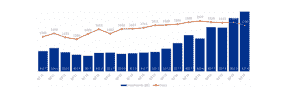
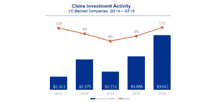

# 在新风险报告中,“杠铃”变成了滑雪斜坡 

> 原文：<https://web.archive.org/web/https://techcrunch.com/2015/10/14/in-new-venture-report-the-barbell-turns-into-a-ski-slope/>

# 在《新风险报告》中,“杠铃”变成了滑雪坡

如果你关注风险投资行业，你可能在最近几年经常听说杠铃效应。这是对投资于许多种子期公司的许多个人和小型风险基金的隐喻，与此相反，风险基金、成长型基金、对冲基金和共同基金拥有大量资金可以部署，并推高了成熟初创公司的估值。

根据 CB Insights 和毕马威(KPMG)新的第三季度报告，杠铃开始看起来更像一个滑雪斜坡，小规模种子资金已经少得多(种子交易开始越来越像传统的 A 轮甚至 B 轮交易)，但大型融资没有明显放缓。事实上，仅在第三季度就有 23 家市值超过 10 亿美元的新公司诞生，高于 2014 年第三季度的 12 家。

报告中其他有趣的观点是:亚洲正在崛起。尽管中国的首次公开募股被叫停，但至少它仍处于大规模融资过程中。

【T2

至于欧洲，CB Insights 创始人阿南德·桑瓦尔说，它正在增长，但“更加温和”。“对欧洲来说，好消息是其种子生长阶段的活动；随着其中一些公司的成熟，这对生态系统来说应该是好事。”

如果你想看完整的(免费的)数据报告，你可以在这里查看。