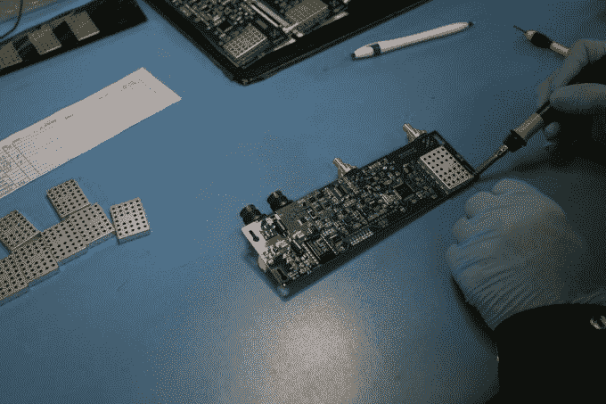
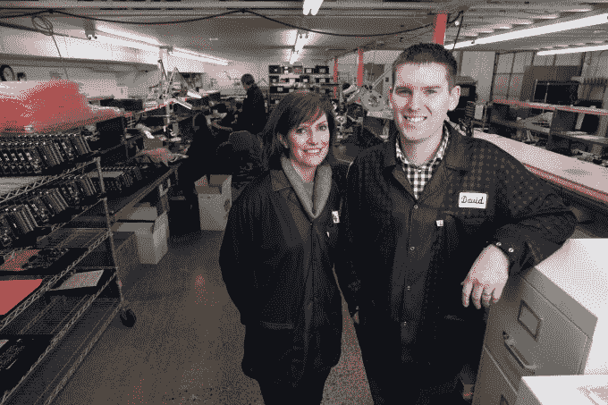
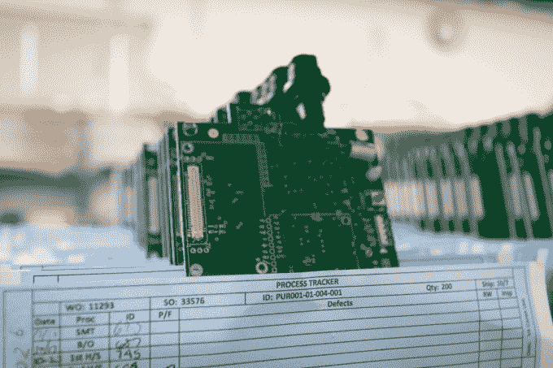
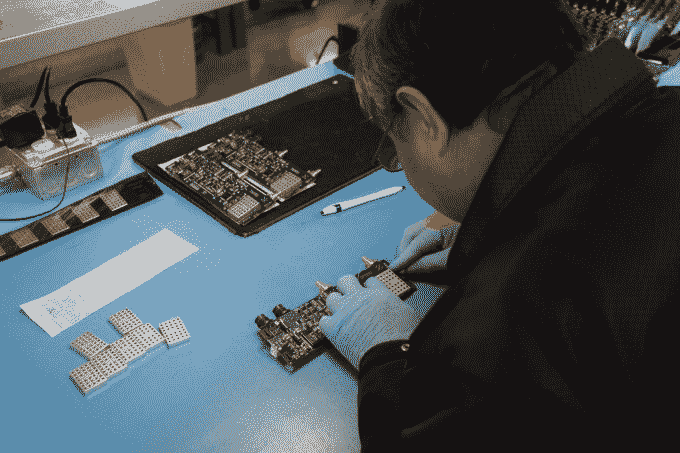

# 经济衰退后 RelianceCM 重建技术品牌 

> 原文：<https://web.archive.org/web/https://techcrunch.com/2014/11/24/in-recessions-wake-reliancecm-rebuilds-a-tech-brand/>

More posts by this contributor

**编者按:** *法拉·沃纳(Fara Warner)是《建美国》和美国在线科技(Aol Tech)的编辑总监，后者包括 TechCrunch 和 Engadget。她曾在《华尔街日报》和《快公司》工作，2007-2009 年间是密歇根大学的霍华德·r·马什新闻学客座教授。*

俄勒冈州的科瓦利斯看起来不像是一个高科技城镇。曾经是伐木中心，现在种植薄荷和羊茅的小农场环绕着这个约有 55000 人的大学城。

但在 20 世纪 70 年代，惠普在科瓦利斯的郊区建了一座大型工厂，带来了一波技术人才。早些年，该工厂组装了手持计算器，这是惠普的第一台个人电脑，并最终以完善喷墨打印而闻名。

几十年来，随着惠普业务的转移，一些科学家和工程师离开，在科瓦利斯开创了自己的事业，创建了一个制造和技术业务基地。此外，俄勒冈州立大学帮助提供受过教育的劳动力，使科瓦利斯能够与北部的波特兰和南部的尤金等更大的都市地区竞争。

其中一家公司是 RelianceCM，这是一家合同制造公司，在 20 年的大部分时间里以 MegaTech 的名义经营。在 20 世纪 90 年代，该公司以“电路板填充工”的身份分三班工作，生产了成千上万块电路板，主要用于电信行业。

电路板现在是一个价值数十亿美元的全球产业，几乎是我们使用的所有技术产品的大脑和肌肉。它们通常由铜板制成，在铜板上焊接线路，将点连接到电阻器和电容器，使技术工作。你阅读这篇文章的电脑、电话或手持设备都是因为电路板而工作的。

到 2013 年，RelianceCM 最大的电信客户将其电路板制造转移到了中国。但该公司没有关闭商店，而是在现在蓬勃发展的硬件初创企业世界中看到了机会，企业家需要小批量的电路板来测试他们的想法，并开始小规模制造。

当时，该公司第三任老板斯科特·施罗德的儿子、现年 28 岁的大卫·施罗德(David Schroeder)决定做一件大多数公司认为不可想象的事情:丢掉 25 年的历史，去掉 MegaTech 这个品牌名称。

斯科特并不喜欢旧名字，“但我认为他疯了，”老施罗德记得当大卫告诉他他们需要改变它时的想法。尽管如此，他还是大胆地接受了一个新名字。

RelianceCM 这个名字将注意力集中在该公司为硬件初创公司提供实际帮助、可靠的电路板和可持续供应链的能力上。然而，放弃这个名字并不容易，即使是像 MegaTech 这样的公司。“这是一个可怕的过程，”大卫说。“我们不只是缩短了名字。它不见了。在系统外冲洗。我们不再使用它了。”

**奇怪的一对**

公司的新远见者:帕蒂·贝克和大卫·施罗德

大卫从未想过加入他父亲的企业，更不用说为硬件初创公司彻底改变形象了。他毕业于俄勒冈州立大学，获得市场营销学位，一心想要做一些可能与 MegaTech 无关的事情。

但那是 2008 年，美国正急剧滑向大衰退。“我从来没有想象过自己会在这里，”大卫谈到该公司位于一个小工业园区的不起眼的办公和制造空间时说，这个工业园区距离该市风景如画的市中心只有几分钟的车程。“但这是我所知道的。”

与过去几代加入家族企业并坚持到底的孩子不同，大卫不想只是继承他父亲的衣钵。他想开创自己的道路。但首先，他的父亲让他在工厂车间工作，与那些在小而精致的产品上工作了十多年的人一起学习制作电路板的过程。

这让他获得了实践经验，所以当他几年后担任业务发展经理时，“他知道自己在说什么，”斯科特在谈到如何吸引潜在客户时说。

大约在大卫加入公司的同时，帕蒂·贝克开始担任公司的办公室经理。她也在寻找度过衰退的方法，和大卫一样，她对公司向外界推销自己的方式并不满意。她也不想在以后的职业生涯中做办公室经理。

然而，经济衰退使得这家小公司很难承担太多风险。但是，当一家生产休闲车的客户 Monaco 破产时，Patty 和 David 看到了一项可能帮助他们度过艰难经济环境的业务。他们决定继续从其他供应商那里采购这些零件，本质上是充当零件供应商，并帮助将这些产品直接提供给消费者。风险得到了回报。“它帮助我们度过了衰退最严重的时期，”斯科特说。

斯科特说，由于这次成功，很明显，帕蒂是退休后接替公司销售经理的最佳人选。帕蒂选择了关系经理的头衔，因为该公司在更名为 RelianceCM 时转移了重心。

48 岁的帕蒂开玩笑说，当他们走进来向新客户推销公司的能力时，她知道他们在想谁是“中年妇女和孩子？”

但是这对奇怪的组合起了作用。David 经常从技术问题开始，而 Patty 则就合同制造之外的话题与人交流。但是谈话并不总是以这种方式结束。“一个我本以为会和 D(她对大卫的昵称)相处融洽的人最终和我聊了起来，反之亦然。”

帕蒂说，一起旅行和会见客户帮助她和大卫做出决定，RelianceCM 需要成为一个企业家会有信心的公司。他们希望他们的公司能够满足初创企业的心态——一种需要快速灵活制造的商业模式。

“我们想把谁作为客户来谈，那时我们正在和更多的初创公司谈——我们一直称他们为‘新客户’——但这些人有一种新的思维模式，”她说。“他们不仅仅是我们试图介绍给他们的工程师。他们是拥有更广阔视野的企业家。”

**硬件很酷…再次**

对许多人来说，即使是那些硬件企业家，代工制造也有点神秘。但正如大卫简单说的，“我们在打造别人的产品。当它归结为将任何部件组装在一起时，我们是将它拧在一起、将零件放在板上并将产品运出这里的人。”

几十年来，这种类型的制造一直被运往海外，因为制造电路板可能是极其劳动密集型的。但对于只需要几块电路板进行测试，或者几千块电路板放入产品进行销售的初创企业来说，去亚洲可能会令人望而生畏。即使是大规模的，在海外代工制造领域航行也并不容易。

> 他们已经把这个以一种方式运作了二三十年的行业——可能更久——搞得天翻地覆。大卫·施罗德

随着硬件再次变得很酷，这两个因素发生了冲突。有些公司需要在现实世界中测试他们的想法，但国内很少有地方能制造电路板。大卫说，当他告诉旧金山地区的人他从事合同制造时，他们认为他在中国有一家工厂。他们花了一段时间才明白 RelianceCM 实际上在美国制造电路板。

像 Dragon Innovation 这样的公司已经帮助硬件初创公司 Pebble 和 Sifteo 在海外制造产品。但并不是每个公司都需要成百上千的零件。有些人永远不会，也不是每个人都想去中国。这就是 RelianceCM 希望填补真空的地方，尤其是国内。

“如果劳动力成本与零部件成本相比仍然很低，我们就有竞争力，”斯科特说。“我们可以与需要高接触的早期公司合作，并与他们一起成长。”斯科特策略的一部分也是投资一些早期公司。就大卫而言，他在波特兰花了很多时间，在那里他组织并帮助运营每月一次的 PDX 硬件初创公司 meetup。

无论硬件初创公司现在有多火，代工制造仍然是现在所谓的“物联网”中不太性感的一面，物联网试图将硬件与软件和传感器结合起来，通过互联网将各种机器连接在一起。

但是如果没有 RelianceCM，像 VendScreen 这样的公司可能不会颠覆像自动售货机这样的行业。

面对智能手表或无人机等华而不实的硬件产品，VendScreen 似乎并不那么酷。但该公司是一个很好的例子，说明为什么像 RelianceCM 这样的公司是互联网连接硬件领域的重要一环。

大多数自动售货机仍然深深地嵌入在模拟机器世界中。许多人仍然只接受硬币或现金，并在可能与机器是否没有薯片和苏打水没有关系的路线上重新进货。

VendScreen 想要改变这种情况。它的技术本质上是一种 Android 改造，将自动售货机变成了一台大数据机，并且可以使用信用卡。RelianceCM 制造的小型塑料设备实际上塞满了七块电路板。这个堆栈赋予了自动售货机发送数据的能力，这些数据包括什么在卖，什么没卖，营养数据以及这七块板子能提供的几乎所有其他东西。

所有这些都集中在 RelianceCM 主楼停车场对面的一个小制造空间里。一些设备还未完工，电路暴露在外，另一些设备正在与 VendScreen 的服务器“对话”,还有一些设备已经打包，准备发货。

“他们已经把这个以一种方式运作了二三十年的行业——可能更久——搞得天翻地覆，”大卫说。

他可以对自己的公司说同样的话，该公司正在证明，在俄勒冈州中部的一个小镇上，为初创企业代工也是可能的。

