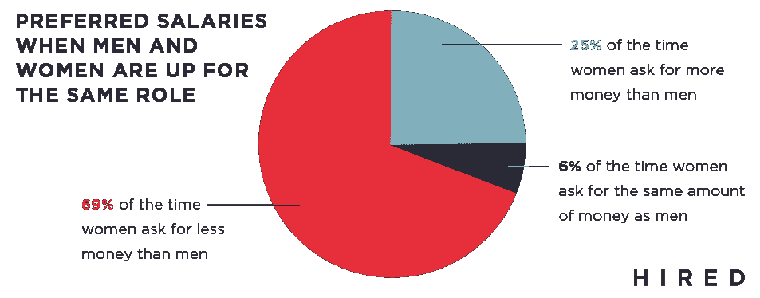

# 在科技行业，随着时间的推移，女性的工资性别差距会变得更大，对黑人女性来说更是如此

> 原文：<https://web.archive.org/web/https://techcrunch.com/2017/04/04/in-tech-the-wage-gender-gap-worsens-for-women-over-time-and-its-worst-for-black-women/>

一项最新研究显示，在面向科技工作者的就业市场“T2 雇佣 T3”上，女性求职者获得的工作机会超过 12 万份，但她们在同一岗位上的平均收入仍然低于男性同行，有时甚至要低得多。

“雇佣”组织的数据显示，在同一家公司，从事相同工作的女性得到的薪水比男性低 63%，白人女性的平均薪水比男性低 4%，在最极端的例子中，女性得到的薪水比男性低 50%。同样，在 employee 分析的 10 个职位空缺中，有 1 个公司给白人男性的薪水比给女性的至少高 20%。

这既可怕又不足为奇。根据美国大学女性协会的数据，薪酬差距可能还需要 5 到 136 年才能完全消失。

也许这份新报告更能说明问题:随着时间的推移，女性的工资会发生什么变化？在同一家公司里，谁的工资最低？是拉丁裔和黑人女性。

实际上，和去年的首次研究不同，这次 employed 将求职者进行了更窄范围的细分，包括年龄和种族。研究发现，拥有四年或更少工作经验的白人女性对金钱的需求实际上高于男性，可能是因为她们掌握了市场对更多入门级工作的定价信息。

然而，另一方面的差距开始出现在有六年或六年以上工作经验的候选人身上，技术领域的白人女性要求的比他们的白人男性同行少，并且得到了。事实上，随着时间的推移，在全国范围内，从事同样工作的男性同事平均每挣 1 美元，技术行业的白人女性平均只能挣 0.90 美分。

Hired 的首席数据科学家杰西卡·柯克帕特里克(Jessica Kirkpatrick)认为，同行的收入透明度较低是一个可能的驱动因素。“女性在开始时可能更清楚入门级工作的合适薪资期望，但随着她们的职业发展，与自己比较的同行越来越少，她们应该获得的薪酬可能就不太清楚了。”

柯克帕特里克说，许多其他因素也可能在起作用，他列举了面试过程中的无意识偏见以及有时会影响那些从事业中抽出时间来抚养孩子的女性的母性惩罚。

不管怎样，更糟糕的是拉丁裔女性和黑人女性面临的薪酬差距。根据其计算，黑人女性的收入是白人男性的 79 %,是白人男性和白人女性收入差距的两倍。西班牙裔女性的情况稍好，白人男性的收入只有西班牙裔女性的 83%。

Kirkpatrick 说，她希望 Hired 的研究“有助于提高意识，以便个人可以调整他们的要求，客户和公司可以认识到这是一个系统问题，并调整他们的做法，使之更加公平。”

与此同时，她补充说，该公司的数据“确实表明，如果你是一个代表性不足的少数族裔，偏见就会变成双重歧视。”

你可以在这里浏览它的调查结果。