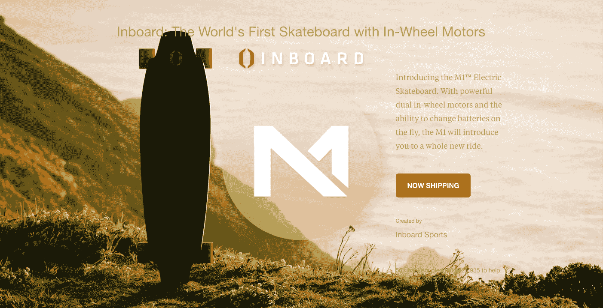

# 内侧技术筹集 800 万美元成为电动滑板的特斯拉

> 原文：<https://web.archive.org/web/https://techcrunch.com/2017/11/16/inboard-technology-raises-8-million-to-be-the-tesla-of-electric-skateboards/>

如果你是一家开发电动滑板的公司，已经[在 Kickstarter 上筹集了近 50 万美元](https://web.archive.org/web/20230307142248/https://www.kickstarter.com/projects/inboard/the-monolith-worlds-first-skateboard-with-in-wheel)和  [击败了鲨鱼队](https://web.archive.org/web/20230307142248/https://www.business2community.com/entertainment/shark-tank-inboard-technology-electric-skateboard-accepts-750000-loan-offer-kevin-oleary-lori-greiner-01719733#x2IAJ5JC4Hwh0RGI.97)你会为安可做些什么？

至少对 I [nboard Technology](https://web.archive.org/web/20230307142248/https://www.inboardtechnology.com/) 来说，答案是走出去，在新一轮风险投资中筹集 800 万美元，成为滑板界的特斯拉。

该公司由 Ryan Evans 和 Theo Cerboneschi 于 2014 年创立，最初是 Cerboneschi 的大学愿景，即在电动滑板上在校园内狂奔。

埃文斯是运动装备制造商 Pure Action Sports 的前总裁，两人在 Pure Action 一起工作时，他遇到了已经成为职业风筝滑手的 Cerboneschi。

两个人都热爱滑板，都喜欢坚固耐用、软件驱动的电动滑板，由此诞生了内置技术。

总部位于加州圣克鲁斯的该公司在最近一轮融资中一次又一次地取得成功，并在洛杉矶的 advanced Ventures 的带领下达到高潮。该公司的合伙人科比·富勒将加入公司董事会。

“这是市场上最糟糕、设计最好、最有趣的电动滑板，”富勒告诉我。

但是对于富勒和埃文斯来说，滑板不仅仅是童年玩具的有趣更新。

“围绕城市中心人口越来越密集，有一个总体的宏观论点。富勒说:“汽车交通变得越来越糟糕，城市需要优先考虑其他交通方式，方便人们出行。

进入，内舷。

富勒说，汽车拥有量的下降、流动性选择的增加以及公共交通枢纽之间对过渡车辆的需求，将推动对新出行方式的需求。

对于 5 英里或更短的行程，电动滑板或自行车将成为更受欢迎的选择。根据该公司提供的数据，最近的研究表明，美国超过一半的旅行实际上不到 5 英里……20%不到 2 英里。

正如 Evans 今年早些时候告诉 [Smart 杂志](https://web.archive.org/web/20230307142248/https://www.smart-magazine.com/en/inboard-urban-electromobility/)的，“通过 M1，我们创造了多式联运……我们提供了一种有价值、高效的解决方案，为您提供了一种更个性化的城市出行方式——它将您与所有可用的交通方式联系起来。”

在这一轮之后，Inboard 将会出现在全国 200 多家百思买商店的货架上。此外，作为对潜在乘客的额外激励，该公司将在 11 月 21 日至 27 日期间，在 1399 美元的标价基础上提供 400 美元的折扣，正好赶上假期。

https://www.youtube.com/watch?v=OGBhWhUy75w

内侧 M-1 与竞争对手如 [Movpak](https://web.archive.org/web/20230307142248/https://techcrunch.com/2014/09/02/the-movpak-is-an-electric-skateboard-that-folds-into-a-backpack/) 、 [Blink Board](https://web.archive.org/web/20230307142248/https://techcrunch.com/2016/06/24/review-actons-blink-board-is-a-quirky-board-with-an-unpolished-remote/) 或 [Zboard](https://web.archive.org/web/20230307142248/https://techcrunch.com/2017/01/10/zboard-is-an-electric-skateboard-that-doesnt-need-a-controller/) 的区别在于其甲板上完全集成的电池和电子设备；一个正在申请专利的轮内电机系统，这意味着董事会不需要皮带传动系统；该公司表示，还有一种允许可更换电池的设计，使主板的续航时间更长。

和特斯拉一样，该公司更新了固件，以提高速度、里程和扭矩。据该公司称，最新的固件更新使该板的性能提高了 40%，无需任何硬件升级即可提高性能。

所有这些功能不仅吸引了前期投资，还吸引了电池技术开发商 LION Smart、欧洲投资公司 Sunstone Capital 和之前的种子投资者 Sweet Capital 等投资者，后者领导了该公司 370 万美元的种子轮投资。

富勒不仅是投资者，也是客户，他说:“这是一个非常棒的、漂亮的高性能主板。”。