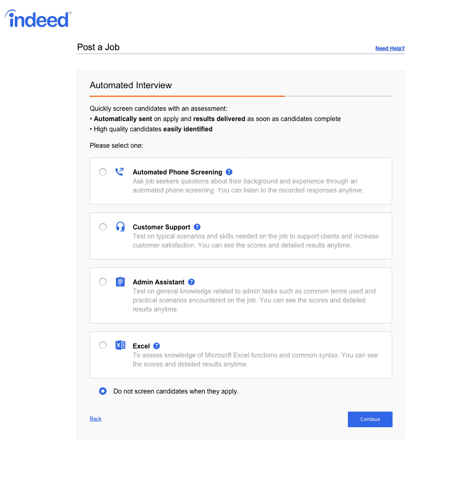

# 事实上，buying 接受面试是为了让任务模拟成为求职申请的一部分吗

> 原文：<https://web.archive.org/web/https://techcrunch.com/2017/08/04/indeed-is-buying-interviewed-to-make-task-simulations-part-of-job-applications/>

# 实际上，buying 面试是为了让任务模拟成为求职申请的一部分吗

事实上，每月有超过 2 亿人寻找工作的求职平台正在收购在线工作评估工具“面试”。交易的条款尚未披露，但包括三名联合创始人在内的所有 12 名受访员工都将在 Indeed 工作。

在三藩市接受采访的是 Y Combinator 2015 年夏季班的[成员，他们为 IBM、Zillow 和 Thumbtack 等客户提供工作评估工具。随后，它筹集了 1.5 亿美元的种子资金。](https://web.archive.org/web/20221209002353/https://beta.techcrunch.com/2015/07/13/yc-backed-interviewed-uses-automated-simulations-to-evaluate-job-candidates/)

Indeed 也是受访公司的客户，其日本母公司 [Recruit](https://web.archive.org/web/20221209002353/http://www.recruit-rgf.com/) 是这家初创公司的早期投资者。求职平台使用受访者的 API，让雇主将自动筛选面试或评估附加到申请中。

这些评估包括自动电话筛选、客户支持和行政助理模拟，以及 excel 测试。[我们在第一次发布](https://web.archive.org/web/20221209002353/https://beta.techcrunch.com/2015/07/13/yc-backed-interviewed-uses-automated-simulations-to-evaluate-job-candidates/)时试用了其中的一些评估，发现它们非常现实，可能是预测未来工作表现的好方法。

展望未来，受访者的服务将暂时继续独立存在，最终目标是进一步整合这些平台，以便雇主可以选择将模拟作为其工作申请的核心部分。

