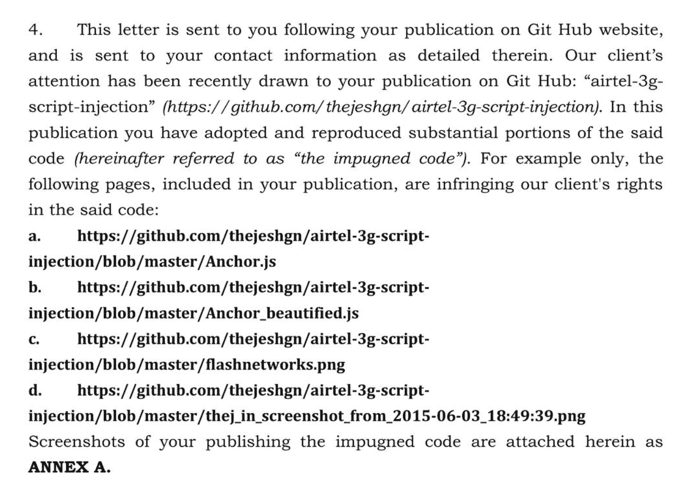
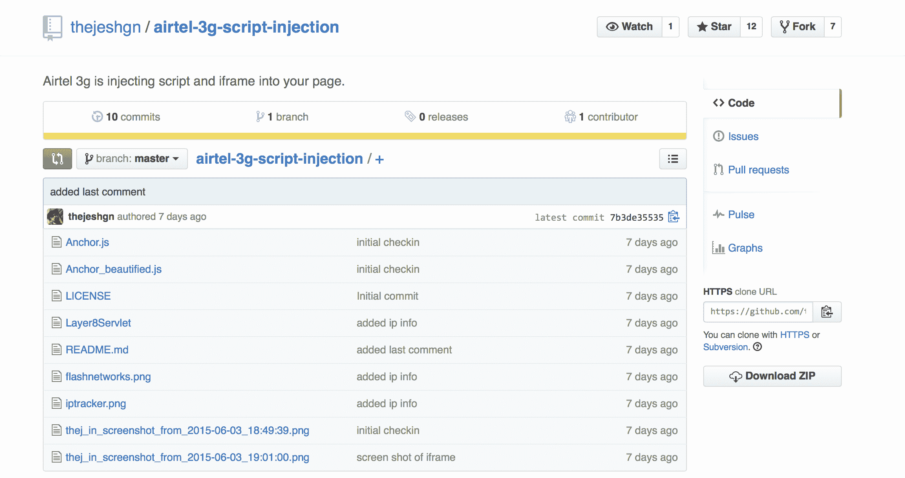

# 印度程序员暴露了代码注入，得到了注入者的停止

> 原文：<https://web.archive.org/web/https://techcrunch.com/2015/06/10/indian-programmer-exposes-code-injection-gets-a-cease-and-desist-from-the-injectors/>

# 印度程序员暴露了代码注入，得到了来自注入者的停止

史翠珊效应的一个令人兴奋的例子是，印度 Airtel 的客户 [Thejesh GN](https://web.archive.org/web/20221209040535/https://twitter.com/thej/status/606126370364649472) 发现运营商已经开始使用 [Flash Networks Layer8](https://web.archive.org/web/20221209040535/http://www.prnewswire.com/news-releases/flash-networks-innovative-layer8-monetization-solution-selected-by-seven-operators-in-the-last-six-months-300037634.html) “货币化”(阅读“广告注入”)解决方案。该代码出现在通过 Airtel 的网络下载的大多数移动网页上，由一对基本的 JavaScript 注入器组成。该网站公布了这段代码，它过去可以通过任何浏览器免费下载，并且[收到了一封停止函](https://web.archive.org/web/20221209040535/https://archive.org/stream/LEGALNOTICETOTHEJESHGNCEASEANDDESISTINFRINGEMENT/LEGAL%20NOTICE%20TO%20THEJESH%20GN-%20CEASE%20AND%20DESIST%20-%20INFRINGEMENT#page/n1/mode/2up)。

罪行似乎是将公共代码上传到一个公共存储库 Github。该代码在这里[公开，但现在似乎被锁定了，被认为是 Flash Network 的专有财产。然而，像互联网上的大多数代码一样，除非有实际盗窃的证据，否则保护这一声明是非常困难的。然而，就像许多荒谬的停止和终止信一样，这并没有阻止 Solicis Lex 的 Flash Networks 律师 Ameet Metha 试图吓唬 jesh 和 Github，就他们而言，懦弱的](https://web.archive.org/web/20221209040535/http://223.224.131.144/l8/Layer8Servlet)[将代码](https://web.archive.org/web/20221209040535/https://github.com/thejeshgn/airtel-3g-script-injection/blob/master/README.md)作为 DMCA 请求的一部分。

垃圾邮件发送者和被垃圾邮件发送者之间这种反复的问题是垃圾邮件发送者永远不会站出来。几乎每一个这类代码注入的例子，从[超级鱼](https://web.archive.org/web/20221209040535/https://beta.techcrunch.com/tag/Superfish)到&美国电话电报公司对[威夫](https://web.archive.org/web/20221209040535/https://beta.techcrunch.com/tag/Weev)的攻击，都让公司成了坏人。虽然我心中的网虫认为这不是一件坏事，但我心中的现实主义者认为这很愚蠢。据推测，Airtel 的一些短视的货币化人员与 Flash Networks 的一些短视的货币化人员进行了交谈，并达成了一项协议，由于代码注入，该协议是不安全的，也是不需要的。揭露这一点并不是犯罪，而 Flash Networks 让它成为犯罪才是犯罪。

Airtel 方面告诉 Storypick 他们与 C & D:

"This 是全球电信公司部署的标准解决方案，用于帮助他们的客户根据使用的兆字节来跟踪他们的数据使用情况。因此，它旨在改善客户体验，让他们能够管理自己的使用。我们的一个网络供应商合作伙伴已经通过第三方试用了该解决方案，以帮助客户从使用的数据量方面了解他们的数据消耗。作为一家负责任的企业，我们高度重视客户隐私，并遵循对客户数据保密的零容忍政策。我们也对 Flash Networks 向 jesh GN 发出的停止通知感到惊讶，并明确声明我们与该通知没有任何关系。”

我也联系了 Flash Networks，看看他们能从这整个激动人心的考验中得到什么。他们写道:

正在讨论中的The Flash Networks 解决方案负责在用户即将用完配额时通过网络浏览器实时通知用户，并为他们提供升级选项和经济实惠的套餐以避免超额收费，从而通过节省时间和金钱为他们提供更好的用户体验。这项服务的设计是为了让用户可以很容易地选择退出。上面提到的 javascript 并不收集或存储任何用户数据，而是用于传递用户消息。该服务尚未公布，因为解决方案仍在测试中，因此不会向用户显示任何消息。它尚未完成发射过程。

相对于 Flash 发送给 jesh GN 的法律通知——jesh GN 未经 Flash Networks 同意，发布了 Flash Networks 的专有源代码。这样做是为了保护和确保 Flash Network 的知识产权。我们很感激 Github 认为我们的请求是合理的，并自动删除了代码。澄清一下，没有人声称发现了 javascript 注入，因为这不是机密，而是知识产权源代码的披露。

我们理解对用户隐私的担忧，因此我们遵循最严格的道德、法规和法律惯例来确保数据的机密性。

[archiveorg-book LEGAL noticetothejeshgncease AND desistin 侵权 THEJESH GN 的法律声明-停止和终止-侵权 width=480 height=430]

[通过 TechDirt](https://web.archive.org/web/20221209040535/https://www.techdirt.com/articles/20150609/06505631281/guy-reveals-airtel-secretly-inserting-javascript-gets-threatened-with-jail-criminal-copyright-infringement.shtml)