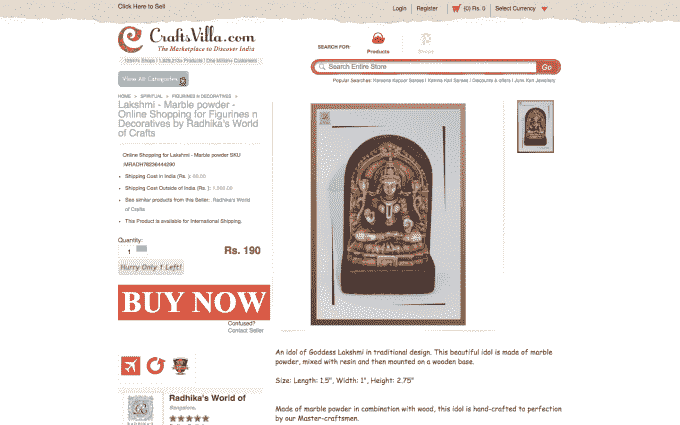

# 印度的 Craftsvilla，一个类似 Etsy 的民族产品市场，筹得 1800 万美元 

> 原文：<https://web.archive.org/web/http://techcrunch.com/2015/04/23/indias-craftsvilla-raises-18-million/>

印度目前正在经历电子商务的繁荣——至少在投资方面是如此。最新一家获得投资者大笔资金的初创公司是 [Craftsvilla](https://web.archive.org/web/20230131005051/http://www.craftsvilla.com/) ，这是一家“民族产品”电子商务网站，如果你想寻找西方的参照点，它可能可以与 [Etsy](https://web.archive.org/web/20230131005051/https://www.etsy.com/) 相媲美。

Craftsvilla 刚刚宣布了其 1800 万美元的 B 轮融资，由[红杉资本](https://web.archive.org/web/20230131005051/https://www.sequoiacap.com/)领投，包括来自 [Nexus Venture Partners](https://web.archive.org/web/20230131005051/http://nexusvp.com/) 、[light speed Venture Partners](https://web.archive.org/web/20230131005051/http://lsvp.com/)和 [Global Founders Capital](https://web.archive.org/web/20230131005051/http://www.globalfounders.vc/) 的参与。估值没有披露。

这家总部位于孟买的公司由首席执行官马诺基·古普塔(Manoj Gupta)于 2011 年创立，他当时是 Nexus 的风险投资人，投资了零售巨头 Snapdeal。

古普塔在接受 TechCrunch 采访时表示:“论文的主题是，印度的文化和多样性非常丰富，全国各地有如此多独特的产品，[但]从未有人认真尝试过将这些产品放到一个平台上。”。

Craftsvilla 可与 Etsy 相提并论，但 Etsy 不是。古普塔说，Craftsvilla 不是像美国公司那样专注于手工产品，而是展示民族商品，如纱丽、手工艺品、珠宝、精神产品或乐器。

“我们的目标是以一种新的方式展示民族商品，”古普塔解释道。“我们说‘民族很酷’"

Craftsvilla 正在接近来自近 12，000 家商家的 200 万件产品，Gupta 表示，这些数字已经在没有营销支出的情况下实现了有机增长。

有趣的是，95%的顾客来自印度，而高达 90%的顾客是女性。古普塔解释说，物流和额外成本使国际销售变得更加棘手，但该公司最近将海外送货的成本转移给了商家——他们可以将其纳入定价——他认为这将有所帮助。

也就是说，Craftsvilla 的目标不是全球观众，印度是主要焦点。然而，古普塔确实计划将业务扩展到东南亚国家，它将继续专注于向国内消费者销售当地的文化产品。为此，该公司已经开始在马来西亚进行测试，但该国的扩张要到明年才会发生。(古普塔告诉我们，他也愿意通过收购进入新市场。)

这笔资金将用于向印度的主流消费者营销该网站，推进公司的技术发展，以及招聘员工。Craftsvilla 在孟买有一个 50 人的团队。古普塔告诉我们，由于它的节俭，它的利润率一直很低，并且“接近盈利”——这与印度最著名的互联网初创公司形成鲜明对比，后者正在通过资本烧钱。

现在，Craftsvilla 每月有 400-500 万美元的 GMV，但它的目标是在年底前将这一数字增加到 2000 万美元。

现在为时尚早，但古普塔说，他相信 Craftsvilla 有潜力发展到亚洲以外的世界其他地区，同时保持对当地的关注。他并不太担心 Etsy 继承了这一衣钵，因为他看到了两者之间的根本区别。

“我们的愿景非常远大，我们希望成为一家价值 100 亿美元的公司，并在民族空间产生重大影响……我们希望成为任何民族事物的目的地，”他解释道。“Etsy 是手工制作的，但它在民族文化领域失去了很多。(我们的产品)不一定需要手工制作，但(它们)在本质上是民族的。”

古普塔已经在考虑未来一轮 1 亿美元左右的融资，以推动 Craftsvilla 更上一层楼。不过，他说，这只是他内心深处的想法，他还没有积极加注。