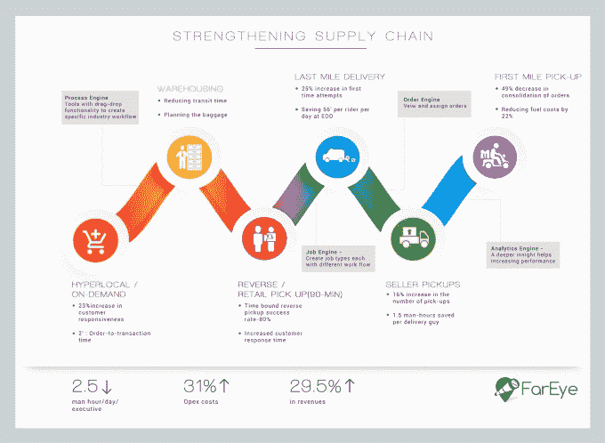

# 印度 FarEye 公司斥资 350 万美元提高电子商务物流效率

> 原文：<https://web.archive.org/web/https://techcrunch.com/2016/06/24/indias-fareye-lands-3-5m-to-make-e-commerce-logistics-more-efficient/>

总部位于印度的初创公司 FarEye 帮助电子商务公司更有效地运营他们的物流，已经从 [SAIF 合伙人](https://web.archive.org/web/20230331062240/http://www.saifpartners.com/)那里获得了 350 万美元的资金。

这家位于新德里的公司运营着一个软件平台，主要位于电子商务公司及其物流和履行合作伙伴之间。这是一个高层次的前提，但 FarEye 做的远不止这些，因此联合创始人兼首席执行官 Kushal Nahata 在接受 TechCrunch 采访时表示。

“全球物流正在发生变化，电子商务扰乱了这个行业并改变了一切，而移动渗透率的增加意味着消费者的期望已经改变，”纳哈塔说，他于 2013 年 1 月与高塔姆·库马尔(首席运营官)和高拉夫·斯里瓦斯塔瓦(首席技术官)一起创立了 FarEye。

Nahata 表示，FarEye“从第一天起就一直盈利”，可以帮助其物流和商业客户进行仓储、第一英里提货、按需和超本地物流、最后一英里等业务。除了管理和优化送货车队——据称其客户的首次送货工作增加了 22%，每位员工每天节省了 2.3 个工时——FarEye 还包括可以预测最佳枢纽位置、最佳运输类型以及前瞻性业务和物流预测的分析。

“我们密切关注物流流程，并整合了需求预测和产能规划功能。他们都在规划劳动力和日常运营中发挥着重要作用。通过端到端移动解决方案，我们正在帮助物流企业简化运营并减少现金消耗，”Nahata 补充道。

该公司通过收取许可费、交易费以及针对垂直行业的额外服务来赚钱。它声称为超过 75 家客户提供服务，包括著名的 Ecom express、Gojavas、Holisol、Hitachi、aCommerce、Sephora 和 Lazada。

虽然该公司总部位于印度，其 30 名员工大部分在德里，但其三分之一的收入来自海外，主要是东南亚和中东，在东南亚，电子商务正显示出大规模起飞的迹象。考虑到扩张，FarEye 正在班加罗尔、孟买和新加坡开设业务发展办事处，旨在增加其销售和营销，以在更多不同的垂直行业中获得新客户。它还计划将员工人数增加一倍。

该公司还希望利用物联网和无人机在印度实现自动化交付。

Nahata 强调，该公司筹集资金是为了扩大规模，而不是因为它正在耗尽资本。

“我们必须成为一家盈利的初创公司，”他说。“我不想建立一个在两到三年内就消失的东西。我们希望存在 10 年或 20 年，成为全球性企业。”