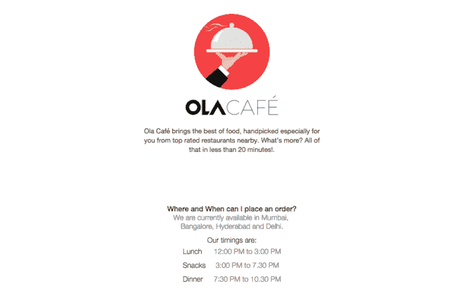

# 印度的 Ola 关闭了其点播食品和杂货订购服务

> 原文：<https://web.archive.org/web/https://techcrunch.com/2016/03/09/indias-ola-shutters-its-on-demand-food-and-grocery-ordering-services/>

# 印度的 Ola 关闭了点播食品和杂货订购服务

与优步在印度竞争的本土公司 Ola 在推出其食品和杂货订购服务不到一年后就关闭了这些服务。

[Ola Cafe](https://web.archive.org/web/20230325194442/https://www.olacabs.com/ola-cafe) 和 [Ola Store](https://web.archive.org/web/20230325194442/https://olastore.com/) 是 Ola 的第一家非交通服务，但它们不是全国性的，仅在少数一线城市提供。两者都被宣传为可能会被取消的试点项目，现在今天得到了证实，一周前 [Mint 报道](https://web.archive.org/web/20230325194442/http://www.livemint.com/Companies/DP5zpO9x44cqIiHkVOLAjN/Ola-may-shut-down-grocery-food-delivery-services.html)由于成本和用户兴趣低于预期，这些服务将被关闭。

Ola 在一篇博客文章中说:“随着我们加强对为 10 亿人建立移动性的关注，我们正在结束这两个实验，并从这些实验中吸取经验教训，以便在未来更好地为你服务，”Ola[迄今为止已经从投资者那里筹集了超过 14 亿美元](https://web.archive.org/web/20230325194442/https://techcrunch.com/2015/11/17/ola-the-company-beating-uber-in-india-lands-500m-in-fresh-investment/)。

优步被广泛认为在印度落后于 Ola，它率先提出了在交通应用程序中提供按需服务的想法。该公司在美国推出了 UberEats，它很快将成为一款独立的点餐应用程序，但到目前为止，优步还没有在印度或其他全球市场提供类似的选项。

[Ola 和优步本月都在印度推出了摩托车出租车按需服务](https://web.archive.org/web/20230325194442/https://techcrunch.com/2016/03/02/uber-and-ola-launch-motorbike-taxi-services-in-india/)。随着时间的推移，这些服务可以建立一支自行车司机队伍，支持印度的按需服务。例如，在印度尼西亚，红杉资本(Sequoia)支持的 Go-Jek 运营着一系列按需服务，这得益于其超过 20 万名司机的车队。但利润率和潜在收益是否值得一走还有待观察，特别是当优步和 Ola 继续通过相互竞争烧钱的时候。

目前，对 Ola 来说，按需服务的实验已经结束，但是还有很多公司只专注于这个领域——比如 [InnerChef](https://web.archive.org/web/20230325194442/http://www.innerchef.com/) 和 [Yummist](https://web.archive.org/web/20230325194442/https://techcrunch.com/2015/12/08/indias-yumist-gobbles-up-2m-for-its-meal-delivery-service/) 、 [Peppertap](https://web.archive.org/web/20230325194442/https://techcrunch.com/2015/09/29/keep-tapping-on-dem-peppers/) 和 [Grofers](https://web.archive.org/web/20230325194442/https://techcrunch.com/2015/11/26/indias-on-demand-delivery-startup-grofers-raises-120m-led-by-softbank/) 。