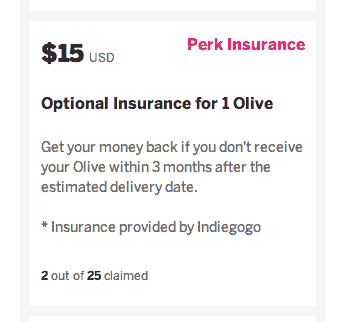

# Indiegogo 正在测试众筹产品的可选保险费 

> 原文：<https://web.archive.org/web/https://techcrunch.com/2014/12/01/indiegogo-is-testing-optional-insurance-fees-for-crowdfunded-products/>

# Indiegogo 正在测试众筹产品的可选保险费

对于众筹网站 Indiegogo 来说，今年是棘手的一年，这要归功于许多利用其服务为可疑项目筹集资金的活动(尽管也有一些很酷的用途)。看起来该公司正在用一个新的功能来回应，让投资者对他们的投资感到安心。

该公司正在测试一种“可选保险”费用，如果支持者在预计交付日期的三个月内没有收到最终产品，将会退款。Indiegogo insurance 目前正在对一个项目进行测试，该项目名为[压力管理可穿戴设备 Olive](https://web.archive.org/web/20221208164501/https://www.indiegogo.com/projects/olive-a-wearable-to-manage-stress) ，在该产品 129 美元的支持价格基础上，它提供了 15 美元的潜在安心感。

该公司向 TechCrunch 证实，它正在进行这项测试，但拒绝讨论更广泛的保险计划。

“Indiegogo 定期开发和测试新功能，以满足资助者和活动所有者的需求。这项试点测试目前仅限于这种个人运动，”一位发言人告诉我们。

保险的引入对 Indiegogo 来说意义重大，Indiegogo 被广泛认为是继 Kickstarter 之后众筹活动的第二选择。

这种差异的一个原因可能是 Indiegogo 被认为在监管和过滤其更富想象力的项目/ [那些看起来纯粹是欺诈的项目](https://web.archive.org/web/20221208164501/http://thenextweb.com/insider/2014/07/31/trouble-crowdfunding-interesting-product-blinds-red-flags)时更加宽松。

今年早些时候， [TechCrunch 的 Matt Burns 写了一篇关于支持众筹项目的风险的文章，强调了 Indiegogo 上托管的一些项目。他特别指出，Indiegogo 的“灵活融资”选项可以消除众筹背后的一些责任。这种选项允许公司全额收集它们的融资总额，不管它们是否达到了目标融资额，但要扣除 Indiegogo 的费用。](https://web.archive.org/web/20221208164501/https://beta.techcrunch.com/2014/04/09/the-risk-and-rush-of-supporting-a-crowdfunding-project/)

引入保险可以帮助支持者减轻永远得不到他们支持的好得难以置信的项目的风险，这将是一个受欢迎的步骤，但在 Indiegogo、Kickstarter 或类似服务上支持项目时，仍有许多其他赌注。

[Indiegogo 在一月份筹集了 4000 万美元的 B 轮融资](https://web.archive.org/web/20221208164501/https://beta.techcrunch.com/2014/01/28/indiegogo-raises-40-million-in-series-b-to-expand-their-crowdfunding-reach/)，并且正在其他领域试水。早在 9 月份，它[推出了一个“永久资助”选项](https://web.archive.org/web/20221208164501/https://beta.techcrunch.com/2014/09/17/indiegogo-forever-funding/)，让项目在众筹网站通常提供的一个月标准窗口之外继续接受捐赠。

*帽尖匿名 TechCrunch 爆料者*