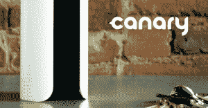
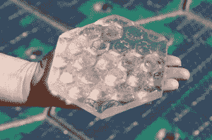

# Indiegogo 提高了硬件项目的众筹水平

> 原文：<https://web.archive.org/web/https://techcrunch.com/2016/05/20/indiegogo-teams-up-with-arrow/>

硬件众筹活动的最大挑战之一是及时交付。Indiegogo 比大多数人更清楚这一点，它正与 [Arrow Electronics](https://web.archive.org/web/20230225235323/https://www.arrow.com/) 合作，通过工程协助和市场支持来帮助企业家交付产品。

此举继续了众筹平台击败 Kickstarter 成为小工具和电子产品首选平台的努力，将自己定位为一个从资金到生产的完整平台。

## 对企业家的更广泛支持

> 新的联盟对两家公司来说都是明智之举。

Arrow 整合意味着 Indiegogo 在将产品推向市场的过程中变得不干净——这是众筹界的一个令人耳目一新的变化。合格活动将直接获得 Arrow 的设计工具、原型服务、制造支持、供应链管理协助，以及最重要的工程专家。顶层套餐包括价值高达 50 万美元的产品和服务。

Indiegogo 首席执行官大卫·曼德尔布洛特说:“我们非常兴奋，因为 Arrow 加强了我们的承诺，帮助企业家尽快将他们的想法转化为产品。”“我们已经看到 Indiegogo 上的技术和物联网项目出现了令人难以置信的增长，我们认为这是因为我们正在开发新的方式来帮助企业家获得资金以外的支持，这次 Arrow 合作就是一个很好的例子。”

Canary 的 Indiegogo 活动取得了巨大的成功，并且是在 Arrow 的帮助下完成的。

在承诺提供帮助之前，Arrow 将评估 Indiegogo 活动的技术可行性、可制造性以及这是一个好主意还是会让创业者梦想破灭(好吧，最后一部分可能是我编造的)。接受箭治疗的竞选活动会收到一个特殊的箭头徽章，表明该活动背后有一群聪明人，理论上应该会增加成功交付的机会。

在过去的一年里，Indiegogo 推出了新的服务，旨在支持创业者超越其业务的众筹阶段，包括 [InDemand](https://web.archive.org/web/20230225235323/https://learn.indiegogo.com/indemand/) ，这使得活动能够在众筹活动结束后继续接受预购，以及 [Marketplace](https://web.archive.org/web/20230225235323/https://learn.indiegogo.com/how-it-works-marketplace/) ，这是 Indiegogo 向电子商务的飞跃，为企业主提供销售随时可以发货的产品的服务。

## 对两家公司来说，这都是一个重大举措

Solar Roadways 在 Indiegogo 上取得了成功，并在 Arrow 的帮助下继续提供服务。

从 Indiegogo 的角度来看，与 Arrow 整合是一个非常有趣的举动，但这是否是一个好的商业决定还有待观察；箭头徽章的引入可能会创造一个双层系统，有徽章的竞选活动更容易获得资金，而没有装饰的竞选活动会枯萎，不受欢迎和孤独。

Arrow 和 Indiegogo 彼此并不陌生；获得巨大成功的[Solar roads](https://web.archive.org/web/20230225235323/https://www.indiegogo.com/projects/solar-roadways#/)和 [Canary](https://web.archive.org/web/20230225235323/https://www.indiegogo.com/projects/canary-the-first-smart-home-security-device-for-everyone#/) Indiegogo 活动都向 Arrow 寻求交付帮助，并且都在顺利实现其超过 200 万美元的 Indiegogo 活动。Indiegogo 表示，这项新举措只是正式确定了两家公司之间的现有联盟。

新的联盟对两家公司来说都是明智之举。Arrow 得到了 Indiegogo 的认可，并获得了远远超过其竞争对手(如 [PCH](https://web.archive.org/web/20230225235323/http://www.pchintl.com/) ，他创建了[高速公路加速器](https://web.archive.org/web/20230225235323/http://highway1.io/)作为其交易流生成战略的一部分)梦想的巨大交易流。Indiegogo 也赢了，因为它迎合了创业者和支持者的心，积极努力提高其成功项目的交付率。

目前还不清楚 Arrow 的交易是否具有排他性，但我希望这笔交易是第一步。Indiegogo 可以做得更糟，而不是为高质量企业建立一个支持市场，帮助新晋企业家充分利用他们的众筹资金，向渴望的公众提供他们的梦想产品。