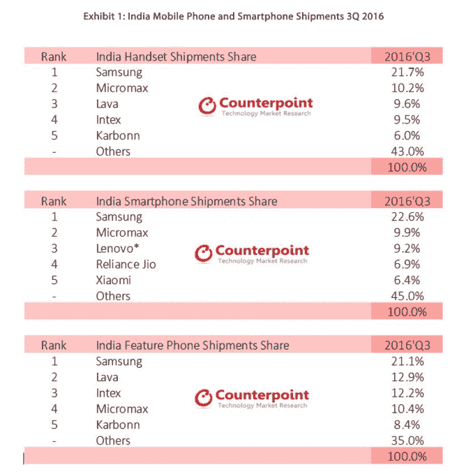

# 为印度开发 Android 操作系统的初创公司 Indus 瞄准了与中国 OEM 厂商的交易 

> 原文：<https://web.archive.org/web/https://techcrunch.com/2016/11/04/indus-intex-chinese-oems/>

# 为印度开发 Android 操作系统的初创公司 Indus 瞄准了与中国原始设备制造商的交易

为印度开发本地化版本安卓系统的初创公司 Indus OS T1 在与印度巨头 T2 Intex T3 达成销售基于其操作系统的智能手机的协议后，现在正在追逐国际原始设备制造商。

[根据 Counterpoint Research](https://web.archive.org/web/20221006200418/http://www.intex.in/) 的[数据，Intex](https://web.archive.org/web/20221006200418/http://www.counterpointresearch.com/press_release/3q2016india/) 在印度拥有约 10%的销售额，因此将该公司作为合作伙伴将提升 Indus 在印度移动领域的覆盖率。这种合作关系还意味着，Indus 现在已经与几乎所有的印度顶级手机品牌达成了协议，包括 Micromax、Karbonn、Celkon 和 Swipe，但不包括 Lava，这意味着它现在可以将注意力集中在许多争夺印度市场份额的海外公司身上，印度是少数几个逆全球手机销售放缓趋势而动的地区之一。

“我们的目标是让原始设备制造商注册，”Indus OS 联合创始人兼首席执行官 Rakesh Deshmukh 告诉 TechCrunch。“现在我们想继续前进，与中国和国际品牌合作。”

根据 Counterpoint 的数据，印度智能手机市场在最近的 2016 年第三季度创下历史新高，出货量同比增长 23%。按市场份额计算，三星、联想和小米位列前五大智能手机品牌，但许多其他海外品牌也在争夺这个新生市场的份额。

Android 占印度智能手机销量的 88 %,这也是 Indus OS 看到机会的地方。这家初创公司对谷歌拥有的操作平台进行了重组，以提供本地化功能，包括印度多种语言的翻译/键盘、更简单的用户界面、免费消息和本地化应用，它认为这些功能是开发智能手机的关键，这些智能手机可以被下一批不太了解的首次使用智能手机的人使用。

今年早些时候，Indus OS 完成了一轮 500 万美元的首轮融资，Deshmukh 暗示它可能很快会追加投资。

“我们现在没有加注，但会进行一些讨论，”他说。“让我们看看进展如何(目前没有计划，但)投资者正在接近我们，因为公司表现良好。”