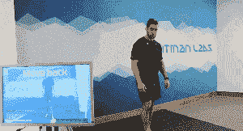
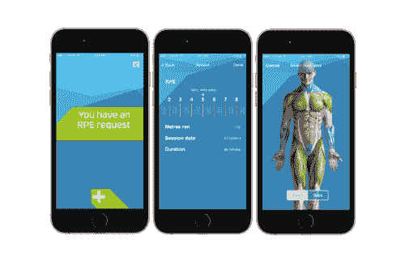
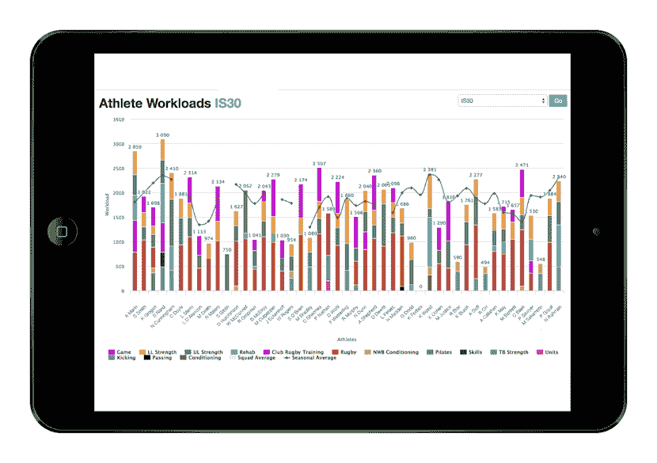

# Kitman Labs 的伤害预防技术帮助职业运动员远离板凳席

> 原文：<https://web.archive.org/web/https://techcrunch.com/2015/09/30/injury-prevention-tech-from-kitman-labs-helps-pro-athletes-stay-off-the-bench/>

上个赛季，当科比因肩袖撕裂而无限期坐在板凳上时，洛杉矶湖人队支付了他 2350 万美元。仅去年一年，受伤球员的薪水就让职业运动队损失了 5 亿美元，而这只是其中的一小部分。

为了让更多的球员留在首发阵容中， [NFL](https://web.archive.org/web/20230316062424/http://espn.go.com/nfl/story/_/id/13665228/miami-dolphins-aim-prevent-injuries-futuristic-sports-performance-program-nfl) ， [MLB](https://web.archive.org/web/20230316062424/http://espn.go.com/mlb/story/_/id/12551008/losangeles-dodgers-kitman-labs-pioneering-injury-prevention-program) 和 NBA 球队越来越多地转向 [Kitman Labs](https://web.archive.org/web/20230316062424/http://kitmanlabs.com/) 。这家总部位于门洛帕克的初创公司正在利用数据分析来防止受伤，这除了成本高得离谱之外，还可能意味着赢得和输掉 NBA 总决赛或世界职业棒球大赛的区别。

Kitman Labs 由斯蒂芬·史密斯(Stephen Smith)创建，他是一名前爱尔兰橄榄球首席教练，在为其关于运动员受伤风险因素的硕士论文进行试验时遇到了一些障碍。

“三年来，我们收集了近 100 种运动员受伤的前兆，如压力、疲劳、睡眠时间和接触某些活动，发现没有相关性，”史密斯说。“人类太独特了，没有一个特定的阈值或特定的变量会增加每个人的受伤率。”

因此，史密斯开始建立一个人工智能层，可以将他收集的数据应用到每个运动员的个人基础上。史密斯说，这种方法效果更好:第一支使用该平台的职业橄榄球队在两年的时间里减少了 30%以上的伤害，增加了 10%的球员。

为了评估运动员的健康和受伤情况，Kitman Labs 从各种来源获取数据。或许最具革命性的是这家初创公司的 3D 视频筛选工具，名为 Capture，它可以在没有任何可穿戴设备或传感器的帮助下扫描运动员的运动。

使用带有红外光的摄像机，Capture 能够以生物力学实验室的准确度识别运动员的关节。虽然实验室需要大约 30 分钟的准备时间和 30 分钟的测试时间，但是，Capture 可以放在背包里，在 30 秒钟内测试一名运动员。

当您站在 Surface Pro 平板电脑前时，电脑会指示您跳跃。从这个单独的练习中，Capture 收集并处理了 16000 个数据点，以吐出一系列图表来展示运动范围、重量分布、平衡和力量。

“这是体育界最大的游戏改变者之一，”史密斯说。“现在我们可以量化正在发生的事情，而不是根据运动员告诉我们的情况来告诉他们是好是坏。”

除了 Capture 收集的结果外，还会提示运动员在 Kitman Labs 应用程序中输入关于其感知的睡眠质量、食欲、疼痛程度和心理健康状况的反馈。他们还可以集成第三方数据源，包括全球定位系统跟踪器、心率变异性监视器和力板传感器。

队医可以输入每位运动员的体检结果，教练可以输入个人和团队表现以及运动员日程安排的信息。

Kitman 的分析平台综合了所有这些信息，并生成了关于个人运动员和整体团队健康的报告。教练可以覆盖团队的锻炼计划和输赢记录，寻找练习强度、运动员健康和比赛中表现之间的相关性。

“这不是火箭科学，我们只是为他们提供相关信息，让他们明白当他们进行 X 活动时，会在运动员中引起这种类型的压力报告，”史密斯说。

对于职业队来说，真正了解运动员如何应对压力的竞争优势是显而易见的。事实上，显而易见的是，许多使用 Kitman 平台的专业团队都不愿意公开姓名。

然而，转变职业体育产业只是史密斯对 Kitman Labs 长期愿景的第一个目标。

“没有更好的数据集来证明这一概念，因为没有人比职业运动员更受关注，”史密斯说。“但我们相信这是人类的优化，无论你是消防员还是在谷歌工作。”

*脸书图片:Flickr | [基思·艾利森](https://web.archive.org/web/20230316062424/https://www.flickr.com/photos/keithallison/5262427419/in/photolist-922jke-8fpo2g-8bjrf7-8fsCUN-8fpnqa-8fpn1B-8fpnwD-8fpnTc-q1hfuA-q1hjkw-v4FabF-q1g1cS-77JvQe-pkPfYj-4waoqT-4wauYx-4weCaS-b3ViA4-6VQxan-4JWuyu-8fsCLu-5EFAsr-bordco-7f5yKD-ed8aze-33iWtV-33otNo-bBkXiX-33iWpB-33iWhR-33iWaP-33iWfz-33otx1-4JWGib-gS2Vz9-gS3qP8-gS3F14-gS2RCv-gS2C73-gS3xsZ-gS2GGJ-gS3z5M-gS2Djw-gS3AzF-gS2Fhw-gS2DDm-vJ3NLg-4JRUep-qhKx3E-4JWagJ/)*