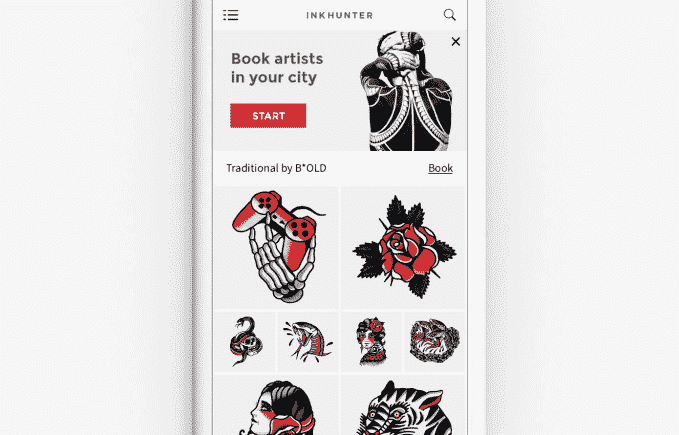

# InkHunter 前往 YC 建立一个先试后买的纹身市场

> 原文：<https://web.archive.org/web/https://techcrunch.com/2018/07/18/inkhunter-heads-to-yc-to-build-a-try-and-buy-tattoo-marketplace/>

[InkHunter](https://web.archive.org/web/20230224135429/http://inkhunter.tattoo/) 是一款增强现实纹身试穿应用，诞生于 2014 年完全温和的日子里的 48 小时黑客马拉松，在 Y Combinator 的 2018 年夏季批次中获得了一席之地，为自己赢得了种子加速器的标准 12 万美元交易，换取了 7%的股权。

我们第一次报道 InkHunter 是在 2016 年 4 月，当时 ink hunter 刚刚在 iOS 上发布了一个 MVP，并且正在考虑为纹身艺术家建立一个市场。几个月后，下载量达到 250 万次，InkHunter [发布了它的安卓应用](https://web.archive.org/web/20230224135429/https://techcrunch.com/2016/10/05/inkhunters-ar-tattoo-app-exits-beta-on-android-as-startup-looks-to-wider-b2b-play/)，在 2016 年夏天，它在纽约经历了[时代](https://web.archive.org/web/20230224135429/http://eranyc.com/)加速器项目。

当时，该团队正在考虑 B2B 商业模式支点，基于将他们的核心 AR 技术授权给电子商务应用程序和其他开发者。尽管他们想让纹身试戴应用继续作为一个展示平台。

一晃两年过去了，在 InkHunter 的应用程序在纹身社区获得足够的牵引力后，该团队恢复了他们的市场想法——已经拥有 800 万用户——所以他们搬到了山景城，并回到了购买纹身应用程序之前先试一下的最初概念，使用 AR 来推动当地纹身艺术家的预订。

“根据我们从用户那里获得的反馈，我们专注于从‘尝试’到‘尝试并购买’体验的迭代。这是我们 YC 项目的目标，该项目非常注重增长和用户互动，”CTO Pavlo Razumovskyi 告诉我们。

“上次我们谈过，我们没想到纹身市场会有这样的接受度。但当我们看到纹身社区的使用和反馈非常强劲时，我们决定加倍关注这些受众。”

新增加的预订选项在现阶段很大程度上是一个 MVP——ink hunter 使用一个 Typeform 界面，要求用户通过预订请求输入他们的详细信息，以便稍后通过短信联系，并提供有关当地纹身艺术家的信息(从美国市场开始)。

但该团队希望 YC 项目有助于磨练他们的方法。

Razumovskyi 证实，他们已经开始在美国提供预订请求礼宾服务，目前还没有任何纹身师加入计划中的市场，他们只是挑选当地的纹身师来帮助用户预订。

“虽然这种方法不可扩展，但它有助于我们找出问题并快速迭代解决方案，”他补充道。“我们几乎完成了这一阶段，即将在选定的地点推出纹身艺术家的应用内搜索，只列出拥有大量作品的授权艺术家。”

InkHunter 表示，近一半(45%)的用户表示希望在未来几个月内纹身，而在礼宾功能的第一周，该公司就收到了 500 多份预订请求。

尽管你不得不怀疑用户在皮肤上尝试墨水的愿望是否也会延伸到尝试不同纹身师的愿望——或者是否许多常规纹身师可能不喜欢坚持使用他们已经认识和信任的纹身师，以及他们喜欢的风格。(这种情况可能不需要应用程序坐在中间接受重复预订。)

InkHunter 渴望纹身的用户的首席执行官 Oleksandra Rohachova 说:“我们希望帮助他们尽可能少地后悔。”因此，该团队可能也会仔细审查他们在市场上列出的纹身艺术家。

该应用程序的主要功能是让用户浏览数千种纹身设计，并使用其核心的 AR 功能虚拟试戴它们——这需要人们洒一点现实世界的墨水，通过在他们想要纹身的皮肤上留下几个钢笔标记来锚定虚拟设计。作为 AR go 的用例，这是一个非常令人愉快的例子。

InkHunter 还支持拍照和分享照片——将朋友的意见纳入你的隆皮决定，并帮助该应用程序的声誉传播。

该团队希望建立应用程序业务的下一阶段是，一旦 InkHunter 用户决定了他们的下一个 tat 的设计和放置，他们就会对依赖该应用程序来寻找和预订艺术家感到舒适。下一次，也是为了他们的下一个纹身。