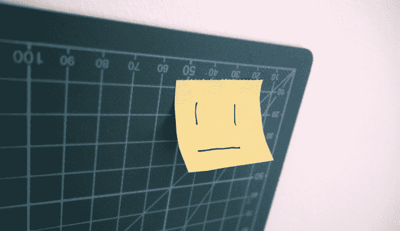

# InkHunter 的 AR tattoo 应用退出 Android 测试版，因为初创公司着眼于更广泛的 B2B 应用 

> 原文：<https://web.archive.org/web/https://techcrunch.com/2016/10/05/inkhunters-ar-tattoo-app-exits-beta-on-android-as-startup-looks-to-wider-b2b-play/>

TC 于 4 月 3 日在[推出了一款名为](https://web.archive.org/web/20221226041640/https://techcrunch.com/2016/04/06/inkhunter-is-an-ar-app-for-trying-tattoos-before-you-ink-indelibly/) [InkHunter](https://web.archive.org/web/20221226041640/https://www.crunchbase.com/organization/inkhunter#/entity) 的有趣的增强现实纹身应用，该应用背后的初创公司今天发布了其[安卓应用](https://web.archive.org/web/20221226041640/https://play.google.com/store/apps/details?id=tattoo.inkhunter)，该应用在 iOS 上的下载量已达到约 250 万次。

他们一直在 Android 上进行测试，因为他们努力确保他们的 AR 技术可以处理一系列硬件和较慢的 Android 设备，但现在正式推出。

该团队还在充实其不断发展的商业模式，在纽约的[时代](https://web.archive.org/web/20221226041640/http://eranyc.com/)加速器度过了一个夏天，从乌克兰搬到了美国。

他们的应用程序创意始于 2014 年年中 48 小时黑客马拉松中的一个项目，但这家初创公司现在正寻求超越虚拟尝试纹身的应用程序——着眼于 B2B 游戏，计划向电子商务和游戏应用程序制造商授权他们的核心增强现实技术。

因此，他们现在不是专注于为纹身艺术家建立一个市场，而是为其他开发者开发一个 SDK，这些开发者特别需要在自己的应用和服务中实现 ar 驱动的产品可视化。

该团队打算继续开发他们的 InkHunter 消费者纹身应用程序，尽管主要是作为 AR 技术的展示。首席执行官 Oleksandra Rohachova 还表示，他们正在寻求与品牌合作，在应用程序中开发品牌纹身活动——主要是为了“社交分享”的潜力，而不是鼓励人们认真地在自己身上纹上公司的标志([尽管人们当然会这样做](https://web.archive.org/web/20221226041640/http://i.telegraph.co.uk/multimedia/archive/01392/nike_1392160i.jpg)……)。

“我们将在年底推出几项活动，”她告诉 TechCrunch。

当谈到他们通过 SDK 进行授权的计划时，他们希望在与选定的合作伙伴进行首次测试后，在大约一年的时间内向所有人推出，并计划在今年开始。

首席技术官帕夫洛·拉祖莫夫斯基(Pavlo Razumovskyi)认为，对于钢笔和墨水驱动的虚拟试衣来说，可能有意义的许可用例是手表和珠宝等配件。InkHunter 的 AR 要求用户在自己想要虚拟尝试的地方用墨水画三条直线——比如纹身——其算法使用这些直线来锚定结果并正确缩放。

Razumovskyi 提到的另一个可能的用例是可视化房间中的大型家具或电子产品。对于这种情况，他建议用户可以使用便利贴放置在房间中他们想要新沙发/电视/桌子等的正确位置，而不是用户在他们的皮肤上绘画来正确固定 AR。

“现在，如果你想在你的应用中尝试增强现实，有两种方法。第一个基本上是一些打印的标记——所以你需要打印一些东西，或者购买一些东西，或者得到一些应用程序可以识别的东西。这使得它几乎不可能传播给很多人，”他说。“我不知道任何基于一些印刷材料的 AR 成功的 B2C 例子。

“也有不使用任何标记的技术。Pokémon Go 用的。但是它们容易移动，而且不太稳定。因此，当我们开发纹身应用程序时，我们想出了如何制作稳定而不是不稳定的 AR——具有在用户中传播的能力。而我们的秘制酱就是这三条线。

“人们可以用任何种类的笔在任何表面上画出这些标记。不同的形状，应用程序仍然可以识别。并能给出一个稳定的结局画面——就像纹身一样。”

现在你知道了:一家科技初创公司认为自己的秘方是老式的钢笔和墨水……谁说纸已经死了？

该团队刚刚结束 ERA 的演示日，Rohachova 表示，由于成本原因，他们计划留在纽约，同时将一些开发人员留在乌克兰。目前，他们已经通过加速器项目从 ERA 获得了 4 万美元的资金，但计划今年开始培育种子。