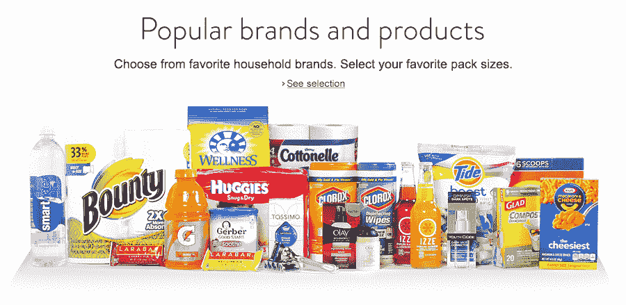
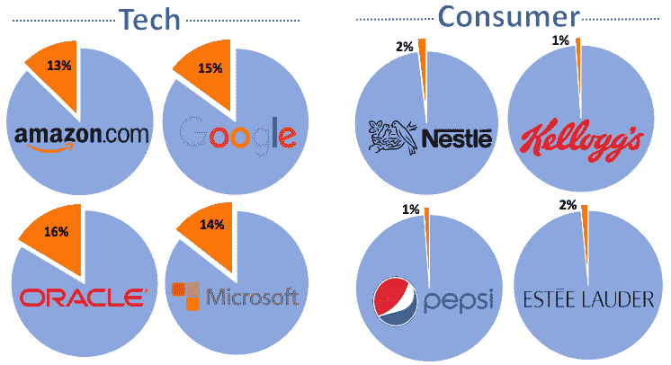
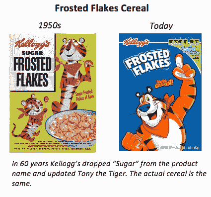
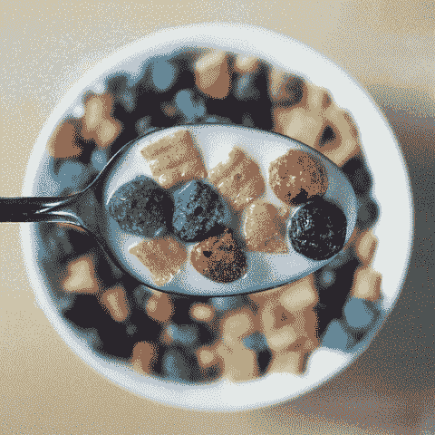

# 为了赢回消费者，大品牌应该投资 R&D 和创新技术

> 原文：<https://web.archive.org/web/https://techcrunch.com/2018/04/23/innovation-can-help-old-consumer-brands-win-customers-and-influence-people/>

莱恩·考德贝克撰稿人

[Ryan Caldbeck](https://web.archive.org/web/20221207223329/https://www.linkedin.com/in/ryancaldbeck)

是消费者和零售投资市场的创始人和首席执行官

[CircleUp](https://web.archive.org/web/20221207223329/https://circleup.com/)

.

More posts by this contributor

商品消费的世界正在发生变化。消费者的口味变得越来越分散，大公司的市场份额继续被新兴品牌夺走。这些现任者通常很难想出如何应对。CPG 充满了聪明的人，但许多最大的品牌已经看到他们的销售在过去几年中停滞或下降。

消费品公司可以通过增加收入或削减成本来增加利润和实现股东价值，但这些公司试图扭转局面的策略并没有奏效。当他们创新时，他们只对产品进行增量改变(比如减少薯片的脂肪)，而不是为消费者提供他们真正想要的新产品。

或者他们花费数十亿美元做广告来说服消费者购买现有产品。如果他们不能增加收入，他们将通过剥离有价值的业务团队或与其他消费公司合并来削减成本，从而削减支出。这些战略没有将大 CPG 定位于长期成功；我想推荐几个可能的。

在我深入研究之前，我想先说我没有所有的答案(甚至大部分)。我是一家拥有 65 名员工的初创公司的首席执行官，而不是一家拥有 3 万名员工的大公司。我希望分享的见解是从十多年从事消费投资和帮助消费公司成长的工作中收集的，但它们最终都是从外部观察的见解。

把“家乐氏”换成百事、雅诗兰黛、雀巢、卡夫-亨氏或无数其他大品牌的名字，观察结果仍然会引起共鸣。这不仅仅是一家公司的问题，而是几乎所有 CPG 公司都存在的问题。

## 我会有什么不同的做法

在担任凯洛格首席执行官的第一天，我会认真照照镜子，问自己凯洛格的哪些品牌仍然相关，可以增长。我最近与一家大型 CPG 公司的前副总裁进行了一次谈话，他说，大 CPG 认为，如果他们带来正确的消息，一切都可以是相关的，这是有罪的。我同意。作为首席执行官，我会坦率地承认，我们有一些品牌和产品现在是摇钱树，但正在慢慢死去。

一个不舒服但积极主动的步骤是卖掉正在死去的传统摇钱树，将这笔意外之财投资于创新。本周，我与一位在《财富》100 强消费品公司工作了 20 年的资深人士进行了另一次讨论，他说:“我认为 10 年后我们的公司将不复存在。会被打散的。”关于销售传统品牌的对话会让许多消费者高管不安，但这是需要进行的对话。砍掉奄奄一息的摇钱树是最难的，但可能是最重要的一步。

在决定剥离哪些传统品牌后，我的下一步将是公开宣布，我们将把重点从削减成本转移到投资创新文化，以实际发展业务。这可能会导致我们的股票价格在短期内下跌，但从中长期来看，这将极大地帮助我们的公司。

简单来说，我们不可能永远靠削减成本来生存。我们需要成长。我们的创新文化将以多种方式构建和推广。接下来的不是一个顺序列表，而是应该并行执行的计划。

**1)研发。**我们将向华尔街发出信号，我们将专注于增长和创新，而不是削减成本。我们将重新审视研发流程和管道，我们将敢于有更大的梦想。2017 年，凯洛格在研发上花费了 1.48 亿美元(净收入的 1.1%)，这乍听起来似乎很多，但相比之下，谷歌同期在研发上花费了 166 亿美元(净收入的 15%)。在这方面，科技和消费者支出之间的二分法在下图中得到了强调。

**研发支出占年度净收入的百分比**

来源:2017 年公司 10-Ks

难怪其中一家公司 60 多年来一直以同样的方式生产磨砂片(大部分时间都在为[做愚蠢的电视广告](https://web.archive.org/web/20221207223329/https://www.youtube.com/watch?v=f6sw39pPrr8))，而另一家公司最初是搜索引擎，现在生产手机、地图和无人驾驶汽车。想象一下，一家科技公司连续五年销售同样的产品是多么滑稽，更别说 50 年了。研发不仅仅是想出一种新口味或降低现有产品的脂肪含量。

正如一位 CPG 资深人士最近告诉我的那样，“消费者不再关心‘更白的白人’。”它包括建立一个适应性的基础设施，真正倾听消费者想要什么，然后以一种允许他们敏捷和有效的方式将信息传递给开发团队。我们需要一个专注于品类和消费者，而不是产品的 R&D 团队。百事可乐不应该考虑低脂肪薯片，他们需要重新思考整个零食类别。

为什么想象百威英博开发一种不会引起宿醉的啤酒是疯狂的，但想象埃隆马斯克把人送上火星不是疯狂的？为什么 Clorox 投资 10 亿美元开发无毒、安全的漂白剂替代品是可笑的，但想象一下向优步投资 150 亿美元是正常的——这家公司正试图取代世界上所有的出租车，并重新思考交通运输。这些评论旨在推动 CPG 首席执行官上市，而不是贬低 SpaceX 或优步。

好的 R&D 还包括留意可能已经存在的好主意。印度可能会出现一种牙膏，它将彻底改变我们对美国牙膏的看法，但如果我们不听，我们永远不会知道。如果没有 R&D 的基础设施会发生什么，看看制药业就知道了。在制药业，大型制药公司现在不得不付钱外包创新，因为它们无法在内部培养创新。CPG 正在成为大型制药公司。

**②孵化。**除了投资大型消费品公司并与之合作，我们还将提供内部空间和专业知识来帮助它们成长。凯洛格最近与康尼格拉品牌和芝加哥市合作，投资 3400 万美元[的食品孵化器](https://web.archive.org/web/20221207223329/https://www.fooddive.com/news/why-conagra-and-kellogg-invested-in-a-34m-startup-incubator-in-chicago/509762/)，预计将支持大约 75 家公司，其中 80%属于零食类。这无疑是朝着正确方向迈出的一步，但我希望我们扩大规模，在内部进行操作。我想每年从各种各样的类别中孵化 100+家公司，并成为消费者的 Y 组合者。这将是双赢。我们帮助大型消费品公司成长，这些公司可以利用我们的专业知识和基础设施。

3)风险投资。太多的 CPG 公司只投资那些品牌超过 5 年的品牌——最终支付了一大笔钱。我会改变我们的任务，投资于 10 年后会令人感兴趣的公司，而不仅仅是我们认为会立即为我们的收入或现有产品战略做出贡献的公司。在这里，我们需要从长计议，数据起着很大的作用。凯洛格不会仅仅通过派十几个人去 T2 西三期博览会来确定创新。我们需要一个非商品化的数据和技术解决方案，它可以帮助我们通过观察他们的增长潜力，而不是他们的博览会销售摊位，尽早识别出突破性品牌。在风险投资方面，凯洛格实际上领先于大多数 CpG，因为他们有一个 1 亿美元的风险投资部门。但是这个还是太小了。

首先，我会让我们的风险投资部门管理 5 亿美元的资产(不到净收入的 4%，但仍是许多 CPG 企业风险投资部门的 50 倍)，并告诉他们，他们将投资 200-300 家公司，在未来 2-4 年内专注于收入低于 1000 万美元的早期公司。如果这听起来很疯狂，看看谷歌的 [GV](https://web.archive.org/web/20221207223329/https://www.gv.com/portfolio/) 可以得到一些灵感。他们建立了一个多样化的投资组合，从许多、有时是意想不到的角度来促进创新。如果科技风投可以拥有数百家公司的投资组合，我们也可以。消费者领域的风险投资并不新鲜。许多大型消费品公司已经成立了风险投资部门，但大多数消费者风险投资公司仅计划在三到四家公司之间投资约 500 万至 1000 万美元。然后，首席执行官失去了勇气，屈服于短期成本削减的压力，放弃了战略。我们将敢于从长计议。

除了资本，我还会创建一个结构，为这些公司提供资源和支持，帮助它们取得成功。我们将创建一个项目，允许凯洛格(可能还有我们的合作伙伴)和我们投资的投资组合公司之间的实习。几乎每个星期，我都会收到一封来自这些上市公司的品牌经理、营销人员、供应链专家或其他人的电子邮件，他们希望跳槽到较小的公司。这个见习项目将成为小品牌的资产，同时也是留住人才的工具，为凯洛格带来创新。

**4) M & A.** 我不反对 M & A，但我反对 M & A 的唯一目的是剥离成本，作为传递长期股东价值的策略。我的信念是，10 年后许多消费类公司现有核心产品的营收将比现在小得多。这些产品不会被一两个新产品取代，它们会被数百个——或数千个产品取代。这就是消费者的[细分](https://web.archive.org/web/20221207223329/https://www.morganstanley.com/ideas/big-brand-disruption)，或者我们过去所说的消费者个性化。大的 CPG 可以购买这些产品(在早期阶段)或者输给他们。我希望我们的公司能够吸收更多的小品牌，而不是在这些品牌已经很大的时候，花费数亿(或数十亿)美元。我们还需要投资必要的基础设施，以便与更多品牌合作，并从它们的增长中获益。这些品牌将加入凯洛格家族，而不是威胁它。

合伙企业和合资企业。在消费领域，你不时会听说合资企业或合伙企业，但这种情况并不多见。为什么？我认为很多时候，大型消费品公司担心与另一家公司合作将意味着利润分成，这可能会对底线产生负面影响。这不是一种富有成效的态度。你可以在几乎所有其他行业看到成功合作的例子——无论是谷歌[与沃尔玛](https://web.archive.org/web/20221207223329/https://www.nytimes.com/2017/08/23/technology/google-walmart-e-commerce-partnership.html)合作，在谷歌快递上提供沃尔玛的产品，还是克莱斯勒[与 Waymo 合作开发无人驾驶汽车，与各种利益相关者合作往往有助于培养最佳创新。我还认为，与其它消费品公司合作，促进教育行业本身的发展，是一个巨大的机遇。我们可以举办会议，将最好的消费者企业家和最聪明的想法聚集在一起，我们都会从中受益。](https://web.archive.org/web/20221207223329/https://www.ft.com/content/fd96456a-fc2b-11e7-9b32-d7d59aace167)

## 为什么这很重要

如果我作为首席执行官的计划得到有效实施，我认为我们会看到三个强大的影响。首先，通过在更多新兴品牌上下更多小赌注，建立创新文化，凯洛格将成为消费品领域的主导者。他们将不再害怕流离失所。他们将是制造和利用混乱的人。其次，这一路线图将确保最好的产品送到消费者手中，确保每个人都能获得更多种类的食品和更健康的选择。最后，通过建立这种基础设施，凯洛格将能够在分销、品牌、供应链和团队方面为企业家提供帮助。随着这些公司的成长和成功，这也将增加股东的价值。消费者是一个极其低效的市场，但凯洛格可以成为帮助改变这种状况的上市公司。

再说一遍，我很容易提出这样的策略。当你站在内部向外看的时候，要实现它们要困难得多。我认为，许多大的 CPG 首席执行官可能确实有大胆的想法，从长远来看，这些想法将有助于他们的公司，他们只是无法在一个专注于短期的环境中实现这些想法——一个要求立即削减成本的董事会和一个要求立即实现股票价值的市场。

因此，当整艘船正在下沉时，这些首席执行官们被束缚住手脚，不得不在泰坦尼克号的甲板上重新摆放椅子。他们担心，如果他们竭尽全力去拯救这艘船，他们不会坚持太久。盖茨、马斯克和贝佐斯可以自由地发挥远见卓识，将他们的公司推向创新的前沿，而凯洛格的首席执行官卡希尔、卡夫食品的首席执行官赫斯和可口可乐的首席执行官昆西则必须在他们被放入的盒子里工作。我真心希望大型消费品公司开始创新，变得有创造力，倾听消费者的需求——公司董事会和华尔街将意识到这些东西的长期价值。如果这个行业不发展，你永远不知道，谷歌可能会介入下一个大的早餐麦片。