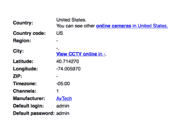

# Insecam 展示来自世界各地的不安全网络摄像头 

> 原文：<https://web.archive.org/web/https://techcrunch.com/2014/11/07/insecam-displays-insecure-webcams-from-around-the-world/>

# Insecam 显示来自世界各地的不安全的网络摄像头

一个名为 [Insecam](https://web.archive.org/web/20221209135536/http://insecam.com/) 的奇怪网站声称展示了来自世界各地的 73，000 个不安全的网络摄像头，其中大多数是闭路电视和简单的 IP 摄像头。所有的摄像头都有两个共同点——它们通过可公开访问的网络端口进行传输，并且仍然使用默认密码，因此任何拥有网络爬行机器人和必要资源的人都可以输入 admin/admin 来访问该流。

该网站按照型号和位置对摄像头进行了分类，大多数摄像头都是由 Foscam 和松下等主要制造商制造的标准 IP 摄像头(或摄像头库)。这些[“未修补”相机列表](https://web.archive.org/web/20221209135536/http://www.networkworld.com/article/2223785/microsoft-subnet/unpatched-trendnet-ip-cameras-still-provide-a-real-time-peeping-tom-paradise.html)已经存在多年，但这是第一个在[主板](https://web.archive.org/web/20221209135536/http://motherboard.vice.com/read/this-website-streams-camera-footage-from-users-who-didnt-change-their-password)脱颖而出后获得全球关注的聚合器。

当你参观这个地方时，你会看到什么？恐怕不多。我相信全世界的关注已经开始拆除服务，大部分的饲料都死了。然而，正如网络世界指出的那样，许多 Foscam 品牌的相机被用作婴儿相机，这一事实应该让家长们三思。如果你离开首页，开始观看更远处的摄像机，你可以看到一些直播摄像机，但大多数视频流是死的。

创建者是一位匿名管理员，似乎在俄罗斯提供这项服务，他写道:

Sometimes 管理员(可能你也是)忘记更改安全监控系统、在线摄像机或 DVR 的默认密码，如“admin:admin”或“admin:12345”。所有互联网用户都可以使用这种在线摄像头。在这里，你可以看到数以千计的这种相机分布在世界各国的咖啡馆、商店、商场、工业物品和卧室里。要浏览相机，只需选择国家或相机类型。本网站旨在展示安全设置的重要性。要从该网站删除您的公共摄像机并将其设为私有，您唯一需要做的就是更改您的摄像机密码。

网络摄像头没有理由使用弱密码公开流式传输。虽然您的 it 人员可能更容易使用标准的 admin/12345 组合来设置您的八路闭路电视，但很明显，任何有一点技能的人都可以并将利用您的慷慨。当数据公开时，这不是计算机犯罪，我们不应该欢迎侵犯隐私，因为我们懒得阅读手册。