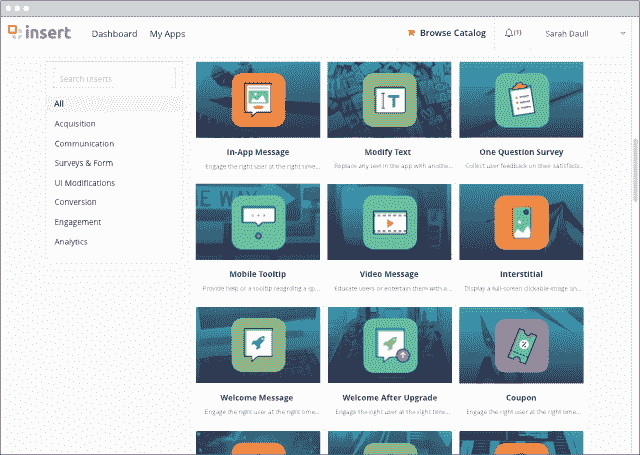

# 应用内营销初创企业 Insert 筹资 1000 万美元 

> 原文：<https://web.archive.org/web/https://techcrunch.com/2016/08/04/insert-series-a/>

# 应用内营销初创企业 Insert 筹资 1000 万美元

[插入](https://web.archive.org/web/20221025222856/http://www.insert.io/)是来自应用程序开发公司 Worklight(被 IBM 以 7000 万美元收购的[)背后团队的新创业公司。今天，它宣布已经筹集了 1000 万美元的首轮融资。](https://web.archive.org/web/20221025222856/https://beta.techcrunch.com/2012/01/31/ibm-buys-html5-app-development-company-worklight-to-expand-mobile-enterprise-services/)

Insert 首席执行官沙哈尔·卡米尼茨表示，Worklight(他是该公司的创始人和前首席执行官)专注于“应用程序的核心开发”，他逐渐意识到应用程序的非核心部分应该分离出来，并让营销人员和产品设计师可以访问。

“我想让他们能够独立地向应用程序添加功能，而无需任何开发人员的参与，”Kaminitz 说。“他们应该能够实际执行他们的想法。这就是 Insert 的意义所在。”

这似乎与一个[常见的](https://web.archive.org/web/20221025222856/https://beta.techcrunch.com/2015/07/27/mixpanel-codeless-analytics/) [主题](https://web.archive.org/web/20221025222856/https://beta.techcrunch.com/2015/06/17/optimizely-personalization/)相联系，即给予营销人员更多的权力，在没有开发商帮助的情况下采取行动。就 Insert 而言，Kaminitz 解释说，如果你是零售商，你不会将该平台用于“你的应用程序的核心、独特功能”(如你的购物车)，但你可以使用它来添加演示视频、调查或图形等内容，突出应用程序中的某些功能。

这些功能可以通过 Insert 的可视化编辑器添加，无需编码，也不需要任何应用商店更新或批准。

Insert 于 2 月份推出，已经被巴克莱银行用来改进其移动银行应用程序。事实上，Kaminitz 说他发现“公司越大，问题越大”——因为大公司有更长、更复杂的开发周期。

新的资金来自 Battery Ventures，Battery 的 Itzik Parnafes 加入了 Insert board。Kaminitz 表示，除其他外，这将使该公司(总部位于特拉维夫)扩大其在美国的业务，并在纽约市开设一个办事处。