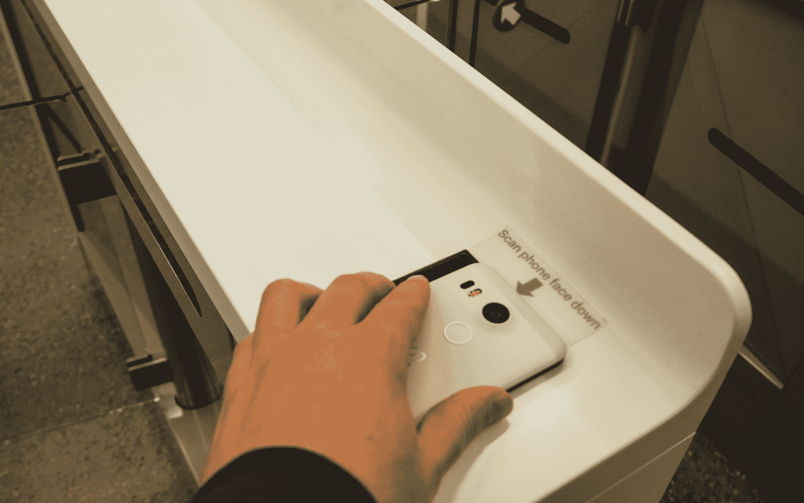

# 在亚马逊的监控驱动的免结账便利店

> 原文：<https://web.archive.org/web/https://techcrunch.com/2018/01/21/inside-amazons-surveillance-powered-no-checkout-convenience-store/>

到目前为止，许多人都已经听说了亚马逊最大胆的尝试——无现金、无收银员的 Go 商店。走进去，拿上你想要的，然后走出去。最近，我有机会这样做，并向它的首席设计师之一请教。(这家商店位于西雅图市中心，现在对公众开放。)

我进去的目的是想偷点东西，抓住这些自满的亚马逊类型的人打盹。但是当我进去的时候，很明显这不是一个选项。我和亚马逊公关代表的距离从未超过一两英尺，正如项目技术副总裁迪利普·库马尔(Dilip Kumar)说服我的那样，他们已经针对系统上的这种原始攻击做好了准备。

正如你可能在宣传片中看到的那样，你通过一个大门进入商店(此前只有亚马逊员工可以进入)，当你扫描手机上的亚马逊 Go 应用程序生成的二维码时，大门就会打开。此时(嗯，实际上是你进入的那一刻，甚至可能是之前)，你的账户与你的实际存在相关联，摄像机开始跟踪你的一举一动。

许多，*许多*相机。

[gallery ids="1589027，1589028，1589038"]

我想知道亚马逊无收银员商店的想法最初是什么时候提出的，它将如何实现。天花板上、展示柜后面、基座上的摄像头？哪种？接近度和重量传感器，人脸识别？这些会在哪里整理和处理？

亚马逊的方法没有我想象的那么复杂，或者不如说不是我想象的那样。该系统主要由安装在天花板上的几十个摄像头组成，从多个角度覆盖和恢复商店的每一平方英寸。我猜在我去过的商店里可能有一百个左右，它的大小和一个普通的杂货店或加油站差不多。

 这些是普通的 RGB 相机，定制时在外壳中用电路板做一些基本的计算机视觉工作，大概是运动检测，基本的物体识别等等。

它们由独立的深度感应相机(使用飞行时间技术，或者我从 Kumar 那里了解到的)增强，这些相机像其余的一样融入背景，都是哑光黑色。

从这些摄像头捕捉到的图像被发送到中央处理器(因为缺乏更好的术语，不知道它到底是什么)，它真正的工作是快速准确地识别商店中的不同人和被拿起或拿着的物品。拿起某样东西就把它加入你的“虚拟购物车”，你可以随心所欲地把它放进手提包或购物袋里。不需要举起来让系统看到。

[gallery ids="1589031，1589029，1589033，1589035，1589030"]

这是秘制酱料，库马尔告诉我，我相信他。确定哪个穿着相似的人拿起哪个几乎相同的酸奶杯似乎是一个老生常谈的问题，但很难以所需的速度和准确度做出正确的判断，以便将整个业务建立在这个基础上。

毕竟，一个学生，有了这些天可用的资源，可能在几周内设计出这个商店的一个版本，这个版本在 80%的时间里都可以工作。但是，要在 99.9%的时间里无摩擦地、即时地把它做好，是一个需要大量工作的挑战。

值得注意的是，没有使用面部识别(我问)。亚马逊可能很早就意识到这将招致注重隐私的购物者的指责，尽管这些人来这家商店的想法在我看来不太可能。相反，该系统使用其他视觉线索和手表来保持相机之间的连续性——你永远不会看不到镜头，所以系统很容易看到购物者从一个相机移动到另一个相机，并建立联系。

如果相机出现技术问题，或者镜头沾到了酱汁，系统也不会完全瘫痪。它已经在相机丢失的情况下进行了测试，尽管很自然地，它不会在替换物到位和系统重新校准之前很长时间。

 除了摄像头，货架上还有重量传感器，系统知道每件商品的确切重量——所以不要像我考虑的那样，试图一次拿两块酸奶，然后把第二块放在手心里。你也许可以用印第安纳·琼斯的方式，用适量的沙子装在袋子里，但这比大多数商店扒手愿意付出的努力要多。

而且，正如库马尔对我说的，大多数人*不是*商店扒手，这个系统是为大多数人设计的。构建一个假设恶意而不仅仅是检测差异的系统并不总是一个好的设计选择。

错误率可能低到亚马逊都不在乎，但这并没有阻止它在运营第一天就发生在某人身上:

这种事情在普通商店经常发生，东西被错误扫描或跳过，或者直接被盗——一定数量的“损失”是可以预见的。所以偶尔的花式酸奶加减不会打破商业模式，但是对于 Amazon Go 的第一天来说并不好看。(好像是为了自我鞭笞这样的错误，亚马逊甚至没有纠正这些错误的方法，如果你设法不付钱就出去了，该公司官方并不在乎。不过，如果你改变主意或者买得太多，你可以退货。)

事实上，如果系统发现自己陷入困境，就有一个人在循环中，但库马尔说这种情况非常罕见，几乎不需要考虑。他还说，监控商店的难度不会随着面积的增加而增加，尽管你当然需要更多的摄像头和更强的处理能力。

 这也经过了严肃人群的检验；他们告诉我，我们在下午的淡季去了那里，但在午餐高峰前不久，可以发现几十人而不是几个人进进出出，除了在入口处向传感器展示他们的手机外，什么都不做。

可能没有收银员，但有工作人员:补货的配货员；在葡萄酒和啤酒区有一个身份检查员(我肯定是以前的侍酒师),后面的厨师正在做新鲜的三明治和套餐。有人还在入口区徘徊，帮助人们使用应用程序，回答问题，并收取回报。

选择主要是带走的午餐和小吃，还有回家路上在杂货店买的一些日常用品。不过，价格是你在超市而不是便利店所能预料到的。

至于亚马逊利用其现有属性和挂钩的预期策略，很少有人能找到。该应用程序是独立的，你的购买会在那里被跟踪，而不是在你的“主”亚马逊账户上。Prime 会员不会得到更低的价格。全食超市有自己的一小部分，但没有更广泛的合作关系(也没有计划将这些商店中的任何一家转变为 Go，尽管我无法想象为什么不这样做)。

总的来说，这个系统的无缝性给我留下了深刻的印象，我可以看到这些东西在各处成功地运行。

从哲学的角度来说，我当然感到困扰——你刚走出的便利店是一个友好的面具，面对一项极具争议的技术应用:无处不在的个人监控。

我认为，用一百个不间断地记录每一个微小动作的摄像头来代替收银台或自助结账台有点大材小用。有什么好处？20 或 30 秒的时间？缺乏便利几乎不是这个市场的抱怨——它就在名字里:“便利店”

就像当今许多公司应用技术的方式一样，在我看来，这似乎是大量的创造力和资源被用来“解决”一些很少有人关心、更少有人考虑的问题。作为一项技术成就，这是非凡的，但话说回来，机器狗也是如此。

这家商店很好——我只能说这么多。我不知道亚马逊会把它带到哪里，也没有人会有意义地回答我的这些问题。Amazon Go 将从本周开始向公众开放，但是否有人会发现它不仅仅是一个新奇的东西还不得而知。