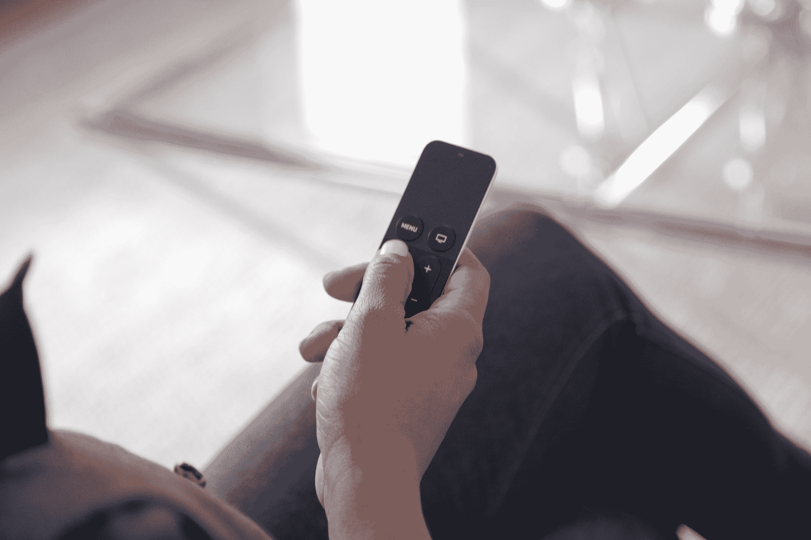

# 苹果智能家居内部 

> 原文：<https://web.archive.org/web/https://techcrunch.com/2016/11/07/inside-an-apple-smart-home/>

自从我在 1999 年看到迪士尼的[智能房屋](https://web.archive.org/web/20221025222548/http://www.imdb.com/title/tt0192618/)以来，我就梦想有一个能自我清洁并做早餐、午餐和晚餐的家。我们还没有到那一步，但是苹果的 HomeKit 和 [Home app](https://web.archive.org/web/20221025222548/https://beta.techcrunch.com/2016/09/13/apple-home/) 让我们(我)离那个梦想更近了一点。

苹果正在与亚马逊和谷歌竞争，试图让大众接受智能家居。与亚马逊和谷歌不同，苹果没有制造自己的设备——除了作为中枢的苹果电视。相反，它主要依靠第三方制造商让他们的设备与它的 HomeKit 系统兼容，然后通过 Home 应用程序与 iOS 进行深度集成，将所有这些设备联合起来。

上周，我有机会参观了位于加州阿拉米达的住宅建筑公司 Lennar 建造的终极苹果 HomeKit-wired house。整个房子里有 100 多个 HomeKit 设备，包括 Lutron Serena 智能灯罩、霍尼韦尔 Lyric Round Wi-Fi 恒温器和西勒奇感应门锁。

[gallery ids="1412842，1412843"]

苹果的 Home 应用程序旨在让你通过一个应用程序轻松控制家中所有智能、联网的产品。您可以将某些 HomeKit 设备组合在一起，以创建或编辑新场景。这样做可以让你通过一个命令来激活多个设备，无论是点击屏幕还是通过 Siri。

如上图所示，您可以看到您最喜欢的“场景”，或者您最常用的模式。场景可以是从你想让你的灯在吃晚饭的时候看起来像什么，到你想在回家的时候打开什么产品。例如，“我在家”的场景，打开你的门，打开灯，让恒温器启动。

Apple TV 可以作为 HomeKit hub，让你远程访问你的家，做一些事情，如关闭车库门和查看门口的摄像头。为了确保完全的隐私和安全，苹果要求在所有 HomeKit 认证的设备中进行下一级加密，并对设备进行物理访问以进行设置。

不过，我在家的经历很简单——在我到达之前，苹果已经确保所有的设备和场景都已经设置好了。如果我完全靠自己来做，我不会安装超过 100 个设备，因为我没有一栋两层楼的房子。我住在一个三居室的公寓里，我甚至还没有租到它，所以我不能在这个空间里为所欲为。然而，我可以做一些事情。

苹果给我指了一个我称之为智能家居入门套件的东西。这是一个[智能插头](https://web.archive.org/web/20221025222548/https://www.amazon.com/iHome-iSP5-Wi-Fi-SmartPlug-Seamlessly/dp/B010ACFEI0)，让你从你的家庭应用程序控制灯、加热器、风扇和其他设备。需要明确的是，iHome 智能插头还兼容 Nest、亚马逊 Alexa 和 Smart Things。观看页面顶部的视频，一窥生活在苹果版智能家居中的感受。