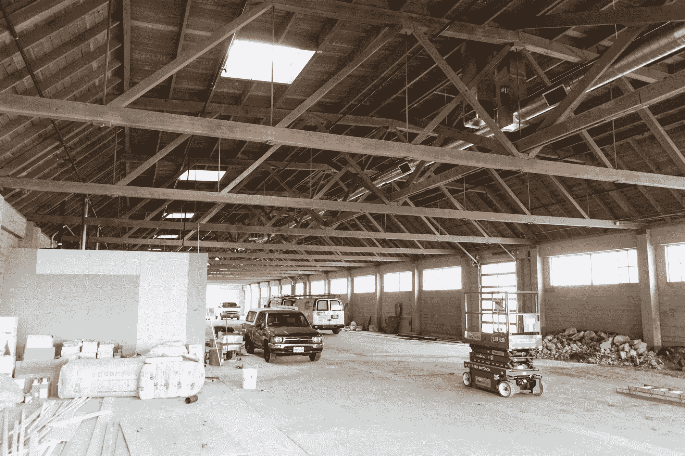
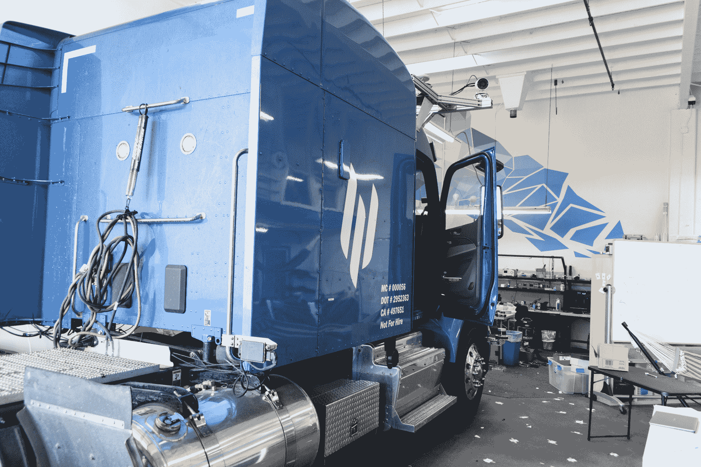

# Inside Embark 的使命是让无人驾驶卡车成为现实

> 原文：<https://web.archive.org/web/https://techcrunch.com/2017/09/20/inside-embarks-mission-to-make-autonomous-trucking-a-reality/>

自动货运是一个越来越多的公司争夺人才和资金的领域，但新来者 [Embark](https://web.archive.org/web/20230406133708/http://embarktrucks.com/) 在资金、人才获取、产品开发等方面表现抢眼。

这家初创公司由首席执行官亚历克斯·罗德里格斯(Alex Rodrigues)和首席技术官布兰登·莫克(Brandon Moak)于 2016 年创立，目前仍非常年轻。然而，罗德里格斯和莫克已经研究自动驾驶技术很长时间了——他们在滑铁卢大学上学时一起研究自动驾驶，两人都获得了机电一体化工程学位。然而，一次路边事故促使他们特别关注卡车运输。

“关键时刻是我们正前往我们的一个演示，我们被困在路边——它爆了一个轮胎，”罗德里格斯在采访中解释道。“我们被困在这里以南两个半小时的地方，不得不等了五个小时的拖车。那是我真正看到卡车运输业的地方。我开始数，每五秒钟就有一辆卡车经过，他们都说‘招聘司机’"

Embark 此后通过三轮融资筹集了 1722 万美元，投资者包括 Data Collective(其最大投资者)、SV Angel、Y Combinator 和 Maven Ventures。该团队正在快速增长，计划很快从 17 名员工增加到 60 名员工，这家自动货运初创公司也正在翻新其新空间，这是一个大型仓库，曾经存放旧金山巨人的商品，但现在将容纳最多五六辆配备 Embark 自动驾驶技术的开发卡车。

罗德里格斯带我参观了这个 15000 平方英尺的新空间，它还没有完全完工，但正在成形，搬进去的日期有望定在 10 月。它大部分是开放式的地板，天花板很高，后面还有一个装卸坡道，供卡车进出。将会有几个会议室和电话室，但大部分都将保持开放的概念。

我还参观了 Embark 现在的总部，它位于贝尔蒙特的硅谷。这是一个更加拥挤的事情，只有一个空间的彼得比尔特半卡车，没有拖车。他们确实有第二辆更新的卡车停在隔壁的空地上，这辆卡车是他们从邻居那里租来的，通过在隔墙上凿一个简陋的洞连接起来。

除了占用大量空间的卡车空间之外，目前的登船空间已经所剩无几。一张桌子和一间午餐室占据了车库地板的其余部分，二楼有两间工程师办公室。后院提供了共享烧烤和蹦床。

然而，Embark 在它短暂的存在中做了很多事，但收效甚微；今天，该团队发布了上面的视频，该视频加速了两个小时的连续自动公路驾驶，而没有一次手动接管。这是该公司的一项新记录，不仅具有单车道自动驾驶功能，还具有变道、高速公路转移等功能，速度高达 55 英里/小时(当然是法律限制)。

【YouTube https://www.youtube.com/watch?v=5pYWhBQ7N4E]

我乘坐了 Embark 的第一辆 Peterbilt 卡车，它装载了一套传感器，包括威力登激光雷达，光学相机和雷达阵列。在驾驶室内，没有太多迹象表明卡车具有自主能力。当然，还有踏板和方向盘，后面的沙发床也还在。

然而，在床的下面，有大量的计算能力——一系列 Nvidia GPUs 和其他组件，它们是自动驾驶卡车的大脑。Embark 在卡车上完成所有处理工作，包括传感器融合和路线图绘制。

一名工程师可以坐在后面，实时监控传来的实时数据，而安全驾驶员则把手放在方向盘上，随时准备在必要时接管。安全驾驶员还可以手动驾驶卡车进出高速公路(驾驶员的手必须一直放在方向盘上，因为 Embark 的技术在加州机动车辆管理局的眼中符合 SAE 级自动驾驶的标准)。

对于 Embark 来说，连续 100 英里的自动驾驶是一个巨大的里程碑，特别是在驾驶复杂的情况下，这还包括首次在镜头中出现的自动驾驶卡车，它可以处理多次变道、高速公路转移和没有明确标记的导航车道。

为了进入市场，Embark 需要走更多的路，Rodrigues 说他们每次完成新的测试都会学到很多东西，并做出很多改变。Embark 目前的重点是高速公路驾驶，它希望这能帮助它比竞争对手走得更快。

卡车运输行业面临的主要挑战是缺乏专门从事长途运输的人才。罗德里格斯告诉我，工作并不短缺，但年轻一代不想处理长时间和大量时间远离家庭和家人的长途工作。

[gallery ids="1545060，1545061，1545063，1545064，1545066"]

“卡车运输处于一个非常独特的位置，你有商业需求，也有很少有人知道的人口需求，”他说。“基本上，随着 50-65 岁人群的退休，卡车运输将在未来 15 年内失去大部分劳动力。没有人来填补这一空白，因为长途货运对年轻一代没有吸引力。我们能够解决人口问题，同时提高生产率。”

Embark 希望通过使长距离公路驾驶完全自动化，并在旅程的开始和结束时使用短途司机来解决这一问题。短途司机更容易找到，因为他们不需要花几周时间在路上，也不需要长时间呆在卡车驾驶室里。

“通过这样做，你能够创造更多年轻一代真正想要的高薪本地工作，”罗德里格斯指出。

罗德里格斯告诉我，他希望这项技术能在下一个十年开始时投入商业使用。然而，他没有谈论任何具体的时间表或日期，并对任何在技术发展的早期阶段这样做的人保持谨慎。

Embark 的最新卡车是另一辆彼得比尔特卡车，该卡车制造商实际上为这家初创公司定制了该卡车，展示了它希望在未来实现的一些承诺:Embark 说服彼得比尔特在车上安装能够容纳 48 小时汽油的油箱，这意味着卡车可以连续行驶两天——理论上足以穿越美国，或者至少接近美国。