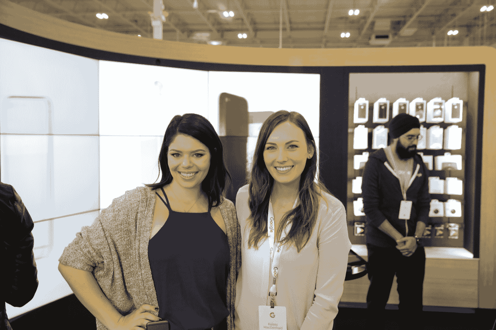
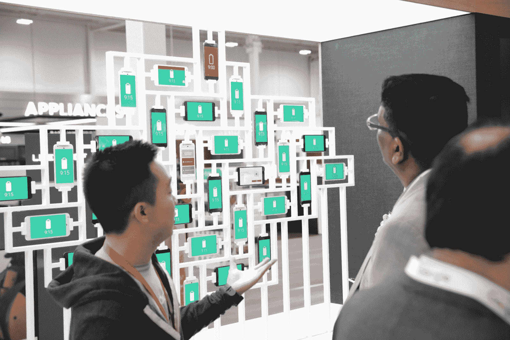

# 谷歌商店内部，谷歌正在重塑其销售设备的方式 

> 原文：<https://web.archive.org/web/https://techcrunch.com/2016/11/18/inside-google-shop-where-google-is-reinventing-how-it-sells-devices/>

谷歌通过新的 Pixel 和 Pixel XL 智能手机对其硬件策略进行了重大的反思，这两款手机都是谷歌自己设计和制造的。它还在重新思考如何销售设备，推出了新的谷歌商店。

今年秋天，谷歌推出了其 Pixels、Chromecast Ultra 和 Daydream View VR 耳机，为了帮助销售这些设备并向客户展示它们的功能，该公司将在加拿大的一些百思买商店推出店中店。

当它在[的一次活动](https://web.archive.org/web/20221208211134/https://beta.techcrunch.com/2016/10/04/everything-you-need-to-know-from-googles-pixel-event/)上发布 Pixel 时，也首次展示了谷歌 Wifi、谷歌 Home 和 Daydream View，谷歌还透露，它将在纽约市创建一个弹出式体验店，供用户查看其新产品。不过，在加拿大推出的谷歌商店并不是临时性的；谷歌不仅希望在这些地方展示当前和未来的设备，还希望在这些地方培养用户的社区意识。

听起来熟悉吗？应该的——谷歌商店有一个对公众开放的可用活动议程，这类似于苹果公司运营的店内程序。装饰也很相似，但在审美上明显是谷歌的，浅木纹和灰色织物搭配明亮的色彩(谷歌备用)。由于这是一家店中的店，空间非常宝贵，但谷歌实际上充分利用了有限的空间，使用定制的模块化家具，当站立空间有限时，这些家具可以嵌套，但也可以轻松容纳，比如说，一小群学生在必要时坐在凳子上。

【YouTube https://www.youtube.com/watch?v=0xTyGtu-Ryo]

产品被分组在一起，但是当把它们放在一起展示有意义的时候，特别的电台会把它们组合起来；比如带 Pixel 的 Chromecast，或者带 Daydream View 的 Pixel。一个带转盘控制的多屏显示器也占据了整个空间的一个角落，例如，让游客有机会乘坐谷歌地球进行大规模旋转，或者在季节性特别活动期间跟踪和与圣诞老人一起闲逛。

“我们喜欢人们可以进来，发现，玩耍和享受乐趣，这只是碰巧与技术有关，”谷歌零售营销总监 Janell Fischer 说。“因此，我们真的尝试了许多不同的沉浸式体验，有些是产品和产品功能的直接展示，有些则更具探索性和趣味性。”

费舍尔指的是“门户”之类的东西，我在上面提到的多屏互动显示器，让购物者飞越谷歌地球或在太阳系中旅行。谷歌还邀请了 YouTubers 和其他人来举办特别的研讨会和会议，包括首次亮相活动，这是一个由 [TheSorryGirls](https://web.archive.org/web/20221208211134/https://www.youtube.com/user/TheSorryGirls) 主办的丑陋毛衣节日主题 DIY 活动。

谷歌商店将举办研讨会和活动，包括 YouTubers TheSorryGirls 的首次活动。

费舍尔表示，他们已经为这个空间和由“谷歌指南”运营的专注于产品的教程制作了“超级可编程”的空间，谷歌指南是全职员工，实际上是谷歌的承包商，而不是百思买的员工。示例课程包括“如何使用谷歌助手计划假期旅行；指南还将能够帮助完成更普通的任务，包括基本的设备使用。

谷歌与迪克森在英国推出了三家商店，但费舍尔表示，由于推出了谷歌自己的硬件设备，他们已经重新设计了整个体验。菲舍尔说，迪克森商店的重点是软件和服务，但硬件的引入促使他们更加注重展示如何一起使用一切。同样，这种模式听起来类似于苹果的方法——菲舍尔实际上在三年前加入谷歌之前曾在苹果的零售部门工作。然而，谷歌的实体零售方式听起来会有一个额外的、不断发展的超本地化元素。

Fischer 解释说:“这个领域的优点是，当新产品推出时，我们可以快速更新它，我们还可以快速远程更新所有的数字内容，因此我们还将为这个领域的门户区域创建新的应用程序。”“我们将从来到这家商店的人那里学到很多东西，我们真的想看看如何让内容适应观众。”

除了本地节目，每家百思买的谷歌商店都可以拥有为其所在城市量身定制的独特数字内容——就像在这个位置的门户网站上装饰一个巨大的“Mississauga”数字标志，指示商店所在的多伦多郊区。

零售业务是建立庞大而忠诚的高端移动设备客户群的关键，而这并不是谷歌在之前的 Nexus 项目中真正拥有的东西。谷歌商店看起来是实现这一目标的良好开端，它对细节给予了大量关注，并愿意随着公司对零售方法的发展从反馈中学习。

虽然这种方法很有前景，但似乎仅限于英国和加拿大——至少目前如此。“我们目前没有在美国做任何事情的计划，”费舍尔告诉我，但投资和关怀在我看来，这是未来更大零售计划的原型。

[gallery ids="1418538，1418537，1418536，1418535，1418532，1418531，1418530，1418529，1418528，1418526，1418522，1418518，1418506，1418516，1418517，1418