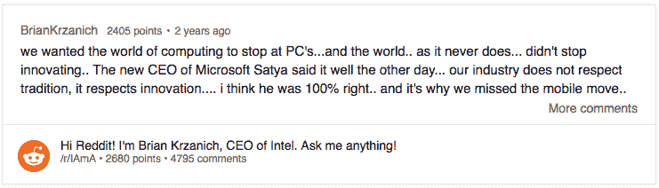
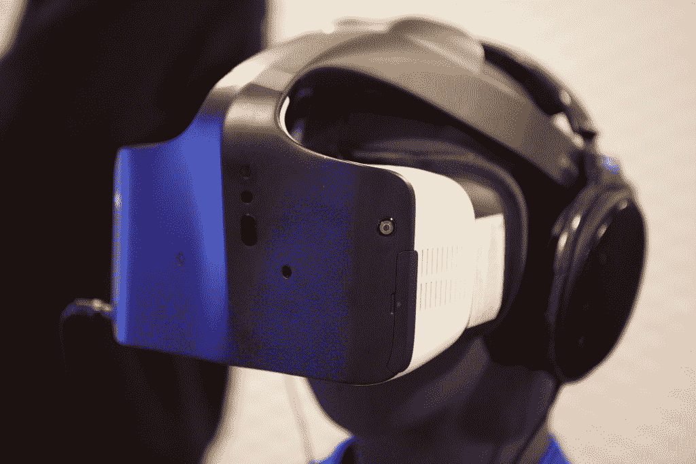
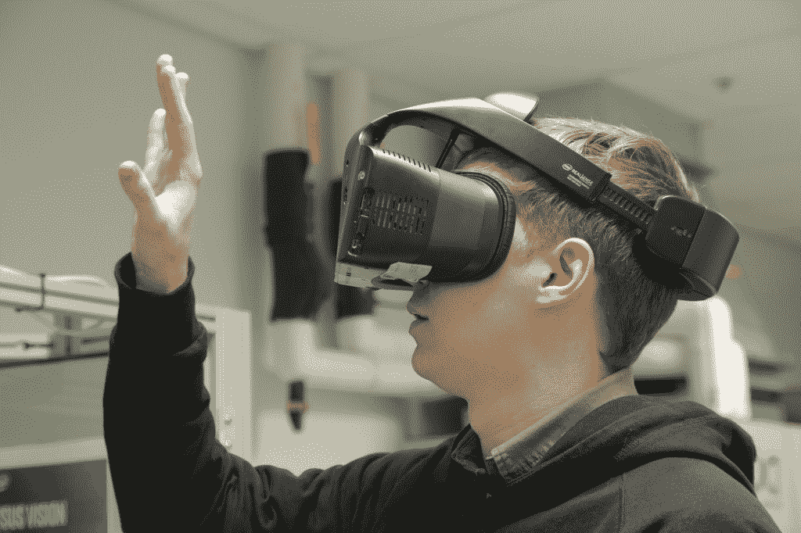

# 了解英特尔构建新现实的竞赛 

> 原文：<https://web.archive.org/web/https://techcrunch.com/2016/11/03/inside-intels-race-to-build-a-new-reality-2/>

我

在许多方面，虚拟现实仍然是一个幻想。
2014 年，脸书以 20 亿美元[收购了 Oculus](https://web.archive.org/web/20221209023853/https://beta.techcrunch.com/tag/FacebookOculus/) ，这无疑缩短了消费者接受新未来主义的时间。对与其并肩作战的科技巨头来说，这次收购是一个信号。移动最突出的成功故事是着眼于可能的下一个平台转移。对于那些被移动技术烧伤的公司来说，这是一个在虚拟现实上采取行动的信号。

具有讽刺意味的是，如果不是不足为奇的话，那么许多在 VR 和 AR 领域进行大量投资的公司正是那些搞砸了移动革命或失去控制的公司。

随着手机销售的崩溃，HTC 正在积极定位自己，将 VR 转变为核心业务。曾经的手机市场王者诺基亚正在打造高端虚拟现实捕捉系统。似乎从未与 Windows Mobile 产生共鸣的微软，正在努力为耳机构建 Windows 全息操作系统。

在许多方面，英特尔过去的十年也被定义为未能利用移动平台转变的需求和机遇。在系统架构方面坚持过去的决定使该公司难以跟上高通、苹果和三星等公司的步伐。今年早些时候，该公司宣布计划[解雇近 12，000 名员工](https://web.archive.org/web/20221209023853/https://beta.techcrunch.com/2016/04/19/intel-announces-its-slashing-its-workforce-by-11-percent/)并终止一些 Atom 移动芯片组的开发。

英特尔首席执行官布莱恩·科兹安尼克将第一个告诉你，他的公司的移动灾难是自己造成的。

他认为他的公司的虚拟现实倡议是非常早期的项目，最终可能成为近 50 年历史的英特尔的关键业务，他自 1982 年作为工程师加入以来一直在英特尔工作。

那一年，VR 大多是《创》之类的电影捕捉到的未来主义梦想。虚拟现实可以说已经在 2016 年到来，但仍然有越来越多的人怀疑当前的虚拟现实努力只不过是许多任性的公司用适度的 R&D 元假装创新的公关噱头。

当我前往英特尔的圣克拉拉总部，独家首次参观该公司的虚拟现实实验室时，所有这些都在我的脑海中，该实验室正在研究如何虚拟复制我们的感官体验。这项关于我们如何看到、听到和感受世界的研究正在为该公司的第一个主要头戴式显示器项目 Project Alloy 提供信息。这是一款无线独立虚拟现实耳机，针对其自有品牌的虚拟现实进行了优化——它称之为“融合现实”

## 咒语

如果说英特尔对其项目 Alloy wireless HMD 的早期戏弄引起了人们的喘息，那么这款耳机将突出一种称为“融合现实”的新型交互方式的声明则引起了人们的叹息。说到术语，我们已经有了虚拟现实、增强现实、混合现实，我想还有真实现实(尽管我每天都越来越不确定)。

我不会说合并现实是一个需要添加到字典中的术语，但它背后的哲学是值得注意的。融合现实基本上是虚拟现实和计算机视觉的融合，使虚拟现实耳机能够理解周围的环境，包括环境特有的人、地方和事物。该技术在很大程度上依赖于英特尔的 RealSense 计算机视觉摄像头阵列，该公司也一直在使用该阵列为机器人、无人机和自动驾驶汽车提供动力。

当谈到融合现实时，RealSense 使耳机佩戴者能够通过显示器看起来像是凝视，并在一个完全虚拟的环境中看到真实世界的一部分(如你的身体和其他人)。英特尔希望这项技术能够让你将虚拟现实的不可能环境与现实的物理复杂性无缝融合。

## 实验室

英特尔的圣克拉拉园区是一台工作中的机器。当我在一组英特尔高管和员工的带领下走过走廊时，工程师们的鼠标点击和机械键盘敲击声发出了轻微的嗡嗡声，引导我通过越来越严格的安全访问级别。

在实验室的一楼部分，我首先注意到的是它的空旷。当我在那里参观设施时，实验室的员工基本上被清空了，某些区域被封锁了。咔哒咔哒的嗡嗡声也平息了；实验室的这一部分包含一个最先进的 3D 声音室，英特尔正在这里研究融合现实环境的动态音频。

迎接我的第一个友好的身影是一只装在装有传感器的开放式笼子里的机械臂。这是英特尔研究手部运动和构建算法以让该公司的 RealSense 传感器跟踪手势的主要工作。虽然 Oculus、HTC 和索尼等虚拟现实同胞已经推出了与虚拟现实内容互动的运动跟踪控制器，但英特尔希望将其手部跟踪技术提升到一个精细的水平，使互动无缝，尽管许多专家认为将这种技术作为主要输入方法还面临一些重大挑战。

[//delivery . vidible . TV/jsonp/PID = 56 df 4 e 9 de 4 b 0 c 9 c 31d 626 c 18/vid = 5817 da 335095496 e 466819 df/564 f 313 b 67 b 6231408 BC 51 ee . js](//web.archive.org/web/20221209023853/https://delivery.vidible.tv/jsonp/pid=56df4e9de4b0c9c31d626c18/vid=5817da335095496e466819df/564f313b67b6231408bc51ee.js)

在向不知疲倦的机器人手挥手告别后，我冒险来到一个更加空旷的六楼，英特尔正在这里设计由内而外的跟踪技术，使其 Project Alloy 耳机完全无线。

现在，大多数好的虚拟现实都是有线的，这意味着你有一根很长的线从你的耳机后面延伸到一台昂贵的计算机，推动高端图形。这些系统还通过外部传感器进行位置跟踪，这样当您四处走动时，系统就能准确地知道您的位置。

相反，Project Alloy 依靠一对 RealSense 传感器阵列，根据您与环境中物体的相对接近度来跟踪您的位置。你不必设置任何东西或者在你的墙上钻任何东西；你只要走进一个房间，打开耳机。

说到这个…

## 该项目

在与一个看起来令人毛骨悚然的畸形机器人头部呆了一段时间后，我准备好了 Project Alloy 的独家演示。这个机器人头部带有摄像头，英特尔用它来测试 RealSense 上的头部跟踪。

我首先获得了第一代耳机运行的硬件规格的一些新细节。该套件通过一对 DS4 RealSense 摄像头跟踪其位置，并依靠 Skylake 芯片组进行应用处理，英特尔凌动处理器处理计算机视觉。

虽然它仍在开发中，下一代(被称为“合金 2”)将获得一个新的 RealSense 400 摄像头，并将升级到 Kaby Lake 处理器，但最有趣的是，这款耳机将放弃 Atom，转而使用英特尔最近收购的[之一的 Movidius 的视觉处理单元。](https://web.archive.org/web/20221209023853/https://beta.techcrunch.com/2016/09/05/intel-buys-computer-vision-startup-movidius-as-it-looks-to-build-up-its-realsense-platform/)

在一段时间的极客之旅后，我调整了令人惊讶的舒适耳机的大小，并轻轻地将它平衡在我的头上。虽然我戴着耳机玩了大约 15 分钟，但我的印象很快。

> 对于一家为高端个人电脑制造芯片组的公司来说，制造需要高端个人电脑的耳机似乎是一个相当自然的计划。

某些东西非常粗糙，其他的非常清晰，但总的来说，它感觉像一个明显不同的虚拟现实设备，如果不是一个更有抱负的概念。原型上的从里到外跟踪当然有效，但 DS4 RealSense 相机的精度还有待提高。令人欣慰的是，下一代模型将看到深度相机的分辨率增加了三倍，这将允许更精确的跟踪，让一切都变得更加清晰。

最终，OEM 厂商明年推出的整体硬件体验将是更关键的一环。英特尔很快指出消费类硬件并不是它的强项；它更注重将一些东西组合在一起，展示底层技术。

“在英特尔，我们专注于硬件和体验，但无论如何，我们都不擅长构建物理设备，”英特尔高管蒂姆·帕克(Tim Parker)在带领我进行演示时告诉我。

[//delivery . vidible . TV/jsonp/PID = 56 df 4 e 9 de 4 b 0 c 9 c 31d 626 c 18/vid = 5817d 7195095496 e 466819 de/564 f 313 b 67 b 6231408 BC 51 ee . js](//web.archive.org/web/20221209023853/https://delivery.vidible.tv/jsonp/pid=56df4e9de4b0c9c31d626c18/vid=5817d7195095496e466819de/564f313b67b6231408bc51ee.js)

Alloy 2 最终仍将是一个参考设计，尽管英特尔将与“微软和其他合作伙伴”合作，完善其构建。英特尔不打算在短期内进入消费硬件业务，但 Krzanich 希望这款耳机可以将这些英特尔技术融入下一代 VR 设备的 DNA 中。

“到明年年中，我们将做好 Alloy，开源。这确实是我们的目标，你知道。Krzanich 说:“你把这个东西开源，让每个人都可以在它的基础上开发，有点像旧的微软个人电脑业务。

我仍然非常好奇的是，英特尔将如何选择将其技术转移到有线融合现实体验中。值得注意的是，由于那些花哨的台式机芯片组，英特尔已经拥有了与有线虚拟现实的强大联系。有趣的是，与我交谈过的高管似乎大多不重视 Alloy 的无线特性。事实上，谈话似乎经常很自然地回到虚拟现实。

“我们可以让你摆脱线缆，因为我们可以将所有的计算放在[耳机]中，我们可以进行所有的映射，但如果你真的想要低延迟，高端游戏，那么[有线虚拟现实]将永远是领先的终端系统，”Krzanich 说。

英特尔的一个重大决定将归结为决定合并现实是否重要到足以投资生产虚拟现实专用芯片组。否则，对于一家为高端个人电脑制造芯片组的公司来说，制造需要高端个人电脑的耳机似乎是一个相当自然的计划。帕克没有直接评论该公司目前是否正在考虑以虚拟现实为重点的芯片组。

## 愿景

随着演示在我的腰带下，我唯一能想到的是英特尔从这里去哪里。Alloy 本质上是一个内部开发包，但由于 RealSense 和 Movidius 的帮助，该公司有很多方向可以选择。

通过与 RealSense 和 Movidius 高管的几次会谈，很明显，英特尔可能对虚拟/增强现实空间的了解比它透露的要多一些。

在一个略显拥挤的房间里，英特尔感知计算实验室副总裁阿钦·博米尔克(Achin Bhowmilk)向我展示了该公司最新 RealSense 模型在融合现实环境中的高级演示。传感器阵列不仅绘制空间地图，还识别多房间环境中的物体。当传感器以不同的百分比确定空间内的一张桌子和四把椅子时，捕捉会话的馈送运行。

“这个产品背后的想法是建立感知和理解世界的能力，”Bhowmilk 告诉我。

这个系统与我在个人电脑上使用的 RealSense 技术相差甚远。RealSense 的第一次化身有点乱。被想象成一种新的人机交互方式的东西，以一种笨重的，如果不是基本上无用的，PC 输入系统的形式被介绍给了消费者，这种输入系统还没有准备好迎接黄金时代。

通过虚拟现实，RealSense 获得了一个更值得其计算机视觉灵活性的计算平台。Krzanich 告诉我，他希望有一天这项技术能够在你四处闲逛时为你识别联系人，然后在你的视野中显示适当的通知。

“RealSense 最初是在我们的实验室里想出来的；“我们试图思考键盘和鼠标已经存在 20 年了——它是如何以同样的方式与计算机互动的——所以我们认为也许我们可以把人们的手从它们身上解放出来，”Krzanich 说。然后，我们中的一些人在过去的一年里一直在玩虚拟现实，并开始意识到你受到这些设置的限制。"

> 在英特尔，我们专注于硬件和体验，但无论如何，我们都不擅长制造物理设备。

—英特尔高管蒂姆·帕克

RealSense 为耳机提供了空间和上下文意识，Alloy 为硬件制造商提供了更容易获得的参考，以便将跟踪技术集成到他们自己的产品中。问题是，这些耳机制造商中有很多已经在使用英特尔的技术，即属于英特尔即将收购的 Movidius 的芯片。

Movidius 的低功耗 Myriad 2 视觉处理单元因其计算机视觉能力已成为 HMD 制造商的行业标准。Movidius 是谷歌 Project Tango 智能手机 AR 系统的早期合作伙伴，并宣布与联想合作开发 VR 设备。Myriad 2 的早期普及无疑对英特尔有利，因为它希望为更多设备带来真正的意义。

毫无疑问，RealSense 和 Movidius 将变得更加舒适，但 Krzanich 坚持认为 Movidius 仍将作为独立产品销售，尽管很明显双方都希望看到产品紧密结合。

Krzanich 表示:“我们将继续推动对 Movidius 架构的增强，我们将努力理解该架构如何才能最好地与英特尔架构融合或连接。”。

Movidius 首席执行官 Remi El-Ouazzane 也认为他的产品越来越适合 RealSense 平台，他指出他很高兴能够紧密集成并“充分利用”

“今天，事实是(Movidius 平台)完全是不可知论者，”Movidius 首席执行官告诉我。“我认为这可能会改变，我认为我们需要与英特尔一起开发竞争优势，使整体大于部分之和。”

## 未来

许多虚拟现实的最大支持者只把它视为增强现实技术的延续技术，这种技术将把数字图像叠加到我们周围的世界上。英特尔似乎对观察 VR 最终如何转变为 AR 颇感兴趣。

增强现实是一个令人兴奋的——如果不是可疑的秘密的话——空间。开发人员目前可以使用微软的 HoloLens 耳机，Meta 2 开发套件将很快开始发货，尽管有所延迟，但关于其他一些大肆宣传的头戴显示器制造商的细节仍然很少。

Magic Leap 已经从包括谷歌和阿里巴巴在内的投资者那里筹集了近 14 亿美元，但尚未展示他们即将推出的耳机原型。尽管接近该公司的消息人士告诉我，苹果目前正在基于不同的显示技术构建多个“混合现实类型”的耳机原型，但库比蒂诺还没有关于实际产品的官方消息。

然而，这些耳机中的许多可能有一个共同点，那就是 Movidius。

El-Ouazzane 告诉我:“我很谦虚地说，没有一个大型的 AR 平台不使用 Movidius。

他还详细介绍了 Movidius technology 通过将计算转移到口袋设备上，使其合作伙伴能够将许多增强现实系统上的头戴式眼镜小型化。他认为不显眼的外形将有助于提高设备的接受度。

“最终，我们都应该从‘玻璃洞综合症’中吸取教训。”“AR 眼镜必须是重量在 25 到 30 克之间的设备，并且佩戴起来相当有趣，”他详细说道这个愿景，不是一语双关，是拥有尽可能低的电子设备，所以它将是一个视觉处理器和各种显示器组件，所有的计算都由你口袋里的东西照顾，最有可能是你的智能手机。我们所有的 AR 项目都在那里。"

> 没有一个大的 AR 平台不使用 Movidius。

—雷米·埃尔·瓦赞

虽然 Krzanich 在我们的谈话中强调，该行业“离获得增强现实所需的光学技术还有一两年的时间”，但他暗示英特尔目前已经在 ar 领域进行了“各种开发”。

《合并现实》是一个缩小 VR 和 AR 之间差距的迷人冒险。虽然 Project Alloy 是一个早期的项目，存在明显的缺点，但很明显，英特尔正在为该公司的 VR 努力铺设大量的跑道。这些努力将继续构建更强大的增强现实设备和体验所需的计算机视觉和视觉处理敏锐度。

英特尔正在慢慢来。Movidius 和 RealSense 都没有在 VR/AR 耳机上完全投入；它们也都将自己的才能集中在其他更紧迫的技术平台上，如自动驾驶、安全系统和无人机。Project Alloy 和 merged reality 给了该公司一个明确的产品和产品类别，开始在 VR 和 ar 的更广阔空间中建立自己的努力。

预测下一个计算平台或区分时尚与未来从来都不是一门精确的科学，但英特尔知道 AR/VR 的利害关系，并正在做好准备，以确保不会与这些现实脱节。