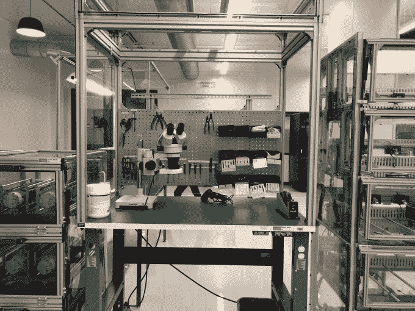
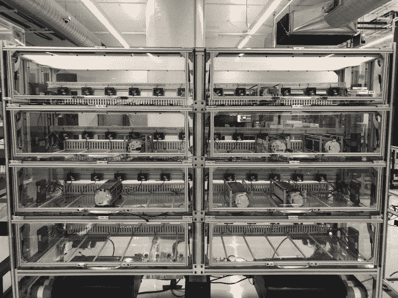
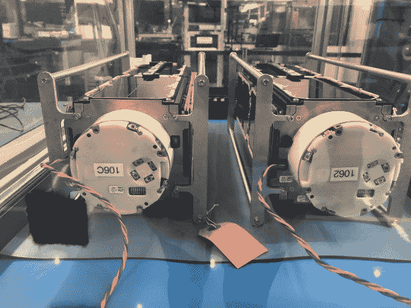

# 在 Planet Labs 新的卫星制造基地

> 原文：<https://web.archive.org/web/https://techcrunch.com/2018/09/14/inside-planet-labs-new-satellite-manufacturing-site/>

卫星成像和分析公司 Planet 正在为其在旧金山的新制造空间揭开神秘面纱。由前美国宇航局雇员创建的 Planet 正在利用其积累的 1.83 亿美元资金中的一部分进行扩张。在旧金山哈里森街(Harrison Street)中间一栋不起眼的办公楼的地下室里，Planet 正在努力建造低轨道卫星，拍摄我们这个不断变化的星球的图像，现在这家航空影像公司有了更多的空间来做这件事，声称新的设施是世界上最多产的卫星制造点。

在新的 27，000 平方英尺的制造场地内是卫星制造站，行星工程师们在那里组装“鸽子”，机器被称为“鸽子”。新工厂的规模是旧工厂的六倍，有了这个新的太空星球，它的工程师声称每周将生产多达 40 颗卫星。荧光面板照亮了工业工作站，小卫星被插在它们的“鸽巢”里。

Planet 称他们的卫星只需要 10 种工具就可以制造出来

行星制造卫星的方式不同于美国宇航局或洛克希德马丁公司。“星球”的运作理念是，与其建造大型笨重的机器坐在太空中用过时的技术和旧的传感器拍摄图像，不如建造许多寿命为一至三年的小型卫星，这样可以更快地完成任务，并提供更好的地球表面图像。有了新的地点，Planet 将把航天器生产的各个方面——从 R&D 到制造再到测试——集中在一个屋檐下。

那么，这些卫星到底是做什么的呢？每颗卫星每秒钟可以拍摄两幅图像，然后行星系统工作到 将图像分类为水、珊瑚、河流、道路、基础设施和森林。

鸽巢中的鸽子

行星的理念是“你不能修复你看不见的东西”。国防、人文和农业部门的合作伙伴正在利用 Planet 卫星舰队提供的数据开展项目，如巴西的森林砍伐分类和坦桑尼亚的城市变化探测。卫星从地球上人迹较少的地方获取图像。成像系统收集了叙利亚道路被破坏的数据，甚至最近还发现朝鲜突然出现了一个化学实验室。一个合作伙伴正在利用 Planet 数据测量澳大利亚珊瑚礁的破坏程度。

过去，Planet 曾与 SpaceX 等发射合作伙伴合作过。然而，在新工厂制造的第一批卫星将于下个月由 PSLV 火箭运送到印度的[。在四年中，Planet 已经发射了 298 颗卫星，其中 150 颗目前正在轨道上运行，每天收集超过 3 亿平方公里的图像。](https://web.archive.org/web/20230329061754/https://www.planet.com/pulse/sixteen-dove-satellites-scheduled-to-fly-on-isros-pslv/)