# 走进 Q2 2017 全球风险投资生态系统

> 原文：<https://web.archive.org/web/https://techcrunch.com/2017/07/11/inside-the-q2-2017-global-venture-capital-ecosystem/>

杰森·罗利是《金融时报》的风险投资和科技记者

[Crunchbase News](https://web.archive.org/web/20230326222024/https://about.crunchbase.com/news/)

.

More posts by this contributor

有一点是清楚的:现在的创业股权市场比三个月前更加稳固。随着交易数量和投资金额连续两个季度增长，以及公开市场对风险投资支持的初创公司股票的兴趣越来越大，有理由对今年下半年保持谨慎乐观。

来自 [Crunchbase News](https://web.archive.org/web/20230326222024/http://about.crunchbase.com/news/) 的这篇报道使用了 Crunchbase 的数据和预测，深入探讨了全球风险投资生态系统的状况。这里，我们想要评估投资和流动性——资金流入和资金流出。

在部分的**资金中，我们将涵盖 Crunchbase 对 2017 年 Q2 全球风险投资生态系统如何投资以及投资多少的预测。然后，我们将评估该结果与 2017 年 Q1 奥运会和 2016 年 Q2 奥运会的对比，让我们了解季度环比和同比表现。**

在**资金流出**部分，我们将回顾收购统计数据，并强调其他值得注意的流动性事件，包括科技 IPO 的解冻市场。

为了帮助你理解这份报告，每一部分将包含一个看涨和看跌的关键发现。事不宜迟，我们开始吧。

## 资金流入

*   **看涨关键发现。**几乎在所有阶段，交易量和交易额都在上升，融资规模也在继续增长。从大多数指标来看，如果增长持续下去，全球风险投资市场有望在今年年底前回到之前的高点。
*   **看跌关键发现。**尽管美元和交易额有所增长，但衡量后期融资的指标显示，重返历史高点的步伐将会放缓。此外，非常晚阶段的科技成长股已经延续了多个季度的下跌趋势。

### 风险投资领域概述

2017 年第二季度，全球风险投资行业延续了第一季度设定的轨迹，即从 2016 年下半年因不确定性隐现而出现的低迷中复苏。

在对美国最大的私营科技公司估值膨胀和似乎不可持续的担忧、停滞的科技 IPO 市场、有争议的美国总统大选、英国脱欧公投、无休止和棘手的欧元危机以及中国金融市场动荡等问题之间，令人惊讶的是，全球风险资本市场没有进一步放缓。

现在，不管是好是坏，许多不确定性的来源已经到了紧要关头，投资者似乎已经适应了新常态。Q2 2017 完全是为了扩大今年第一季度取得的成果。

### 全球融资活动:从巡航高度看

为了提供全球风险融资的总体状况，我们调查了风险交易的数量和规模。本节介绍的分析范围是广泛和高水平的。它包括风险资本交易的数量和规模，以及对一些主导交易最多的投资者的快速浏览。

### 交易速度

通过查看本季度和前四个季度达成的交易数量，我们能够很好地了解私募市场投资者对前几个月的感受。

Crunchbase 预计，与 Q1 相比，2017 年 Q2 的股权融资总数增加了约 5.7%，相当于增加了约 300 轮。这种变化主要是由种子期、天使期和早期融资轮的增加所推动的。

从年度来看，所有阶段的融资轮次预计比 2016 年的 Q2 增加了 8.8%，大约增加了 500 轮，这也是受与早期阶段公司达成的交易强劲增长的推动。

我们将在后面的章节中讨论每种投资的变化。

### 预计的 VC 美元量

在这方面，Crunchbase 的预测也表明，全球风险资本市场正在继续向前发展。2017 年在 Q2 部署的资本总额比 2016 年第四季度的当地最低水平大幅增加。尽管如此，在市场回到 2015 年和 2016 年初的令人兴奋的日子之前，还有一段路要走。

下面，我们绘制了 Crunchbase 对 2017 年 Q2 奥运会及其前一年的资金总额的预测。

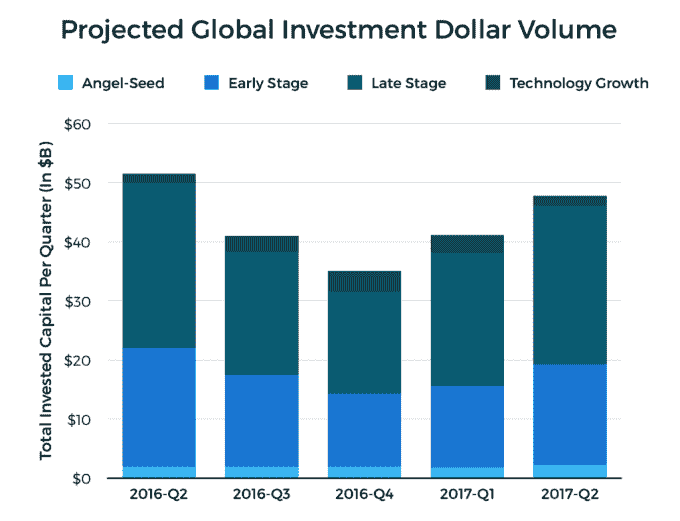

按季度计算，Crunchbase 预计今年第一季度风险投资总额将增长 16%。这意味着投入到初创企业各个阶段的资本总额预计将增加 66 亿美元。按季度计算，收益分布相当均匀，与前几个季度相比，本季度天使和种子、早期和晚期创业公司获得的资金约为 20%或更多。只有技术增长轮的美元交易量出现了季度下降。

正如我们之前提到的，全球风险资本市场还没有完全回到最近的高点。2017 年 Q2 奥运会预计投资 478 亿美元，仍比去年第二季度预计的 515 亿美元少 7.2%。与 2016 年同期相比，早期和后期投资都有所下降。

然而，种子和技术增长类别分别增长了 16.5%和 10.75%。因为这两个融资阶段在总美元量中所占的比例如此之小，所以整个行业不太可能与 2016 年 Q2 奥运会持平。

### 最活跃的主要投资者

我们分析了本季度大约 3200 轮风险融资的数据。这些数据是从 Crunchbase 中提取的，Crunchbase 通常指定给定交易的主要投资者。根据列出的主要投资者的一系列轮次，我们根据这些主要投资者的数量总结了这些数据。总的来说，我们确定了超过 1，250 家独立投资者在本季度领导了一轮或多轮融资。

在下面的图表中，您可以找到全球所有阶段最活跃的主要投资者列表。请注意，随着更多数据的出现，这些排名可能会发生变化。

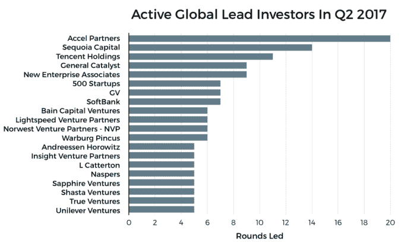

在本季度，该行业一些最大的投资者的轮领导地位似乎出现了显著上升。例如，在我们的《Q1 报告》中，我们发现 [Accel Partners](https://web.archive.org/web/20230326222024/https://www.crunchbase.com/organization/accel-partners) 、[红杉资本](https://web.archive.org/web/20230326222024/https://www.crunchbase.com/organization/sequoia-capital)和[腾讯控股](https://web.archive.org/web/20230326222024/https://www.crunchbase.com/organization/tencent)并列排名第一，各自领先九轮。然而，本季度，Accel 领先了 20 轮，而红杉和腾讯分别领先了 14 轮和 11 轮。

本季度的主要投资者排行榜增加了一些新成员，如 [General Catalyst](https://web.archive.org/web/20230326222024/https://www.crunchbase.com/organization/general-catalyst-partners) ，它在[和](https://web.archive.org/web/20230326222024/https://www.crunchbase.com/organization/grammarly)[轮回](https://web.archive.org/web/20230326222024/https://www.crunchbase.com/organization/samsara-2)等方面领先。软银也首次出现在这份名单上；在过去的一个季度中，这家日本企业集团领导了网络安全公司 [Cybereason 的](https://web.archive.org/web/20230326222024/https://www.crunchbase.com/organization/cybereason)D 轮融资和总部位于英国的 [Improbable 的](https://web.archive.org/web/20230326222024/https://www.crunchbase.com/organization/improbable)5.02 亿美元的 B 轮融资等。另一个第一次投资的是 True Ventures，它与 Kleiner Perkins、Fidelity Investments 和 Wellington Management 共同领导了 3 . 25 亿美元的 E 轮融资，这使得 Peloton 登上了独角兽名单。

也就是说，除了一些意想不到的新来者和其他人的突然下降，这个名单上的大多数公司都代表着“通常的嫌疑人”大多数都是该行业的中坚力量，拥有长期的成功记录，管理着数十亿美元的资产。

既然我们已经从宏观角度探索了本季度的全球融资格局，现在是时候了解每个阶段的具体情况了。

### Q2 风险投资融资趋势的阶段性分析

以下图表显示了融资周期不同阶段各轮融资的平均规模。在查看本季度和未来几个季度完成的融资时，这些指标可以作为有用的比较点。

我们将从种子和天使投资开始“接近金属”,并逐步发展到大型技术增长轮。

#### 天使投资和种子期交易

除了极少数例外，初创公司通常不会筹集很多资金。对单个公司和整个资产类别来说都是如此。虽然 Crunchbase 项目在 Q2 的投资交易中有超过 60%是由种子和天使投资者达成的，但它们只占总美元量的大约 4.6%。

下面，我们提供了一个图表，显示了交易的数量以及种子和天使投资的金额。

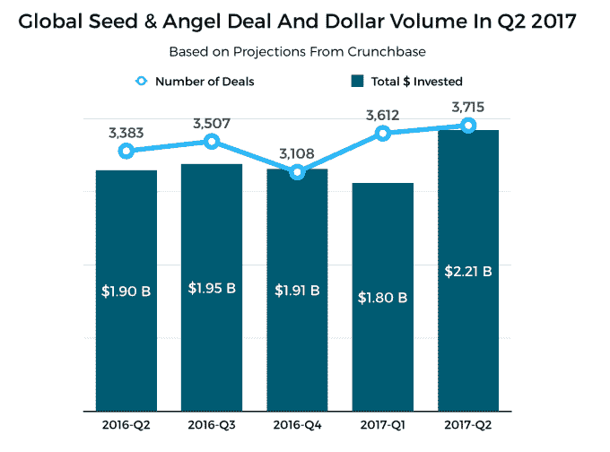

从季度来看，美元和交易量都在增长，尽管幅度各不相同。来自 Crunchbase 的预测表明，在全球范围内，交易量增长了大约 3%，导致本季度比上个季度多了 100 家公司获得资金。尽管种子和天使轮数量的季度增长相当有限，但美元数量的预期增长却绝非如此。Crunchbase 的预测指出，自上个季度以来，投资者对非常年轻的公司投入的资金量增加了 23%，约为 4 亿美元。

投入的资本总额只是故事中金钱方面的一部分。下图显示了平均和中位圆形尺寸的增长。与上面的预测数据不同，上面的数据试图说明可能发生但尚未宣布的轮次，下面的数据仅基于已经记录的轮次。

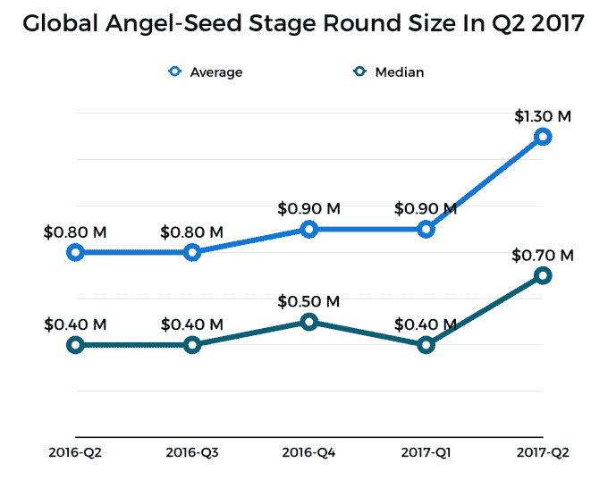

很明显，种子和天使轮的规模正在上升。相对于 2016 年 Q1 奥运会，平均回合增长了 44%，更值得注意的是，中值回合比上一季度的中值回合增长了 75%。考虑到与去年同期相比，平均回合数增加了 62.5%，中位数又增加了 75%，自去年以来的变化更加显著。

让我们来看看上个季度参与最多天使投资和种子投资交易的投资者。

就像上个季度一样，许多最活跃的种子和天使阶段投资者都是加速器项目也就不足为奇了。毕竟，这些机构的业务是向数量相对较多的新兴公司提供少量资本。随着本季度更多轮次被添加到历史数据中，其中一些数字可能会发生变化。然而，除非一个或多个投资者在本季度进行了几十笔投资，并设法将它们都隐藏起来，否则这个列表仍然有效。

(注:由于 Crunchbase 对“天使-种子”类别的分类有些古怪，股权众筹平台 Crowdcube 被列入了这一名单。)

接下来，下表列出了世界各地在 Q2 完成的一些著名的种子和天使投资。

#### 早期交易

早期投资——主要由 A 轮和 B 轮投资组成——是事情开始变得有趣的地方。这些轮次的绝大多数参与者都是机构投资者，考虑到这些交易预计占 Q2 轮次的 30%和总美元量的 35%，这些数据可能会让我们更好地了解本季度的投资者情绪。

下面的图表显示了本季度及之前一年的预计交易量和金额。

与种子和天使轮一样，交易和美元数量都相对于 2017 年的 Q1 有所增长，但程度不同。与 Q1 相比，Q2 多完成了大约 150 笔早期交易，增长了近 9%。这些预测还显示，投资金额显著增加了 23%，有利于全球早期投资金额增加 32 亿美元。(回想一下，种子和天使轮融资的金额也比上季度增长了 23%。)

从每年的情况来看，这表明这是一个仍在发展的行业。2017 年 Q2 早期交易的美元金额仍约为 32 亿美元，比 Q2 2016 年的水印低近 16%。然而，Q2 2017 的早期交易数量比去年增长了 6%，所以这是一个亮点。

再次以复苏和恢复持续增长为主题，我们绘制了自 2016 年 Q2 奥运会以来报道的平均和中值规模。

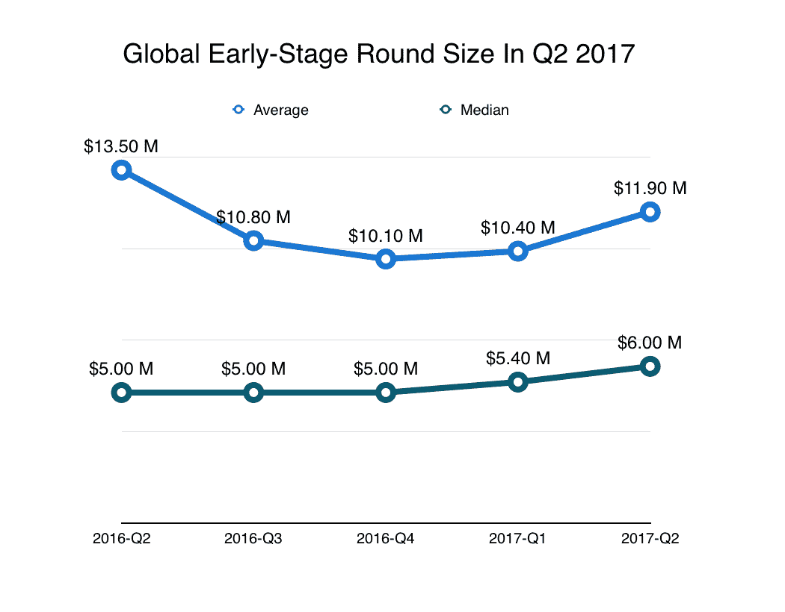

在过去的一个季度中，中值和平均值都有所增加。目前，早期阶段的平均融资额为 1190 万美元，比上一季度增长了 14.4%。中位数为 600 万美元，比 2017 年的 Q1 高出 11%。

然而，从年度角度来看，2017 年 Q2 奥运会是一个大杂烩。尽管早期阶段的中值比 2016 年前三个月高出 20%，但平均水平仍低近 12%。话虽如此，由于中值融资规模随着时间的推移不断攀升，而早期融资的平均规模处于上升轨道，因此到本季度末，这些指标完全有可能回到 2016 年末下跌之前的水平。

当然，这些指标反映了成千上万人的决定，但一些投资者比其他人更多地参与市场。我们确定了在 Q2 完成的近 1300 轮早期融资的投资者，发现了超过 2200 个独特的个人和机构投资者。其中，这里有来自 Q2 的最忙碌的早期投资者。

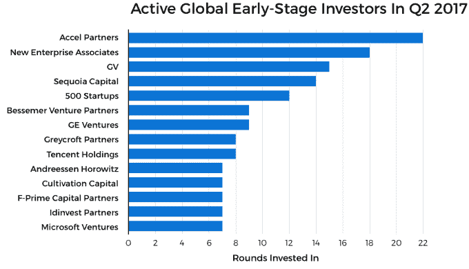

我们又一次看到了许多我们期望在这里找到的投资者。初步分析表明，一些最高产的投资者加快了在 Q2 的交易步伐。例如，在 Q1 的报告中，Accel Partners 被报道已经投资了 11 轮早期风险投资。但根据 Q2 目前的数据，该公司已经将其投资的轮次增加了一倍。NEA 和 GV(前身为谷歌风投)也是如此，它们的早期投资大约是上一季度的两倍。这是否是一种季节性现象尚不清楚。

这里是上个季度引起我们注意的一些早期融资事件。

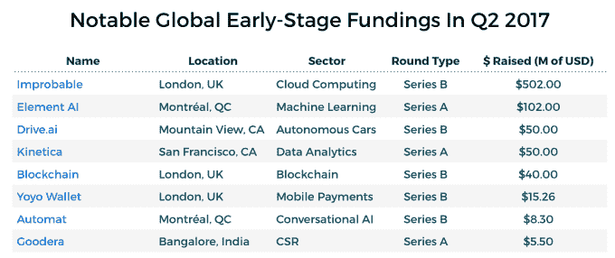

随着种子、天使和早期投资的覆盖，它终于进入了风险融资光谱的后端。

#### 后期交易

与早期交易一样，后期交易中的投资活动(主要是 C 轮、D 轮及以上)表明从 2016 年第四季度的低点持续复苏。在这些晚期交易的情况下，我们能够评估全球风险投资市场的更大份额。在 2017 年 Q2 奥运会上，后期交易占总交易额的 56%以上，尽管仅占交易总数的不到 7%。

根据 Crunchbase 的预测，你可以在下面找到一张显示后期美元和交易量的图表。

这张图表与显示早期交易数据的图表非常相似，令人惊讶。就像我们分析的前几轮一样，后期风险投资交易的数量和金额都在上升，至少相对于过去几个季度来说是这样。

与第一季度相比，2017 年第二季度达成的后期交易约增加了 12%。美元交易量也在按季度增长。预测显示，与今年第一季度相比，Q2 的投资增加了 19%以上，这意味着世界各地的初创公司获得的投资比 Q1 多约 43.5 亿美元。

将本季度与去年第二季度进行比较，再次显示出喜忧参半的结果。就像早期风险投资一样，交易量上升了，但金额却下降了。相对于 2016 年 Q2 奥运会，预测显示后期交易增加了 9%。然而，总体而言，承诺的资本减少了大约 4%。尽管如此，如果我们最近看到的季度环比强劲增长持续到第三季度，市场将比 2016 年初有更好的表现。

现在我们来看看后期 VC 市场的内部情况。

自上个季度(就此而言，前三个季度)以来，中值回合规模没有变化，平均回合规模比 2017 年 Q1 奥运会略有增长 3.5%。再次呼应了一个共同的主题，2017 年 Q2 奥运会的中位后期回合比 2016 年 Q2 奥运会的中位后期回合高出 20%。然而，最后一轮的平均水平比去年的平均水平低了近 14%。但值得注意的是，Q2 2016 年的数据点似乎是一个统计异常值，可能是由一个或多个大型后期回合引起的，Crunchbase 没有将其归类为“技术增长股票”

Q1 2016 年的平均轮次规模为 5490 万美元，2016 年第三季度的平均轮次规模为 6400 万美元，因此很可能一些非常大的轮次扭曲了 Q2 2016 年的平均轮次，远远高于历史正常水平。与此同时，许多来自 Q2 的最多产的晚期投资者也是业内一些最知名的公司。

在各种后期交易中，以下是本季度吸引我们注意力的一些交易。

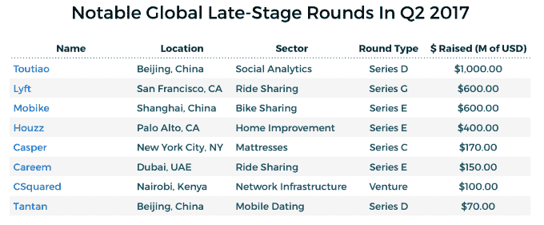

我们几乎完成了逐部门分析。到了最后一个阶段:技术增长。

#### 技术发展

技术增长资本在企业中通常被称为“增长权益”。Crunchbase 将技术增长轮次归类为一系列私募股权轮次，其中也有传统风险投资者的参与，通常是前几轮风险投资的后续。

下图显示了 Crunchbase 对技术增长回合中的交易和美元数量的预测。

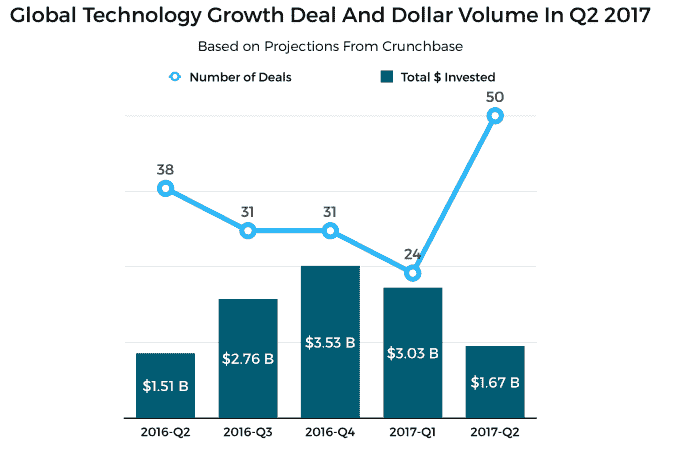

与去年同期相比，交易量和交易额都有所上升。Crunchbase 预计，与 2016 年 Q2 奥运会相比，2017 年 Q2 奥运会达成了十几笔交易，增长了近 32%。美元交易量也有所增加，尽管增幅较低，为 10.75%，约为 1.6 亿美元。

美元和交易额之间有一个有趣的脱节，当你把 Q2 和今年的 Q1 相比时，这一点尤为明显。尽管 Crunchbase 预测，Q2 达成的技术增长股权交易是 Q1 的两倍多，但这些交易所代表的资金总额比上一季度减少了 45%。美元数量下降的原因可能是随着时间的推移，回合规模显著下降。

下面的图表显示了一段时间内技术增长的中值和平均值。

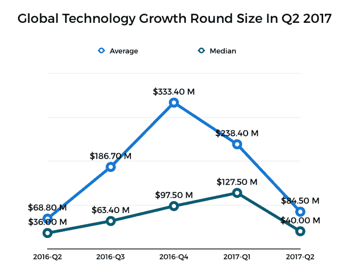

技术成长型股票融资的平均规模从 2016 年第四季度的高点扩大了跌幅，融资规模的中位数也有所下降。这两项指标都比 2017 年 Q1 奥运会下降了 65%或更多。与去年的 Q2 相比，成长型股票的平均发行量增加了近 23%，中位数增加了 11%。

## 钱出来了

*   **看涨关键发现。** Q2 出现了许多成功的科技股 IPO，平息了公众市场投资者对新科技股失去兴趣的担忧。
*   **看跌关键发现。**尽管进行了一些高调的收购，风险投资支持的并购还是经历了几年来最糟糕的一个季度，至少从美元总额来看是如此。

### 风险投资支持的收购

收购是风险资本家和其他私人投资者清算他们所投资公司股票的两种主要方式之一。

下面，你会发现一个图表，显示了随着时间的推移，风险投资支持的创业公司收购。

这张图表有些欺骗性，特别是如果你只比较 2017 年 Q2 M&A 活动与 2016 年 Q2 和第三季度的相对水平。虽然 Q2 2016 年和 Q2 2017 年之间的交易量减少了近 15%，美元量下降了近 80%，但这几个季度似乎是异常值，这一点我们在上个季度的报告中也提到了。

事实证明，2016 年第二季度对大型科技公司 M&A 的交易尤为重要。一些重大收购推动了全球 M&A 元交易量的大幅增长:

风险投资支持的初创公司在 M&A 的退出数量不一定更多——事实上，过去一年交易数量出现了轻微但持续的下降趋势——但它们肯定更有利可图。

尽管如此，Q2 2017 年甚至相对于 2016 年第四季度来说也令人失望，正如我们提到的那样，这是风险资本投资的最低点。与上一季度相比，美元交易量下降了 66%以上，交易数量下降了 6.5%。虽然有一些值得注意的退出，但这仍然是一个相当沉睡的季度。

下面，我们公布了 2017 年 Q2 世博会上一些著名的 M&A 交易。

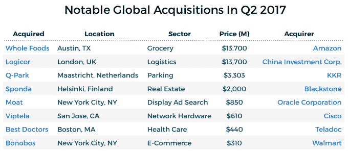

Q2 的许多行业都经历了大量的整合，最明显的是购物和运输。6 月 16 日对 M&A 零售业来说是一个幸运的日子。[在线男装零售商 Bonobos](https://web.archive.org/web/20230326222024/https://www.crunchbase.com/organization/bonobos) 宣布[以超过 3 亿美元的价格将其出售给沃尔玛](https://web.archive.org/web/20230326222024/https://www.crunchbase.com/acquisition/e363ce7714b576d56fe7d5bb2921404c)，这对其投资者来说是一个坚实的退出，投资者包括 Accel Partners、[light speed Venture Partners](https://web.archive.org/web/20230326222024/https://www.crunchbase.com/organization/lightspeed-venture-partners)和 [Nordstrom](https://web.archive.org/web/20230326222024/https://www.crunchbase.com/organization/nordstrom) 。然而，亚马逊以 137 亿美元收购全食超市的消息让这一声明黯然失色，这一消息在出售倭黑猩猩的同一天公布。

在交通方面，大型私募股权公司 KKR 以数十亿美元的价格收购了荷兰停车公司 Q-Park。总部位于纽约的拼车公司 Gett 以 2 亿美元的价格收购了竞争对手 Juno。

正如我们上面提到的，M&A 并不是投资者、创始人和员工获得流动性的唯一途径。让我们来看看本季度全球 IPO 的表现。

### 首次公开募股

Q2 2017 年在美国和欧洲的科技 IPO 都出现了明显的增长，这有助于平息关于“IPO 窗口”对除了最大的公司以外的所有公司关闭的猜测。

在这里，我们公布了来自世界各地的一些最重要的交易。

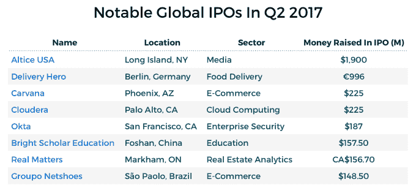

目前，第三季度还没有太多关于 IPO 的公告或监管文件。目前，只有一家风险投资支持的科技公司宣布即将上市:总部位于西雅图的房地产搜索和经纪公司 Redfin，该公司向美国证券交易委员会提交了[文件](https://web.archive.org/web/20230326222024/https://www.sec.gov/Archives/edgar/data/1382821/000119312517219877/d325499ds1.htm)，宣布其打算融资 1 亿美元。迄今为止，Redfin[已经从保罗艾伦的 Vulcan Capital、Draper Fisher Jurvetson、Tiger Global Management 等投资者那里筹集了超过 1 . 67 亿美元的资金。](https://web.archive.org/web/20230326222024/https://www.crunchbase.com/organization/redfin/funding-rounds)

## 结论

尽管全球风险资本市场仍在从去年底的大幅下跌中复苏，但总体而言，2017 年 Q2 是一个相当不错的季度。除了科技成长型股票之外，几乎所有阶段的交易和金额都连续第二个季度出现增长。融资规模不断扩大，我们在 Q1 重点提到的一些最活跃的风险投资公司的投资活动几乎翻了一番，重要的是，风险资本融资总额接近危机前的水平。如果总体上升趋势持续下去，第三季度将真正回归正常，而不仅仅是又一个季度的复苏。

## 方法学

该报告中包含的数据直接来自 Crunchbase，有两种类型:预计数据和报告数据。

Crunchbase 使用预测进行全球和美国趋势分析。预测基于后期报告中的历史模式，这在风险活动的早期阶段最为明显。使用预测数据有助于防止低估或报告扭曲的趋势，这种趋势只有随着时间的推移才能得到纠正。所有预测值都会相应地记录下来。

某些指标，如平均和中值报告的回合大小，仅使用报告的数据生成。与预计数据不同，Crunchbase 仅根据其当前拥有的数据来计算这些指标。就像预测数据一样，报告数据将被正确显示。

请注意，除非另有说明，所有资金价值均以美元为单位。Crunchbase 从融资轮次、收购、首次公开募股和其他财务事件报告之日起，按现行即期汇率将外币兑换成美元。即使这些事件在事件宣布后很久才被添加到 Crunchbase，外币交易也是按照历史现货价格进行转换的。

#### 资助术语词汇

*   种子/天使包括被归类为种子或天使的融资，包括加速器融资和低于 500 万美元的股权众筹。
*   早期风险投资包括 A 轮或 B 轮融资，低于 1500 万美元的无指定系列的风险投资，以及高于 500 万美元的股权众筹。
*   晚期风险投资包括被归类为 C+系列的融资和超过 1500 万美元的风险投资。
*   技术增长包括有风险投资者参与的私募股权投资。