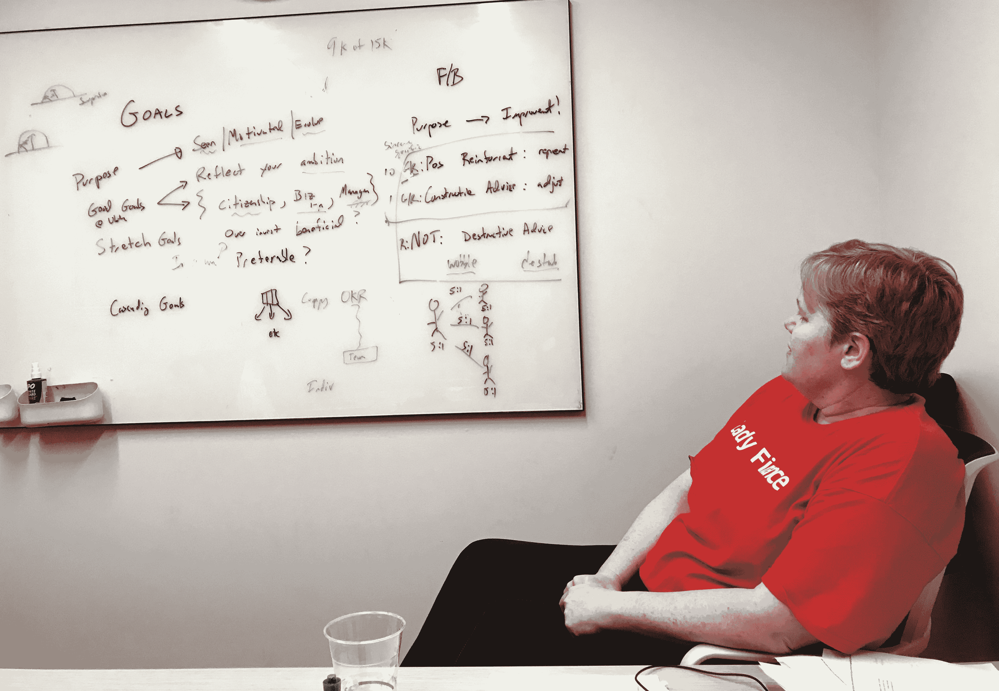

# 了解优步员工绩效评估的新方法 

> 原文：<https://web.archive.org/web/https://techcrunch.com/2017/08/01/inside-ubers-new-approach-to-employee-performance-reviews/>

优步·SVP 和首席人力资源官莲恩·霍恩西清楚地记得苏珊·福勒在[发表博客文章](https://web.archive.org/web/20221225220306/https://www.susanjfowler.com/blog/2017/2/19/reflecting-on-one-very-strange-year-at-uber)指控职场骚扰和管理问题的那一天。

那是 2017 年 2 月 19 日周日——她爸爸的生日。上周，她在优步的总部告诉我，公司也“真的震惊了”。

“我真的从来没有见过员工对某件事如此震惊，对某件事如此反感，”霍恩西说。“然后我决定，因为我能看到这种伤害，我能看到这种震惊，老实说，公司最需要的是被倾听。”

鉴于福勒关于性骚扰和管理的[指控](https://web.archive.org/web/20221225220306/https://www.susanjfowler.com/blog/2017/2/19/reflecting-on-one-very-strange-year-at-uber)，优步彻底检查了其绩效评估程序，其中一个关键的变化是省略了员工评级和等级。

“在过去，这就像是，‘这是你擅长的，这是你不擅长的，这里有一个分数，’”优步运营和物流经理妮可·库埃拉尔告诉我。

库埃拉尔是 600 名员工中的一员，他参与了优步重新设计绩效评估流程的焦点小组，他描述了优步 T3 B3 流程。库埃拉尔称之为“Travis 的创意”的 T3 B3s 详细列出了员工的三大品质/优势以及最差的三项有待改进的地方。

“这是一个非常详尽的过程，把你擅长什么和不擅长什么写在纸上，特别是在我们的文化价值观背景下，”库埃拉尔说。

优步的一些文化价值观要求“永远忙碌”、“小心行事”和“让建筑者去建造”。"

“忙碌意味着可靠和努力工作，”库埃拉尔说。“成为所有者，而不是租赁者，意味着你认真对待自己的工作，在执行时不会问太多问题。”

库埃拉尔说，经理们讨论了这些因素，并将评论输入到一个旨在校准曲线得分的系统中。“这是秘密发生的，这是我最大的问题，也是我希望在新系统中解决的问题。”

她补充说，优步学到的是，你不能关起门来做所有的事情。这可能是一件好事，因为在过去一年左右的时间里，这些门背后发生的事情显然对公司不利。

在优步的最后六个月是前所未有的，福勒的指控，前美国司法部长埃里克·霍尔德的工作场所骚扰调查后 20 人被解雇，优步首席执行官特拉维斯·卡兰尼克休假——最终辞职前的 T2，以及优步卷入 T4 的许多诉讼。展望未来，这家市值数十亿美元的公司将如何改变自己的声誉，或许关注员工才是关键。

## 转变优步的文化

库埃拉尔说，员工对旧流程的一个主要疑虑是，它过于主观，使一些经理能够逃脱他们的偏见。以前，目标没有输入到系统中，这使得很难让员工和经理承担责任。现在，通过将具体目标输入到员工、经理和高层领导都可以访问的系统中，每个人都可以相互问责。

除了围绕绩效设定个人目标之外，还有一个新的公民目标，即在公司内外为他人做好事。举例来说，这可能意味着做公益工作，或者基本上做任何事情来帮助同事、司机、顾客等。优步大学的绩效评估现在把所有这些都考虑进去了。

“因此，我们正在通过这一过程极大地改变文化，”霍恩西说。

> 如果我不想让别人进步，那么给他们反馈是一种不负责任的行为。弗朗西斯·弗赖、优步·SVP 的领导力&战略

福勒的指控出来后，霍恩西对优步的员工进行了一项调查，以了解他们希望未来的绩效评估是什么样的。大约三分之一的员工对调查做出了回应，首批 600 名自愿参与该流程的员工被请来开发绩效评估原型。一旦焦点小组想出了他们的想法，他们就把它带给优步的 200 名领导者。Hornsey 说，最初，一些高级领导人并不赞同提议的变革。但后来，霍恩西提出了“群众智慧”的观点，领导们也同意了。

“对他们中的一些人来说，放弃评级——你知道，给你一个数字——违背了他们 20 年的经验，”霍恩说。“但他们这么做了，因为他们看到这是倾听我们员工心声的真正时刻。”

如果没有具体的评级，晋升和加薪过程看起来会有所不同。Hornsey 说，经理们的过程也可能需要更长的时间。那是因为这不会像给顶层的人最大的加薪，给底层的人最小的加薪那么简单。

“长话短说，我们将采取自我评估，同行评估和经理评估，这些都是以散文形式写在工具中的，我们将利用这些来参加委员会并进行校准，以确保我们在如何将这与奖金联系起来方面非常公平，”Hornsey 说。

这一新的绩效评估周期是在优步提高了部分员工的工资并保证全公司同工同酬后不久开始的。霍恩西说，优步现在要做是确保“我们所做的一切保持系统的公平和公正”。

## 作为礼物的反馈

这就是管理和反馈的用武之地。自 6 月初加入优步以来，领导力与战略公司 Frances Frei 的优步·SVP 已经与 9000 名员工(其中 3000 名是经理)就目标和反馈进行了会谈。

Frei 坐在优步一个小会议室的椅子上，向我讲述了她的新目标和反馈策略。她流露出一种兴奋，这是我在与技术人员谈论不那么吸引人的话题时很少体会到的，比如绩效评估。

在我到达之前的那个会议室里，弗赖已经在白板上概述了她的想法。在我们的谈话中，她经常提到这些想法，强调“雄心”和“发展”等关键词，同时向我讲述她对目标和反馈的理想愿景。

弗雷告诉我，如果你愿意的话，在优步正确使用目标的目的是促进经理和员工之间更频繁、更富有成效的对话。如果做得正确，经理们将围绕目标定期与员工会面，以检查进展情况。

“对于没有学过的人来说，这是一种全新的力量，”弗雷谈到向经理们传授共同制作目标时说。“就像，全新的。”

优步旧金山总部领导与战略弗朗西斯·弗赖的优步·SVP。白板上是 Frei 对优步目标和反馈的愿景。

但弗雷说，比目标更重要的是反馈的“礼物”。她说，反馈有时会被误认为是判断，是你需要做好准备的事情。这不是弗雷在优步提出的反馈过程。相反，她希望推广反馈植根于改进的理念，她称之为“梦想”。

Frei 以说反馈的要点是改进开始了她的推销。如果提供反馈的人不想看到员工进步，那么这个人就不应该提供反馈。“这条规则没有例外，”她说。“因此，反馈的整体就是改进。如果我不想让别人进步，就给他们反馈是一种不负责任的行为。”

弗雷说，只有两种有效的反馈有助于取得成果:积极的强化和建设性的建议。

“积极的强化是进步的关键，”弗雷说。“这是你的秘制调味汁；继续做你正在做的事情，但现在[你]有智慧知道它是什么。”

建设性的建议是在可以做小调整的时候。然而，建设性建议的风险在于，它会在不经意间变成破坏性的建议。她说，这时经理试图给你建设性的建议，“但结果却是我让你变得更糟”。

Frei 接着描述了她是如何看到那些曾经是好员工的人，但后来某个经理说了一些无意中让他们不稳定的话，“这就是业绩的悲惨下滑”。

Frei 说，在一个理想的世界中，积极的强化和建设性的反馈的比例应该是 10 比 1。但这对优步和大多数科技公司来说都太高了。这是因为在科技界有一种观念，当你收到积极的反馈时，那不是“真正的反馈”

“所以我们不考虑它，”弗雷说。“我们很难接受它，而当你很难接受它时，人们会放弃它，我们失去了最美好的改进机制。”

为了营造一个积极强化能够蓬勃发展的环境，人们需要学习如何接受它。弗雷说，反馈也需要真诚和具体。在每个周末，经理们应该能够反思，如果比率是五比一左右，弗雷说，“我们处于平衡状态。”

为了让这一点在优步得到坚持，弗雷开玩笑说，她“超级聪明，有点魅力”是有帮助的，当人们答对时，她会分发史酷比零食。

“所以现在我们有人们的庆祝活动，”弗雷说。“我们在庆祝庆祝者。”

她说，她这样做不是因为她想让世界变得丰富多彩，而是因为她想看到整个公司都有所改善。

## 向前看，不管有没有特拉维斯

在这次绩效评估改革中，优步正在物色几位高管，包括一名首席执行官。谣言四起，最近的一个是卡兰尼克正在策划他的回归。

在少数投资者向他施压要求辞职后，卡兰尼克于 6 月底辞职。从那以后，优步一直由一个包括弗雷和霍恩西在内的 14 名高管组成的委员会管理。

当被问及卡兰尼克的离开及其对公司的影响时，霍恩西说，“感觉没什么不同，”但她承认优步“可能有机会变得更温和一些。”

霍恩西不愿对该职位的任何潜在候选人发表评论，但她表示，优步的搜索委员会正在寻找一位以前担任过首席执行官的人，他有庄重感，并且“能够领导这个组织经历下一次迭代”

无论优步决定让谁担任下一任首席执行官，这个人似乎也应该能够支持优步的新思维方式，即以人为本，并给予员工在公司内外实施变革的权力。