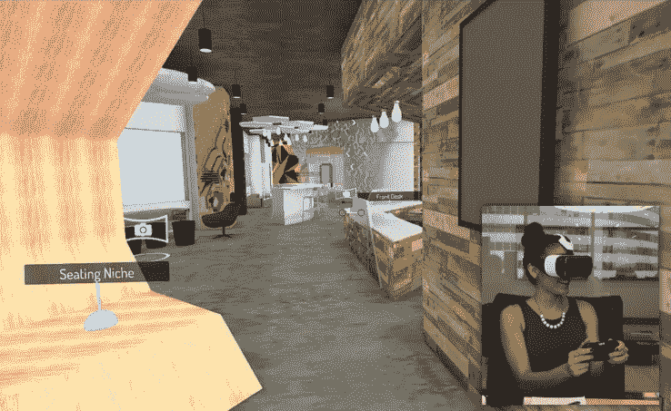

# InsiteVR 获得 150 万美元种子资金，将 3D 模型带入 VR 

> 原文：<https://web.archive.org/web/https://techcrunch.com/2016/08/19/insitevr-grabs-1-5m-in-seed-funding-to-bring-3d-models-to-life-in-vr/>

# InsiteVR 获得 150 万美元的种子资金，将 3D 模型带入虚拟现实生活

目前，大多数在虚拟现实领域筹集资金的公司都专注于娱乐潜在消费者。也许较少被关注的是那些为企业提供酷的解决方案的公司。

InsiteVR 刚刚筹集了 150 万美元的种子资金，以进入建筑和施工市场，并通过虚拟现实让这些行业的客户更容易获得项目的早期愿景。本轮投资者包括 [Y Combinator](https://web.archive.org/web/20221007041048/https://www.crunchbase.com/organization/y-combinator#/entity) 、 [CyberAgent Ventures](https://web.archive.org/web/20221007041048/https://www.crunchbase.com/organization/cyberagent) 、GREE VR Fund、 [PlanGrid](https://web.archive.org/web/20221007041048/https://www.crunchbase.com/organization/plangrid#/entity) 的 Tracy Young 和 Ralph Gootee、Greg Castle 和 Rothenberg Ventures。

每当提到虚拟现实的非娱乐性用例的话题时，很快就会提到虚拟漫游的实践。就房地产而言，有很多现有的初创公司正在解决这个问题，但他们表示，在将虚拟现实软件集成到他们的工作流程和演示中时，建筑和建筑行业并没有得到直接的满足。

InsiteVR 允许建筑师更好地与客户沟通，让他们有机会与客户一起深入 CAD 文件，并以更逼真的方式审视空间。InsiteVR 的客户可以将他们的模型上传到该服务，并在 Gear VR、Oculus Rift 或 HTC Vive 虚拟现实耳机上查看。InsiteVR 依靠“不对称 VR 演示”来允许多个 VR 用户一起探索内容并进行合作，同时桌面用户指导他们通过各种环境。

该公司始于 2014 年 TechCrunch Disrupt 黑客马拉松的一次成功黑客攻击。在那里，创始人 Angel Say 带着 Vrban 和他的大学室友 Russell Varriale 见了面，两人开始了工作。这位联合创始人通过 YC 的 2015 年冬季加速器计划成立了新公司 InsiteVR。一年半后，虚拟现实软件已被用于主持 4，000 多个项目，约有 2，500 个建筑模型通过该软件进行虚拟现实处理。使用 InsiteVR 建模查看器的著名项目包括 Unity 的旧金山总部、微软的罗利办公室和费城 30 街车站的重新设计。

这个领域在未来几个月肯定会变得更加拥挤，但 Say 和 Varriale 认为，他们现在关注的特定行业的客户需求使他们能够开发出比其他产品更适合客户的产品。