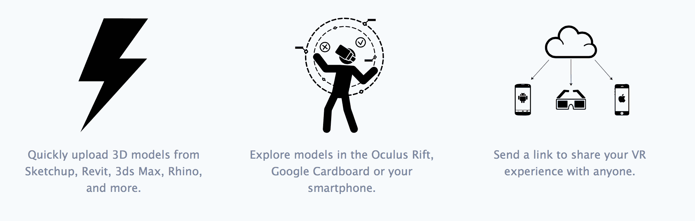

# InsiteVR 让您轻松将 3D 模型带入虚拟世界 

> 原文：<https://web.archive.org/web/https://techcrunch.com/2015/03/14/insitevr-makes-it-easy-to-bring-3d-models-into-your-virtual-world/>

# InsiteVR 可以轻松地将 3D 模型带入您的虚拟世界

当我们展望光明的虚拟现实未来时，我们发现自己陷入了僵局:我们都希望看到令人惊叹的 3D 模型像微小的数字漂浮棺材一样出现在我们面前，但如何将这些完全相同的模型放入随机生成的数字快乐宫呢？

这就是 YC 公司 InsiteVR 的用武之地。这个项目是由哥伦比亚大学的室友安吉尔·赛和拉塞尔·瓦瑞尔创建的，最初是一个获胜的“扰乱黑客马拉松”项目。

“这个想法最初是受到哥伦比亚大学校园里一座新建筑的启发，这座建筑挡住了校园天文台观测星星的视线。我们都感到沮丧的是，没有人能够提前预见到这一点，让这个重大的疏忽从裂缝中溜走，”萨伊说。该团队创造了一种叫做 Vrbun 的东西，他们希望这种东西能够让用户“使用 Oculus Rift 探索城市环境。”目的是让建筑师在他们的建筑建成之前看到它的样子。

该公司与建筑公司、品牌代理公司甚至一家活动制作公司签有六份合同。这家新公司允许你在虚拟现实体验中观看 3D 模型。

这个想法相当简单:你将一个 3D 物体上传到服务中，然后使用 VR 头戴式耳机观看它。然而，因为它支持多种文件类型，你可以上传几乎任何模型，你也可以与他人分享。这是一个有趣的概念，我从未听说过类似的事情——尽管这显然是一个令人信服的想法。

“我们不仅仅是一个可视化工具。我们不认为 VR 只是一个营销噱头，”萨伊说。“我们正在建立一个工具集，以帮助我们的客户以新的方式迭代 3D 设计，并利用虚拟现实解锁的数据，例如人们如何参与一个空间，以及他们大部分时间都在看什么。”

【YouTube = https://www . YouTube . com/watch？v=Kj5AZQmxPXQ]