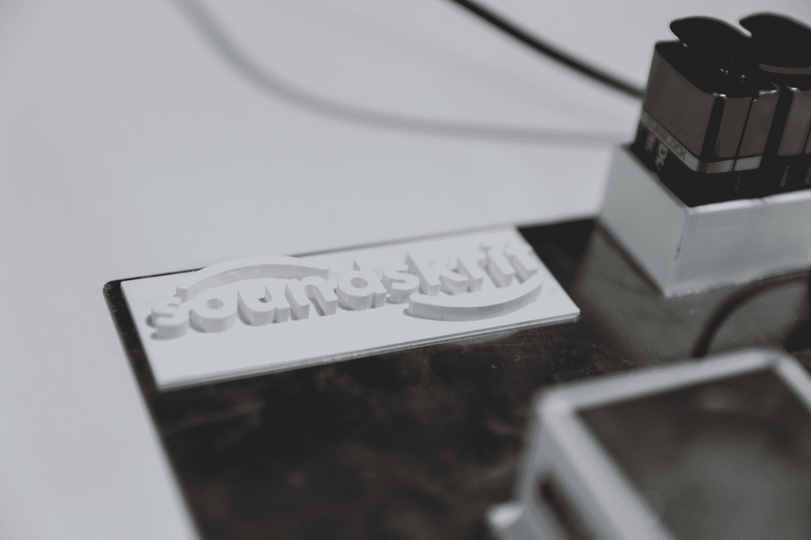

# 受昆虫耳朵的启发，Soundskrit 想让麦克风神奇地定向 

> 原文：<https://web.archive.org/web/https://techcrunch.com/2018/01/10/inspired-by-insect-ears-soundskrit-wants-to-make-microphones-magically-directional/>

# 受昆虫耳朵的启发，Soundskrit 想让麦克风神奇地定向

如今，语音控制无处不在，但为了有效地从各个方向听到人们的声音，像亚马逊的 Echo 这样的设备需要有一整套麦克风，但它们占用空间，需要额外的处理能力，并限制了工业设计。Soundskrit 是一家全新的公司，旨在用一款能够清晰听到并分离来自多个来源和方向的声音的话筒来取代众多话筒。

Soundskrit 设备很容易跟踪同时从不同方向说话的两个独立的声音，迅速提供每个声音的独立录音和抄本；[你可以在这里看到一段视频演示](https://web.archive.org/web/20221025225958/https://youtu.be/Obif8S1wrUM)。它可以很容易地忽略一个声音，以便更好地听到另一个声音，或者专注于接受来自单一方向的声音，例如在摄像机前。

我敢肯定你能想象出这种能力可能有用的六种情况:智能家居设备、视频录制、会议和电话会议……任何你或设备想听到一种声音而不想听到另一种声音的地方。

当然，这已经可以做到，但这是以一种相当笨拙的方式完成的，通过从多个麦克风获取信号，并应用算法来分类噪声，比较波形以确定哪个更强，而获得方向的想法等等。这很复杂，最终会降低录制声音的质量，尤其是在低音域。

该公司的原型麦克风的设计灵感来自昆虫，其中许多昆虫具有高度敏锐的“听觉”，通过感应空气穿过细小毛发或其他压力敏感结构的方式来实现。

Soundskrit 的技术在定制芯片上的特殊薄膜上做了类似的事情。声音从四面八方进入，根据它振动薄膜的方式，可以相当准确地确定它的来源。它做到了这一点，而没有损害声音的质量或音调。

 关于这个话题的研究可以追溯到很多年前，但是这些学生在他们的学习中遇到它后决定将它变成一个产品。他们已经从总部位于蒙特利尔的专注于研究商业化的孵化器 [TandemLaunch](https://web.archive.org/web/20221025225958/http://www.tandemlaunch.com/) 筹集了 80 万美元(加拿大)的种子资金。

目前，该团队刚刚起步，该设备还远未达到可以被纳入真正产品的状态。但是一旦它被小型化，测试等等，它是一个公平的赌注，像谷歌和亚马逊这样的公司，他们专注于准确的语音识别，将会嗅探这项技术。