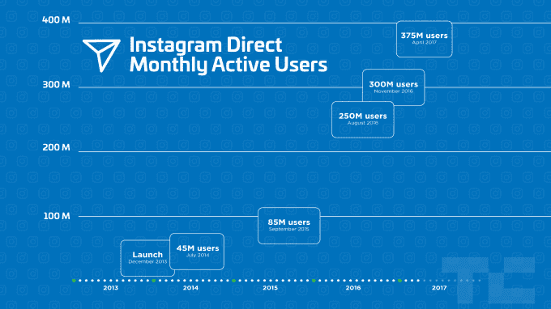

# Instagram 增长加速，达到 7 亿用户 

> 原文：<https://web.archive.org/web/https://techcrunch.com/2017/04/26/instagram-700-million-users/>

Instagram 的用户基础在两年内翻了一番，达到每月 7 亿活跃用户，这得益于故事、网络注册和低端 Android 手机上更好的加入。Instagram 的增长速度其实在加快。自从去年 12 月[的用户数量达到 6 亿以来，仅用了 4 个月就增加了最后 1 亿，而从 5 亿增加到 6 亿用了 6 个月。](https://web.archive.org/web/20230219195301/https://techcrunch.com/2016/12/15/instagram-surges-past-600m-users-fueled-by-algorithmic-feed/)

以下是 Instagram 每增加 1 亿用户所需时间的明细:

*   2010 年 10 月 6 日–发布
*   2013 年 2 月 26 日——1 亿；28 个月
*   2014 年 3 月 25 日–2 亿；13 个月
*   2014 年 12 月 10 日–3 亿；9 个月
*   2015 年 9 月 22 日——4 亿；9 个月
*   2016 年 6 月 21 日–5 亿；9 个月
*   2016 年 12 月 15 日–6 亿；6 个月
*   2017 年 4 月 26 日——7 亿；4 个月

作为参考，这使得 Instagram 的规模比 Twitter 的两倍还要多[。由于 WhatsApp 和 Messenger 拥有 12 亿用户，脸书拥有 18 亿用户，它可能很快就会加入脸书其他网站的十亿用户俱乐部。](https://web.archive.org/web/20230219195301/https://techcrunch.com/2017/04/26/twitters-first-quarter-was-a-surprise-much-needed-hit/)

当被问及 Snapchat 克隆 Instagram Stories 的推出是否有助于增加该应用的用户数量时，一位发言人告诉我，“是的，它影响了增长和保留。”本月早些时候，Instagram Stories 的日活跃用户数达到了 2 亿，超过了 Snap Inc .上次公布的 1.61 亿日活跃用户总数。Instagram 的短暂和永久消息功能 Direct 也受到 Snapchat 的启发，最近达到了 3 . 75 亿月用户。

Instagram 的进步是以 Snapchat 的增长为代价的，自从 Instagram 在 8 月份推出其故事模仿者以来，Snapchat 的增长下降了 82%。下个月 Snap 发布第一份财报时，所有人都会关注它的用户数量。

与此同时，随着 Snap 在广告费率较低的外国市场失去优先地位，Instagram 继续推进其国际业务。“发展中市场对 Instagram 来说一直很重要，”一位发言人说。“美国是我们最大的市场，但巴西一直是我们的第二大市场(目前有 4500 万用户)。除了英国和日本，我们的其他大市场包括印度尼西亚、印度和土耳其。”现在 80%的 Instagram 用户都不在美国。

Instagram 一直在为这些买不起数据套餐或连接能力弱的用户专门打造产品。它刚刚在 Android 上引入了离线模式，该公司告诉我，它一直在更专注于移动网络体验，并将 Android 应用程序的文件大小保持在最低水平。

一位发言人说:“增长是由许多因素推动的，包括我们在 Instagram 上更好地联系人们和他们的朋友的能力。”“我们还采取措施简化和改进我们的注册流程，这有助于吸引来自世界各地的新人。”

拥有如此庞大的受众，Instagram 拥有吸引顶级品牌的规模。该应用程序现在拥有 100 万活跃广告客户，高于 9 月份的 50 万，并计划为他们提供更多数据和灵活性。

一个社交网络在 6.5 年后还能保持这么酷是很少见的。甚至它的主人脸书也开始显得有点老了。但是，通过坚持其视觉交流的根基，同时敏锐地适应新趋势，Instagram 成功地保持了领先地位。