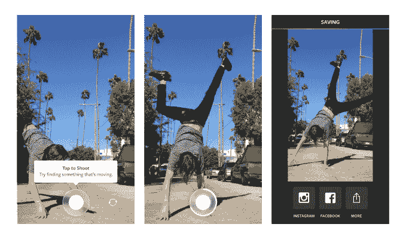
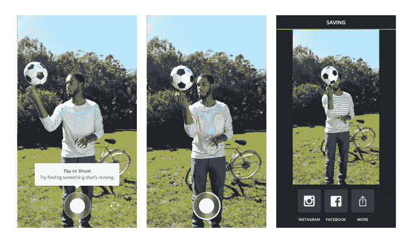
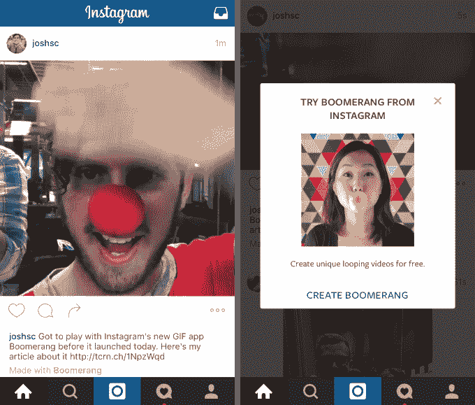

# Instagram 的新独立应用 Boomerang 捕捉 1 秒钟的视频循环

> 原文：<https://web.archive.org/web/https://techcrunch.com/2015/10/22/instagram-boomerang/>

Instagram 不希望它的订阅变得陈旧，但也不想用额外的功能来膨胀它的应用程序。所以今天是[在](https://web.archive.org/web/20230406062800/http://blog.instagram.com/post/131684343987/boomerang-from-instagram) [iOS](https://web.archive.org/web/20230406062800/https://itunes.apple.com/us/app/boomerang-from-instagram/id1041596399) 和 [Android](https://web.archive.org/web/20230406062800/https://play.google.com/store/apps/details?id=com.instagram.boomerang) 上推出回旋镖。这是一个非常简单的应用程序，你可以拍摄一秒钟的五张照片，然后转换成无声视频，向前播放，然后循环播放。回旋镖会自动保存到你的相机胶卷中，但可以很容易地在脸书、Instagram 或其他地方分享，因为该应用程序没有自己的订阅源。该应用程序不需要 Instagram 帐户，甚至不需要登录。

Boomerang 的工作方式与 Instagram 的新贵竞争对手 Phhhoto 非常相似，后者拍摄微小的[gif，Instagram 在 4 月](https://web.archive.org/web/20230406062800/https://techcrunch.com/2015/04/24/nochill/)将其从交友功能中删除。将突发大火转变成动画的想法让人想起了[谷歌照片动画功能](https://web.archive.org/web/20230406062800/https://techcrunch.com/2015/05/28/free-dollars-and-fifty-free-cents/)，尽管你必须在应用程序中拍摄回旋镖。Instagram 似乎并不害怕看到令人兴奋的照片分享者，并看看它是否能将其应用到自己的产品中，即使它被要求复制。

但声明一下，这个应用不太像 Vine。这更像是苹果的实时照片，聚焦在一个非常特殊的时刻。【更新:现在 [Snapchat 有了自己的倒带功能](https://web.archive.org/web/20230406062800/https://t.co/8IdcZ4goRv)，还有新的慢动作和快进视频滤镜。]

你可能会问，如果我们已经有了 6 秒和 15 秒的应用程序，为什么我们还需要 1 秒的视频应用程序。这是因为大多数人都不擅长编写那么长的视频。当你只有一秒钟的时间时，很难变得无聊。

Boomerang 遵循 Instagram 之前独立应用 Hyperlapse(延时)和 Layout(拼贴画)的策略。如果它也获得成功，Boomerang 可以进一步帮助增加 Instagram 五年前的提要的味道。

这一点很重要，因为 Instagram 正在与 Snapchat 争夺青少年用户，Snapchat 不断添加新功能，如[动画自拍镜头](https://web.archive.org/web/20230406062800/https://techcrunch.com/2015/09/15/snapchat-looksery/)和地理滤镜，以保持动态。希望 Boomerang 能给 Instagram 带来一些新东西，而不是老一套的日落、拿铁和婴儿。

尽管“婴儿真的非常非常喜欢回旋镖”，但该应用的产品经理约翰·巴尼特告诉我。  这款应用最初是由 Instagram 的一小群安卓工程师在 7 月的一次黑客马拉松上构思的。“这是我们建造的东西，只是为了好玩，让我们作为一个团队一起玩，”他说。但是随着 Instagram 的大部分员工爱上了这个应用，他们意识到它可能会给全世界带来娱乐。生产回旋镖的核心团队只有五个人。

关于 Boomerang，你会注意到的第一件事是按钮很少。实际上只有两个屏幕。因为你不需要登录，你从摄像头开始。

在正常模式或自拍模式下点击快门按钮，Boomerang 会在一秒钟内快速拍摄五张照片。Barnett 表示，该应用的 iOS 版本实际上会让事情看起来更好一些，因为它可以以 Android 不允许的方式稳定图像，以防止剪辑使你头晕。然后 Boomerang 向您展示您的无限循环创作。Instagram 将剪辑加速到大约两倍的速度，因此来回循环大约在一秒钟内完成。这种略微快进的感觉让一切变得更有趣、更刺激。

[维梅奥·http://vimeo.com/143161189]

你可以选择将你的回旋镖滑动到 Instagram 或脸书，在那里你可以编辑和命名它。还有一个通过手机操作系统分享到其他服务的更多按钮。无论如何，Boomerang 还方便地将剪辑保存为 4 秒钟的视频，来回循环 5 次图像，这样就可以单独观看了。这种自动保存意味着，如果你愿意，你可以立即回去录制更多的连拍。之后，你可以对剪辑做任何你想做的事情，但它们将在 Instagram 等自动循环视频的服务上工作得最好。

总的来说，Boomerang 感觉清新轻巧，令人愉快。只是一个插科打诨或动作镜头的想法的火花，该应用程序可靠地制作了一个有趣的剪辑。完美的循环有一种内在的满足感。Boomerang 做了一项出色的工作，专注于一个浓缩的幽默或美丽的瞬间，这些瞬间可能会因照片而消失，但会在视频中丢失。

Boomerang 最大的问题是它太轻了，你可能会忘记它。这对你的生活并不重要，只是一个不错的奖励。它自己可能会消失在你手机的后屏幕上。但我可以想象，当我本来要拍摄 Instagram 照片或视频时，我会记得把它拔出来。我打赌飞去来器也很棒[脸书视频简介图片](https://web.archive.org/web/20230406062800/https://techcrunch.com/2015/09/30/facebook-profile-gif/)。

我唯一的功能要求是一个倒计时选项，用于显示那些小笑话，Barnett 暗示这可能会在未来的更新中出现。闪光灯也不错。

但是 Boomerang 的简单性意味着很少有人会对他们应该用它做什么感到困惑。考虑到许多用户年龄较轻，相对缺乏应用经验，包括 75%的美国以外的用户，这一点很重要。Boomerang 与像 Mixbit 这样的压倒性内容创作应用相反，这些应用充满了太多的选择，人们在制作任何东西之前就会困惑地放弃它们。

一个问题将是 Instagram 在多大程度上推广 Boomerang。它通过从 Instagram 编辑屏幕链接到其下载页面，增加了 Layout 的下载量，该应用的 4 亿月度用户经常看到该页面。你可以想象在 Instagram 视频摄像头屏幕上有一个类似的 Boomerang 按钮。

[更新:看起来 Instagram 将在其 feed 中的帖子上包含一个“用回飞棒制作”的链接，所以当人们看到一个很酷的循环时，他们将能够立即下载并制作自己的循环。聪明。]

与母公司相比，Instagram 的独立应用战略似乎运气更好。脸书在独立应用中试验新的功能，这些功能与脸书本身没有什么关系，然后把最好的东西带回它的主应用。但脸书的几个应用程序，包括 Riff、Slingshot 和 Rooms，都遭遇了惨败，尽管它们孵化了在照片上画画等功能。

相反，Instagram 将独立应用视为外部创意工具，直接将内容反馈到主应用中。Instagram 没有在它的一系列滤镜和效果上增加更多编辑选项，而是只保留最基本的东西。如果你不想要额外的工具，你可以不使用它们，但外部应用程序会给提要注入活力。这样，即使五年后，人们仍会继续浏览照片和看到广告，通过别人的眼睛看世界。