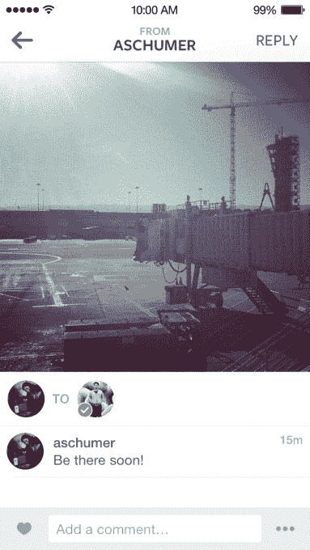

# Instagram Direct 并未消亡，其消息功能拥有 4500 万用户 

> 原文：<https://web.archive.org/web/https://techcrunch.com/2014/07/11/instagram-direct/>

该公司告诉我，[推出 Instagram Direct](https://web.archive.org/web/20221206105214/https://beta.techcrunch.com/2013/12/12/instagram-messaging/) 七个月后， [Instagram 的](https://web.archive.org/web/20221206105214/http://www.crunchbase.com/organization/instagram) 2 亿用户中有 4500 万人在积极发送或打开直接信息。这个 23%的月使用率表明 Direct 远非胎死腹中。虽然我还没有看到或听说过很多朋友使用短暂的私人分享渠道，但它可能正在悄悄地获得那些使用 Instagram 作为主要社交网络的人或寻求比 feed 更亲密的小团体的支持。

在发布之前，当消息人士告诉我们一个短暂的 Instagram 消息功能正在开发中时，我说这是明智之举，原因有四。直接可以:

1.  排挤 Snapchat 等私有且短暂的消息竞争对手，
2.  使用通知比在易被遗忘的订阅源中丢失的照片更能激发回访
3.  通过创造另一个注册理由来全面发展 Instagram
4.  解锁不适于向数亿人广播的内容类型的共享

最后一点是最重要的，我怀疑是什么推动了 Direct 的增长。无论是一张傻乎乎的脸，一个挑逗的微笑，一个粗俗的笑话，还是仅仅是日常对话，Direct 都为比 Instagram 上公开发布的照片范围更广的照片创造了一个媒介。私下里，你不必看起来完美，捕捉最令人震惊的过滤日落，或炫耀你浮夸的生活方式。一对一或更小的密友群体的微分享让我们做自己。

## 那么是谁在用 Instagram Direct 呢？

Instagram Direct 推出[几天后，我质疑它是否注定](https://web.archive.org/web/20221206105214/https://beta.techcrunch.com/2013/12/15/too-different-not-different-enough-why-instagram-direct-may-fail/)。我的朋友都没有用它。进行视觉对话很尴尬，因为每张照片或视频回复都有自己的线索。这与通过 Snapchat、Facebook Messenger 甚至短信分享的感觉还不够不同。

[TC _ 5min code = " 518062004 "]

但我敢打赌，Instagram Direct 的 4500 万粉丝主要由两类用户组成。

### 不是我们

我可能已经屈服于通过我的非典型社交图谱来判断一个国际产品的成功，这些社交图谱由更成熟、更铁杆的科技用户组成。从早期开始，我的许多朋友就在[脸书](https://web.archive.org/web/20221206105214/http://www.crunchbase.com/organization/facebook)和[推特](https://web.archive.org/web/20221206105214/http://www.crunchbase.com/organization/twitter)上。他们经常使用 Snapchat 和 Facebook Messenger、WhatsApp 和其他聊天服务。最重要的是，Instagram 不是他们的主要社交网络。他们对通过文本和链接分享知识感兴趣，而不仅仅是容易消化的照片和视频。

不过，我的图表远不具有代表性。有很多人在 Instagram 上生活和呼吸。厌倦了脸书上的戏剧、空洞、无聊的链接和广告，他们使用 Instagram 作为他们的社交网络。他们不一定是狂热的 Snapchat 或消息应用用户。对他们来说，直接是一种便捷的交流方式，因为他们已经在 Instagram 上花了太多时间，他们的朋友都在那里。有了这些忠实的用户，Direct 可能会蓬勃发展。

### 组

还有谁？几个月前，Instagram 的一位高管告诉我，Direct 在小群体中的影响力越来越大。有些是基于兴趣的，比如一个由摄影爱好者组成的紧密联系的社区，他们使用 Direct 来获得对他们照片的反馈。

其他团体只是朋友的小团体，他们想确保他们的好朋友看到他们的“祖母”。由于该应用程序有一个未过滤的订阅源，如果你关注太多的人或他们不经常发布，很容易失去亲密朋友的跟踪。Direct 的阅读回执显示朋友们是否看过你发给他们的照片，所以你不只是在暗中分享。

这种类型的微分享开辟了更多非正式的内容类型，降低了创作门槛。Direct 可以让人们更频繁地分享更多类型的照片…只是分享给更少的人。只要这能让用户回到应用，拍照，浏览显示广告的 feed，直接微分享对 Instagram 来说就是一个胜利。