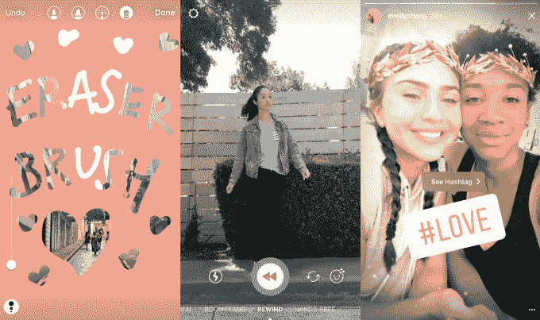

# Instagram 推出自拍滤镜，复制上一个大 Snapchat 功能

> 原文：<https://web.archive.org/web/https://techcrunch.com/2017/05/16/instagram-face-filters/>

今天，Instagram Stories [增加了](https://web.archive.org/web/20230222165756/http://blog.instagram.com/post/160730363267/introducing-face-filters-and-more-on-instagram)一个更微妙、更成熟但容易出错的模仿 Snapchat 心爱的增强现实自拍滤镜。Instagram 称之为“面部过滤器”的八个初始过滤器的工作方式与 Snapchat 完全一样，可以让你在照片或视频中为自己和朋友添加虚拟考拉耳朵、书呆子眼镜、蝴蝶冠或平滑皱纹的化妆品。

TechCrunch 获得了滤镜的独家实践演示，这些滤镜更容易使用，不会扭曲你的脸，但不会像 Snapchat 一样跟踪你的运动，并在你的脸上保持正确的位置。你可以在下面观看我们的实践演示视频，并跟随和观看我们今天在 TechCrunch Disrupt 上对 Instagram 产品副总裁凯文·韦尔的采访: [**Instagram 复制 Snapchat“这是科技行业的工作方式”**](https://web.archive.org/web/20230222165756/https://techcrunch.com/2017/05/16/to-clone-or-not-to-clone/)

人脸滤镜是 Instagram 上最后一个主要的 Snapchat Stories 功能，此前它克隆了 Snap 的幻灯片共享格式，覆盖的创意工具，消失的直接消息等。如果没有令人信服的理由让新用户选择最初的 Snapchat 故事而不是 Instagram Stories 克隆，Instagram 可能会因此扩大差距，增加其 [2 亿每日故事用户](https://web.archive.org/web/20230222165756/https://techcrunch.com/2017/04/13/instagram-stories-bigger-than-snapchat/)，这已经超过了 [Snapchat 的 1.66 亿总用户](https://web.archive.org/web/20230222165756/https://techcrunch.com/2017/05/10/snapchat-user-count/)，并进一步放缓 Snap 的增长率，这导致其在上周宣布疲软的收益后[损失了 25%的股价价值](https://web.archive.org/web/20230222165756/https://techcrunch.com/2017/05/10/snap-is-getting-crushed-after-falling-short-of-wall-streets-expectations/)。

面部过滤器和另外三个功能今天通过一个 [iOS](https://web.archive.org/web/20230222165756/https://itunes.apple.com/us/app/instagram/id389801252?mt=8) 和 [Android](https://web.archive.org/web/20230222165756/https://play.google.com/store/apps/details?id=com.instagram.android&hl=en) 应用更新向所有用户推出。橡皮擦工具可以让你删除添加到图像中的图片，尽管它不能像 [Snapchat 的神奇橡皮擦](https://web.archive.org/web/20230222165756/https://techcrunch.com/2017/05/09/snapchat-magic-eraser/)那样从原始图像中“Photoshop”出对象。Instagram 新的倒带模式反向播放视频，就像 Snapchat 最古老的滤镜之一。

Instagram 最具原创性的新功能是能够键入标签，并将其作为贴纸添加到你的故事帖子中，就像[位置贴纸](https://web.archive.org/web/20230222165756/https://techcrunch.com/2016/12/20/instagram-stickers/)一样。当观众点击这些贴纸时，他们会被带到 Instagram 标签页面，显示其他带有该标签的公开永久帖子。不过，最终，你可以想象通过标签搜索故事的能力，或者观看一个“标签故事”,这个“标签故事”是从所有带有该标签的公开可见的故事中编译出来的。 [Instagram 实际上刚刚开始测试位置故事](https://web.archive.org/web/20230222165756/https://techcrunch.com/2017/05/16/instagram-location-stories/)。

Instagram 的新橡皮擦、倒带模式和故事标签

## 成人面部过滤器

当被问及该应用程序复制 Snapchat 的面部过滤器时，Instagram 的一位发言人说:“围绕增强现实，人们正在做许多令人兴奋的工作。”。“我们从社区中了解到，他们希望用更有创意的方式来分享日常生活，与朋友交流。有了面部过滤器，他们手头的工具比以往任何时候都多，而且都在一个地方。”

虽然这有点回避问题，但最后一部分很有启发性。Instagram 希望成为视觉沟通的一站式商店，无论你的年龄大小。Instagram 在 Snapchat 自拍面具上的旋转旨在让它们变得简单，不那么古怪，从而吸引青少年以外的用户。如果你对故事不感兴趣，你也可以使用 Instagram Direct 和 Boomerang 的面部过滤器，以及你可能想发布到主 feed 的图像。

Instagram 不需要像 Snapchat 那样知道你在屏幕上点击来激活面部过滤器，而是窃取了那个访问点，因此对资深面膜用户来说很直观，而且还添加了一个笑脸按钮，在屏幕底部显示 8 个过滤器的托盘。

Instagram 发言人表示:“设计和特定滤镜是由 Instagram 团队打造的。”但提到脸书去年收购的 AR 初创公司，他们指出，“底层技术使用了 MSQRD 的成像技术和脸书应用机器学习团队的专有技术。”

Instagram 不愿透露可用的过滤器是否会扩展、旋转或来去自如，但他们确实表示“我们将定期为社区带来更多面部过滤器。”下面是初始设置的简要概述:

*   **金冠**——一个凯撒风格的金色花环环绕在你的头上，这款滤镜微妙而又通用，足以成为滤镜的好入门。
*   **考拉**——这个可爱的滤镜增加了考拉的鼻子和耳朵，当你张开嘴时，它们会惊讶地扬起，尽管它没有 Snapchat 标志性的小狗滤镜那么可爱。
*   书呆子眼镜(Nerd Glasses)——这款眼镜让数学方程式在你的脑海中盘旋，可以同时出现在两个人身上，如果你向前倾斜，眼镜会从你的鼻子上滑落。
*   **兔子**——又一次试图击败 Snapchat 的小狗过滤器，当你张开嘴时，这些耳朵会惊讶地竖起，如果你学习左右摇摆，它们会通过折叠来对重力做出反应。
*   **蝴蝶皇冠**——insta gram 尝试 Snapchat 最喜欢的花朵皇冠，在你的头上戴上一圈蝴蝶，随着你的移动而飞舞。
*   **冰冠**——你呼出蒸汽，雪花随着这个冰冠飞舞。
*   孔雀——前景中巨大的紫色羽毛遮住了你的视线，直到它们被拉到一边露出你，当你向前倾斜时，看起来就像一个 20 世纪 30 年代的挡板。
*   **化妆**——insta gram 的最终面部滤镜给你洗出金色的色调，抚平你的皱纹，让你看起来更“美丽”

总的来说，这些滤镜旨在微妙地扩大你的脸，而不是像 Snapchat 的一些更积极的滤镜那样完全覆盖或改变它的形状。虽然这让它们不那么好玩和引人注目，但它们也更加巧妙和成熟——这是成年人可能实际使用的东西。

目前，Instagram 不允许赞助面部过滤器，但这些最终可能会与 Snapchat 的类似广告部门相竞争。随着所有最受欢迎的 Snapchat Stories 功能的成功克隆，剩下的小事情包括向你周围的世界添加 3D 增强现实对象。

现在事情应该会变得更有趣，因为 Instagram 将不得不做更多的创新，因为它已经没有可以复制的东西了。