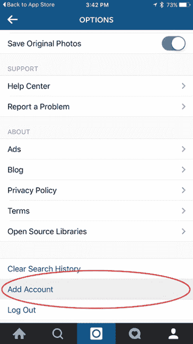

# Instagram 终于可以轻松使用多个账户了 

> 原文：<https://web.archive.org/web/https://techcrunch.com/2016/02/08/instagram-finally-makes-it-easy-to-use-multiple-accounts/>

# Instagram 终于可以轻松使用多个账户了

从本周开始， [Instagram](https://web.archive.org/web/20221221052457/https://www.instagram.com/) 启用了一项功能，允许无处不在的照片分享应用[的用户在多个账户](https://web.archive.org/web/20221221052457/http://blog.instagram.com/post/138938416772/160208-accountswitching)之间切换。毫无疑问，这将让重度用户和社交媒体管理者欢欣鼓舞。

最多可以添加五个帐户，在它们之间切换不需要注销，但是你需要使用 7.15 版本的应用程序(iOS 和 Android)。

[帮助](https://web.archive.org/web/20221221052457/https://help.instagram.com/1682672155283228)页面的说明如下:

作为一名消费者，目前我只能处理一个账户，但随着 Instagram 在品牌营销中发挥越来越大的作用，这一新功能可能会使许多营销人员的工作变得更加容易。

