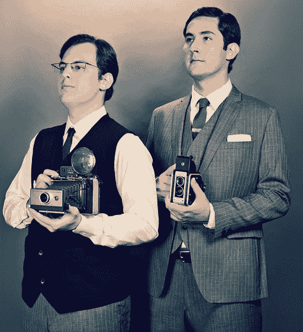
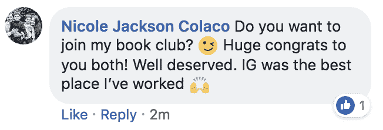
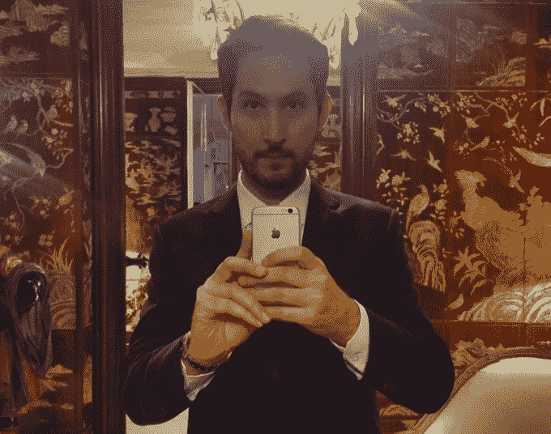
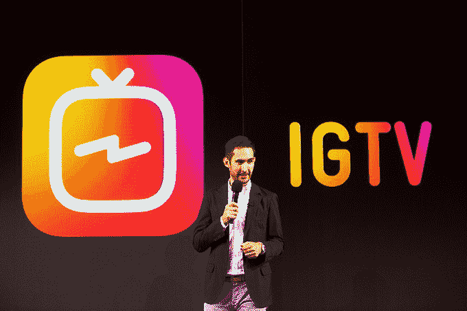

# Instagram 创始人辞职的原因:脱离脸书的独立性减弱

> 原文：<https://web.archive.org/web/https://techcrunch.com/2018/09/24/instagram-founders-leave/>

脸书承诺 Instagram 自治，但随着时间的推移，它减少了导致今天的惊人披露。据《纽约时报》报道，在推出 Instagram 八年后，以及将其出售给脸书六年后，Instagram 联合创始人 CEO 凯文·斯特罗姆和 CTO 迈克·克里格将离开公司。当创始人今天通知公司他们将辞职并在未来几周内离开时，他们显然没有给出离开的原因。

## 为什么？

但据 TechCrunch 的消息来源称，今年 Instagram 和脸书领导层之间关于 Instagram 自主权的紧张关系有所升级。作为收购交易的一部分，脸书已经同意让它独立运营。但在 5 月，Instagram 受人爱戴的产品副总裁凯文·韦尔(Kevin Weil)跳槽到了脸书的新区块链团队，并被脸书新闻频道的前副总裁亚当·莫塞里(Adam Mosseri)取代，后者是扎克伯格的核心圈子成员。

“亚当是一个意志非常坚强的人”，一位消息人士说，“克里斯(考克斯，脸书的首席产品官)和凯文从来没有真正相处过。”在这两者之间，他们可以迫使 Instagram 为脸书做更多的事情——鉴于丑闻和青少年使用脸书品牌减少的影响，这一点很重要。"当 Chris 开始采取主动，而 Adam 更多地是脸书的老派同道中人时，这显然不会令人愉快。我看到这个家伙(Systrom)会被压榨。”然而，另一位消息人士表示，自年中转到 Instagram 以来，Mosseri 广受欢迎，富有成效，考克斯一直与 Systrom 合作。据说两者在公司内部都很受欢迎。

Systrom 和脸书首席执行官马克·扎克伯格历史上相处融洽，但他们偶尔会有分歧。有消息称，在解决问题之前，他们每年都会发生几次冲突。这些冲突包括“分享回脸书。凯文想把分享留在 Instagram 上，但在某个时候，马克希望 Instagram 上的内容制作流向脸书。但最近事情变得更加激烈。”最近，马克决定关闭所有来自脸书的 Instagram 链接。"

这种僵局的证据可以在脸书看到，去年[证实它在书签菜单](https://web.archive.org/web/20230316225224/https://techcrunch.com/2017/09/20/you-can-now-launch-the-instagram-app-directly-from-facebook/?ncid=rss)中增加了 Instagram 的快捷方式。这条捷径已经消失了。今年，一些 Instagram 用户开始在他们的 Instagram 通知选项卡中收到脸书提醒，并在 Instagram 的设置菜单中看到带有红色通知计数的脸书按钮。

脸书从书签菜单中移除了 Instagram 的快捷方式，如第二行所示

脸书施加的压力也表现在其他离开上。今年早些时候，Instagram 的公共政策总监妮可·杰克森·科拉科悄悄离开了公司，据一位消息人士称，她自 2013 年起担任该职位，自 2009 年起担任脸书隐私经理。尽管在 LinkedIn 上仍然显示自己受雇于 Instagam，但 Colaco 通过[在 Krieger 的离职帖子上评论](https://web.archive.org/web/20230316225224/https://www.facebook.com/photo.php?fbid=10104139510769033&set=a.10100106263159573&type=3&comment_id=10104139541033383&comment_tracking=%7B%22tn%22%3A%22R4%22%7D)说“IG 是我工作过的最好的地方”，巧妙地证实了自己的离职。Instagram 的 AR/相机产品负责人凯斯·佩里斯和威尔今年早些时候离开了 Glossier。

两周前，Instagram 的首席运营官·马恩·莱文重返脸书，担任合伙人。莱文被认为是一股强大的凝聚力。由于没有名为 Instagram 的替代品，insta gram 开始看起来更像是脸书的一个产品部门。如果没有他们，加上脸书的其他六大租户都处于有序状态，除了扎克伯格的忠实粉丝莫塞里，还不清楚谁适合领导 Instagram。

我们的消息来源说“莫塞里非常失望，他没有得到威尔·卡斯卡特的‘脸书首脑’的职位。Instagram 的产品副总裁是一种安慰奖。但他们说，他给 Instagram 副总裁的任务是扎克伯格“为凯文和迈克做继任规划”。马克是一个杰出的战略家，当然他会想安插一个人。

尽管有可能离职的传言，但 Instagram 的员工听到 Systrom 将离开时感到惊讶和悲伤。“凯文留下了一些大鞋子来填补”一位消息人士说。"内部有人怀疑亚当能否胜任这个角色。"然而，监督脸书自 2016 年大选以来的反假新闻变化，可能让莫塞里学到了很多关于预测后果的知识——这是一项宝贵的技能，可以带到 Instagram，因为它对文化的影响超过了脸书。我认为他会做得很好。

脸书已经开始入侵 Instagram，在它的设置侧栏(左)和通知标签(右)中设置提醒

在将该应用的用户增加到 10 亿，征服其主要竞争对手 Snapchat，将其转变为一项大规模广告业务之后，Instagram 的创始人可能会觉得他们已经完成了自己的职责，并准备好应对不同的挑战。他们宁愿去建设一些新的东西，而不是对抗脸书的强加。

在一份声明(和 [Instagram 帖子](https://web.archive.org/web/20230316225224/https://www.instagram.com/p/BoIuEEmBWn5))中，Systrom 和 Krieger 写道:“我们计划休息一段时间，再次探索我们的好奇心和创造力。创造新事物要求我们退后一步，理解是什么激励着我们，并把它与世界的需求相匹配；这就是我们计划要做的。”扎克伯格向 TechCrunch 发表了自己的声明，称“凯文和迈克是非凡的产品领导者，Instagram 反映了他们的综合创意才华。在过去的六年里，我和他们一起工作，学到了很多东西，真的很开心。我祝他们一切顺利，并期待看到他们接下来的作品。”

首席执行官凯文·斯特罗姆

## 克里格和西斯特罗姆的崛起

这两人是斯坦福大学的校友，最初创建了一个社交定位应用 Burbn，但发现其照片过滤器是该应用程序中最受欢迎的部分。Instagram 通过将工具与分享照片的社交 feed 相结合，使早期智能手机上的颗粒状照片看起来更好，成为了世界上最成功的移动应用程序。鉴于这种威胁，脸书斥资 7.15 亿美元收购了这家初创公司及其每月不到 5000 万的用户。

在脸书的工程团队的强力推动下，克里格在花费数年时间应对服务器火灾，试图管理 Instagram 的快速增长后，终于可以休息一下了。来自脸书的销售、国际化、反垃圾邮件和其他资源让 Instagram 推动了它的发展，并催生了广告业务。

随着 Stories 的推出，Instagram 的关键时刻到来了，Stories 是 Snapchat 流行的短暂分享功能的克隆。当时，Systrom 承认“他们应该得到所有的荣誉”。但是，通过在已经蓬勃发展的 Instagram feed 上添加故事，对它们进行排序，以显示你最好的朋友，而不是 Snapchat，并关注 Snap 忽视的发展中国家的表现，山寨版很快就超过了原版。Instagram Stories 现在有 4 亿日活用户，而 Snapchat 的整个应用程序有 1.88 亿日活用户。

## Instagram 的遗产

在这六年中，Instagram 也遇到了麻烦。Cyberbully 变得猖獗，导致该公司最终大举投资人工智能和人类版主，以保持应用程序的清洁。俄罗斯军方特工在 Instagram 上传播错误信息和宣传，影响了 2000 万美国人，使该公司卷入了一场选举干预丑闻，这场丑闻将持续到即将到来的中期选举。

Instagram 首席执行官凯文·斯特罗姆在 6 月 20 日的发布会上发布了 IGTV

脸书基本上允许 Instagram 独立运行。Systrom 和扎克伯格密切合作，但 Instagram 没有被迫让用户淹没在其他脸书产品的交叉推广中，也没有做出令人担忧的隐私决定。随着莫塞里的介入，脸书希望 Instagram 发挥作用，它的自主权受到了威胁，导致两派领导人之间的分歧。

此前，同为脸书收购公司的 WhatsApp 创始人在更加严峻的形势下离职。布莱恩·阿克顿(Brian Acton)将脸书的隐私担忧列为离职原因之一，他在推特上写道，“删除脸书”，这是其最近的一个丑闻。

脸书已经逐渐对其所有的收购施加更多的控制。Internet.org 负责人 Chris Daniels 被任命负责 WhatsApp。Oculus 被转移到脸书硬件主管 Andrew“Boz”Bosworth 的管辖范围内，Andrew“Boz”Bosworth 是扎克伯格的另一位长期密友和哈佛同学。总之，这些举措似乎危及了该集团最大收购案的独立性，因为它们任命了最高层的脸书亲信。如果没有 Systrom 和 Krieger，Instagram 可能会看到它的自主权减少。这反过来可能会危及其招聘和留住人才的能力。

也许 Systrom 和 Krieger 最强的遗产将是 Instagram 如何改变了全球文化。它让非艺术家感到有创造力，让人们给朋友一个了解他们世界的窗口，产生共鸣和友谊。

两位创始人的早期照片，经过大量过滤

与此同时，对喜欢的极度渴望导致许多人修饰他们的网络形象，同时隐藏他们的悲伤和脆弱。Instagram 成为成功剧场的首要场所，在这里，人们通过炫耀自己最迷人的时刻，引发对他人健康有害的嫉妒。当 Instagram 推出 Stories 试图让用户分享的不仅仅是他们的生活亮点时，它最终使用智能手机摄像头打断每个特殊时刻的行为变得正常化。

Systrom 在数字福祉问题上表明了立场，称“我们正在开发工具，帮助 IG 社区更多地了解他们在 Instagram 上花费的时间——任何时间都应该是积极的和有意的。。。理解在线时间如何影响人们是很重要的，所有公司都有责任诚实面对这一点。我们想成为解决方案的一部分。我认真对待这一责任。”

也许 Systrom 和 Krieger 的下一个项目将寻求抵消他们的创造对社会造成的一些扭曲。或者他们可以再拍一张照片，通过艺术和自我表达的镜头把人们聚集在一起。Instagram 之所以占据主导地位，部分原因是他们坚持让自己的文化和产品与收购它的公司截然不同。就像他们的应用程序鼓励的那样，Systrom 和 Krieger 看到了其他人没有看到的艺术潜力。

*这篇文章已经更新了关于创始人为什么要离开的背景，以及他们的官方声明。*