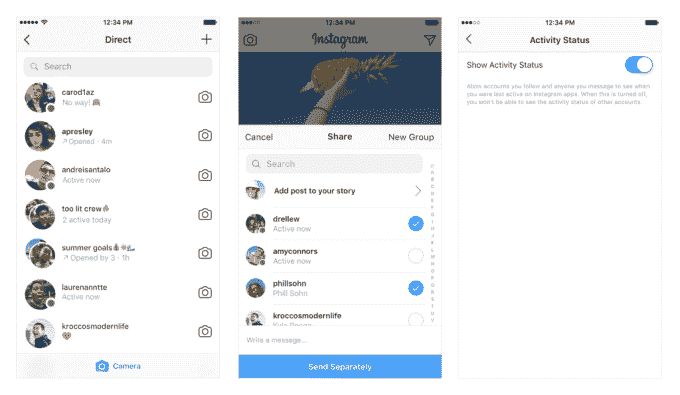

# Instagram 添加了一个状态指示器点，这样人们就知道你什么时候忽略了他们

> 原文：<https://web.archive.org/web/https://techcrunch.com/2018/07/19/instagram-green-dot-status-indicator/>

# Instagram 添加了一个状态指示器点，这样人们就知道你什么时候忽略了他们

在今天的一篇[博客文章中，Instagram 宣布了一项新功能:一个绿色状态点，指示用户何时在该应用上活跃。如果你在 Instagram 上浏览，你会看到朋友的个人资料照片旁边有一个绿点，他们也在 insta gram 上。](https://web.archive.org/web/20230316153152/https://instagram-press.com/blog/2018/07/19/new-see-when-your-friends-are-online-to-dm/)

这个圆点会显示在应用程序的直接消息部分，但当你与他人分享帖子时，它也会显示在你的好友列表中。Instagram 澄清说，“你只会看到关注你的朋友或你直接交谈过的人的状态”，所以这意味着让你与你已经交谈过的人进行更多的交谈。你可以[在应用程序设置菜单的“活动状态”位禁用状态信息](https://web.archive.org/web/20230316153152/https://help.instagram.com/1164377657035425?helpref=faq_content)，默认设置为“开”。

在绿点出现之前，Instagram 已经通过在你的直接信息所在的账户信息旁边以灰色文本显示类似“2300 万年前活跃”或“现在活跃”的信息来显示某人活跃了多久。对于我们这些喜欢平静、不那么实时的体验的人来说，这些功能默认开启的事实令人失望。

鉴于灰色的活动状态文本，状态点可能看起来没有太大的变化。尽管如此，这是一个退出的设计选择，更接近于使 Instagram 成为像脸书或 Facebook Messenger 一样的强迫性实时社交媒体噩梦。灰色状态文本等功能的安静、渐进展示往往非常微妙，以至于用户不会注意到它——作为 Instagram 的日常用户，我几乎没有注意到。

缓慢地进行重大转变是脸书对其产品一直玩的游戏，将微小的设计变化分层，改变用户行为，直到有一天你醒来，不再使用你以前喜欢的应用程序，但不知何故，你似乎无法停止使用它。Instagram 正在为[应用内时间管理](https://web.archive.org/web/20230316153152/https://techcrunch.com/2018/06/16/time-on-instagram/)开发一个功能，但这样的东西否定了脸书更广泛的[所谓的努力](https://web.archive.org/web/20230316153152/https://techcrunch.com/2018/01/11/facebook-time-well-spent/)，使我们与其渴望关注的平台的关系不那么强迫性。

用户现在可以在应用程序中看到谁“在线”，这并不会让他们松一口气。上一次 Instagram 用户热情地要求一个功能是[要求返回到时间顺序提要](https://web.archive.org/web/20230316153152/https://techcrunch.com/2016/07/13/instagrams-algorithmic-feed-is-the-worst-thing-to-happen-to-me-all-summer/)，我们都知道那是怎么回事。多年来，Instagram 用户大多恳求该应用的母公司不要搞砸它，然而我们现在就在这里。Instagram 的 Facebook 化继续发展。

看到这种情况发生在 Instagram 上是一种耻辱，insta gram 曾经感觉像是网上仅有的和平场所之一，一个宁静的空间，在那里你不会陷入实时 FOMO 的困扰，因为通常你的朋友会在# latter 制作以前美好时光的静态图像，而不是广播你现在错过的有趣内容。很难看出像这样的功能与脸书表面上的使命有什么关系，它的使命是摆脱对参与的不懈追求，以“[时间花得其所](https://web.archive.org/web/20230316153152/https://techcrunch.com/2018/01/11/facebook-time-well-spent/)”的口号来深化用户体验的质量随着用户开始对让脸书“免费”的巨大关注度感到不满，看到 Instagram 跟随脸书走上同样的黑暗道路是一种耻辱。