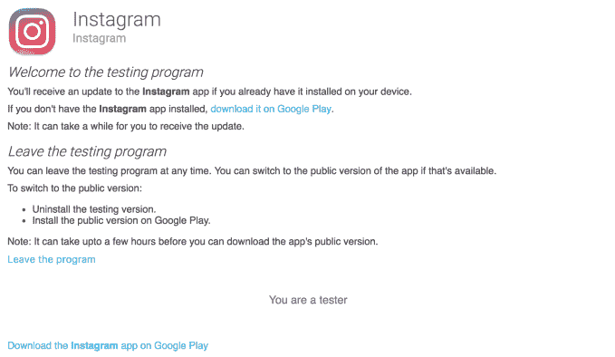

# Instagram 在 iOS 和 Android 上推出 alpha 测试程序 

> 原文：<https://web.archive.org/web/https://techcrunch.com/2017/12/19/instagram-launches-an-alpha-testing-program-on-ios-and-android/>

你是早期采用者吗？好吧，但是你真的是喜欢测试新的、实验性的东西的早期采用者吗，即使这意味着你会经历崩溃和错误？那么你可能有兴趣知道，Instagram 已经在 iOS 和 Android 上推出了 Alpha 测试程序，旨在测试其流行的照片共享应用程序的预发布版本。

Instagram 已经运行 Android 测试程序好几年了。在这里，[账户切换](https://web.archive.org/web/20230206173632/https://techcrunch.com/2015/11/27/instagram-now-testing-support-for-account-switching-no-log-out-required/)和[多相册帖子](https://web.archive.org/web/20230206173632/https://techcrunch.com/2017/02/01/instagram-testing-multi-photo-album-posts/)——现在 Instagram 的标准功能——首次亮相。

然而，该公司新推出的 Alpha 计划将为测试人员提供不同版本的应用程序，因此用户可能无法测试甚至无法进入下一步的功能，更不用说更广泛的公众了。

网站 [Android Police](https://web.archive.org/web/20230206173632/http://www.androidpolice.com/2017/12/19/instagram-opened-alpha-program-android-app-heres-can-enroll/) 在 [Reddit](https://web.archive.org/web/20230206173632/https://www.reddit.com/r/Android/comments/7ketfe/instagram_alpha_program/) 上发现一名 Instagram 员工(现已被删除)的帖子后，第一次听到了 Android Alpha 程序启动的风声。该帖子通过提供一个链接来邀请参与者加入该项目。Reddit 上的评论者随后将这个帖子变成了一系列的功能请求，要求提供倒序订阅、黑暗主题和“重新编程”支持等选项——也就是说，重新发布他人的照片并注明出处。

当然，随着 Alpha 程序的进行，谁知道 Instagram 最终会测试什么。(发现好的给我发邮件！)

虽然阿尔法计划的新闻刚刚被发现，它并不完全是全新的。据我们所知，该项目实际上是在两周前启动的。但是 Instagram 没有正式宣布它的可用性，所以它的存在对许多人来说是新的信息。

Instagram 发言人在一份声明中证实了 Alpha 程序在 TechCrunch 上的发布。

“除了我们在 Android 上已经有一段时间的测试程序之外，我们最近还为我们的 iOS 和 Android 版本的 Instagram 引入了 Alpha 程序，”他们说。他们补充说，这些项目是“从社区收集反馈的好方法”。

测试程序并不真的是一个秘密，但它们也没有被广泛宣传。那些喜欢加入 alpha 和 beta 组的人通常知道在哪里可以找到他们——例如，在谷歌 Play 商店上注册应用程序的测试版本。

事实上，谷歌甚至通过去年推出的[“早期访问”功能](https://web.archive.org/web/20230206173632/https://techcrunch.com/2016/09/01/google-plays-beta-testing-program-early-access-opens-to-more-developers/)让开发者和消费者都更容易做到这一点，该功能将开放测试的应用集中在移动版 Play Store 的专用标签中。

然而，像 Instagram 这样的大公司并不总是使用这个选项。

例如，根据 Android Police 的报告，在 Instagram 的情况下，加入 Alpha 计划的过程包括成为这个[谷歌集团](https://web.archive.org/web/20230206173632/https://groups.google.com/forum/m/#!forum/instagram-alpha-program)的成员，然后加入[Play Store 上的 Instagram 测试程序](https://web.archive.org/web/20230206173632/https://play.google.com/apps/testing/com.instagram.android)。

遗憾的是，iOS 计划目前不接受任何额外的加入请求。

Instagram 并不是唯一一个有测试程序的脸书应用。早在 2013 年，脸书就推出了自己的预发布项目。其他主要的科技公司，包括 Twitter 和 Google，也有自己的程序。