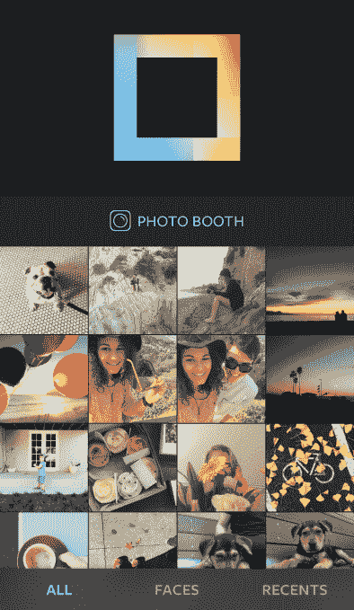
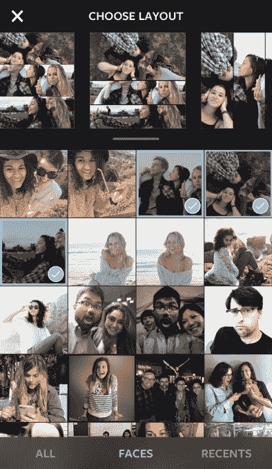
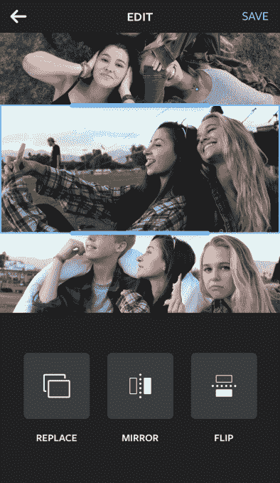
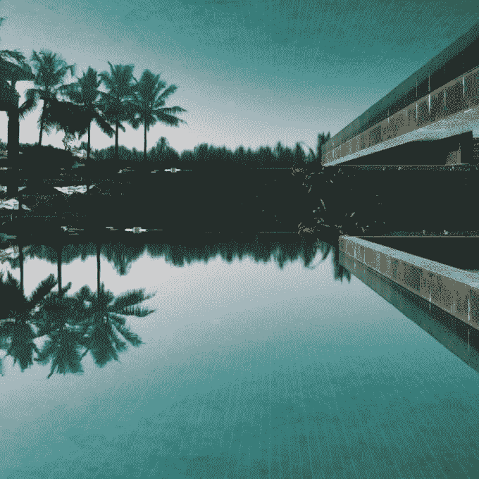

# Instagram 推出自己的照片拼贴应用 

> 原文：<https://web.archive.org/web/https://techcrunch.com/2015/03/23/instagram-layout/>

Instagram 今天[宣布](https://web.archive.org/web/20221127144741/http://blog.instagram.com/post/114416360957/layout-from-instagram)推出一款名为[布局](https://web.archive.org/web/20221127144741/http://blog.instagram.com/post/114416360957/layout-from-instagram)的新应用，这是该公司在其旗舰照片共享应用之外的下一款独立创作工具。通过 Layout，Instagram 用户将能够使用他们的手机照片快速制作拼贴画，然后他们可以选择分享到 Instagram、脸书或其他地方。

该公司告诉我们，拼贴制作已经是 Instagram 上的一项流行活动。我们被告知，Instagram 上五分之一的月活跃用户至少使用一次拼贴应用。如今，应用商店充斥着提供这种功能的实用程序，包括 Pic Stitch、Pic Collage、InstaCollage、PhotoGrid 等许多应用程序。这些应用在本质上都是相似的——它们提供了各种空白的照片网格，用户可以用自己的照片进行定制，有时还会提供可选的文本或贴纸。

值得称赞的是，Instagram 不仅淘汰了市场上现有的拼贴制作应用，还试图推出一款能够改善移动用户体验的应用。

在布局方面，Instagram 通过改变过程中涉及的步骤顺序，对拼贴画的构建方式提供了一种新的视角。

Instagram 的产品设计师约书亚·狄更斯(Joshua Dickens)解释说:“你首先看到的是相机胶卷的视图。“大多数应用程序给你一堆空格子。但更重要的是，在你展示照片之前，选择你想分享的照片，”他说。

当您轻按以选择您想要使用的照片时，Layout 会显示自定布局的预览，您可以在屏幕顶部滚动浏览。您可以使用“布局”选择最多九张照片，每次轻按以添加另一张照片时，您的照片网格选项会自动更新以反映新添加的内容。添加完图像后，您可以快速浏览显示的选项，选择您最喜欢的网格。

## 表面

拼贴制作过程中另一个有趣的功能是点击屏幕底部的“面孔”按钮，过滤你的相机胶卷，只显示那些带有人物照片的照片。Instagram 发现，拼贴画中使用的 90%的照片都有人脸，所以这个选项对那些用朋友和家人的照片填充网格的人来说很有用，而不仅仅是城市风景、物体或其他风景。

## 照相亭

还有一个“照片亭”按钮，让你使用布局捕捉更多自发的时刻。当您轻按此按钮时，该应用程序会启动倒计时，然后捕捉一系列照片，您会看到这些照片会立即出现在布局中。

在过去使用了一些照片拼贴应用程序后，我发现 Layout 翻转了制作拼贴的前几个步骤——即首先选择照片，*然后*选择网格——大大加快了之前耗时的拼贴制作过程。例如，我能够在周末的几秒钟内快速创建一些照片拼贴——在一个六岁孩子混乱的生日聚会上，在所有地方。在过去，使用 Pic Stitch 这样的应用程序进行相同的活动需要更多的时间和反复试验才能找到正确的网格和最佳照片。然而，有了 Layout，这个过程不仅很快，而且弄清楚所有功能如何工作的学习曲线也大大缩短了。

## 网格选项

像其他拼贴建设者，布局也允许你平移照片，以及捏和缩放，以更好地定位它们。此外，您可以抓住照片的手柄，在您选取的网格中调整它的大小，使它相对于其他照片变大或变小。一个“替换”按钮可以让你快速地再次拉起你的相机胶卷来交换照片，只需轻轻一点就可以完成。

交换照片也在同一个屏幕上进行。我过去使用的一些应用程序会在自己的窗口中弹出相机胶卷视图，这使得很难考虑哪张照片在当前的网格选项中看起来合适。我更喜欢 Layout 这样做。

Layout 还提供了一些与众不同的工具，包括点击按钮将图像上下翻转或使照片相互镜像的功能。这使得更多的艺术创作成为可能，比如将风景照片变成具有冷水效果的照片——例如，土地和天空似乎被反射到一个玻璃池里。它还提供了一种更有趣的方式，即“波普艺术”风格的照片，可以为许多 Instagram 用户定期发布的自拍或流行的“每日着装”照片增添趣味。

完成拼贴后，您可以将照片存储在本地，共享到 Instagram、脸书或其他服务，这些服务的应用程序可能已通过 iOS 的共享选项安装在您的 iPhone 上。

自去年秋天以来，Instagram 一直在研究类似 Layout 的应用程序的可能性，过去几个月来，该应用程序本身一直在开发中。像其视频应用程序[Hyperlapse](https://web.archive.org/web/20221127144741/https://beta.techcrunch.com/2014/08/26/instagram-hyperlapse/)一样，该公司建立 Layout 不是为了给公司带来额外的收入——没有更多照片网格或效果等内容的应用内购买，也不会通过广告货币化——而是通过修复当今当前拼贴应用程序的问题来鼓励更多照片分享到 Instagram。

随着 Layout 的首次亮相，这家脸书所有的公司现在每月拥有超过 3 亿活跃用户，似乎正在努力寻找方法，让它的主要应用程序对其核心受众保持简单，同时也满足更高级用户的需求，这些用户正在寻找更好的工具来处理他们的照片和视频。这符合 Instagram 的趋势，即 Instagram 一直在研究人们用作伴侣的其他应用程序，然后试图自己构建功能，有时是在 insta gram 的核心产品中，有时是作为独立应用程序，如 Hyperlapse。

“Instagram 愿景的一个关键部分是激发创造力，”Instagram 的产品经理约翰·巴尼特指出。“创作应该简单、直观、有趣，”他补充道。

布局是[目前是一个 iOS 应用](https://web.archive.org/web/20221127144741/http://blog.instagram.com/post/114416360957/layout-from-instagram)，但安卓版本将在未来几个月内发布。