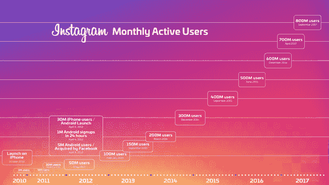

# Instagram 计划于 6 月 20 日为长格式视频中心 TechCrunch 举办发布会

> 原文：<https://web.archive.org/web/https://techcrunch.com/2018/06/11/instagram-long-form-video/>

# Instagram 计划 6 月 20 日为长格式视频中心举办发布会

上周 [TechCrunch 报道 Instagram 将推出一个长视频中心](https://web.archive.org/web/20230123111918/https://techcrunch.com/2018/06/06/instagram-watch-video/)，暂定于 6 月 20 日推出。现在 Instagram 要求记者回复 6 月 20 日的“特别活动”，确认我们独家新闻的日期。邀请函上简单地写着“ Instagram 有一些消息要分享，我们希望你是第一个听说的人。”这是 Instagram 从社交媒体演变为纯粹“媒体”的机会， 从 YouTube 和 Snapchat Discover 窃取更长的移动观看会话。

以下是我们从消息来源处获悉的长格式视频中心的详细信息:

*   格式: Instagram 将允许创作者上传 4K、全屏、垂直方向的视频，长度远远超过当前 60 秒的视频限制。
*   **目的地:**这些视频将从一个集中的中心获得，该中心拥有热门视频的精选部分，并可以选择继续观看你已经开始的剪辑，尽管尚不清楚它的应用程序或单独的 Instagram 将在哪里托管这个目的地。
*   **发布合作伙伴:** Instagram 一直在与社交媒体明星和内容公司会面，为 6 月 20 日的发布会确定发布合作伙伴。

*   **中等质量:**内容旨在近似你在 YouTube 上看到的明星创作者的剪辑，用深谋远虑的好相机拍摄，但大多数不会是网飞原创或 HBO 质量的。
*   **链接:** Instagram 将允许创作者添加一个链接，可以通过在视频上滑动来访问，这样他们就可以为他们的其他社交网站、电子商务商店或网站带来流量。
*   货币化: Instagram 计划让创作者从他们的长视频中赚钱，但尚未最终确定具体方式。这可以采取前置广告或中间插播广告的形式，创作者有可能获得收入分成。

Instagram 也很有可能宣布它已经达到了 10 亿用户，这将是吸引内容创作者的一个很好的方式。Instagram 在 2016 年 12 月达到 6 亿，2017 年 4 月达到 7 亿，2017 年 9 月达到 8 亿。如果它每四个月左右增加 1 亿用户，这意味着到 6 月 20 日的活动时用户应该达到 10 亿。

Instagram 有机会在 YouTube 和 Snapchat Discover 之间找到一个平衡点。YouTube 提供了令人难以置信的内容广度，但它充斥着业余视频，很难找到其中的精华。通过算法化、个性化的管理和更窄的资源范围，Instagram 可以提高你喜欢所展示内容的可能性。这可能会鼓励用户用 Instagram 的长视频来充实 7 分钟的优步之旅或 30 分钟的通勤，而不是漫无目的地在网上闲逛。

Snapchat 专注于对 Discover 的强力监管，只与选定的合作伙伴合作。但这意味着很难找到真正能引起共鸣的东西。最近的重新设计淹没了朋友的故事和半专业创作者的河流抛光发现视频。Snapchat 只有 1.91 亿日活用户，而 Instagram 有 5 亿多日活用户。这种接触可以吸引那些想要建立自己的品牌和受众的创作者，并从他们的内容中赚钱。

这就是脸书希望通过 Facebook Watch 做的事情，但最初的视频中心充斥着三流真人秀和纪录片，没有激起年轻人群的兴趣。脸书是一个无处不在的工具，但它肯定不再酷了。是 NBC。在这里，Instagram 有机会成为 MTV 的第二次降临。

*请在太平洋时间 6 月 20 日上午 9 点回来查看我们对 Instagram 事件的报道，并阅读我们对即将到来的事件的完整独家报道:*