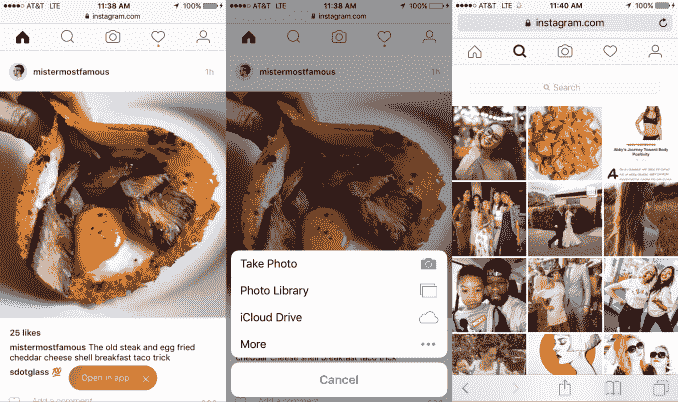

# Instagram 推出移动网络分享以追求全球增长

> 原文：<https://web.archive.org/web/https://techcrunch.com/2017/05/08/instagram-mobile-web/>

Instagram 希望成为全世界的照片应用，即使你不能或不愿下载它。在网络缓慢、数据昂贵的情况下，为了追求国际增长，Instagram 对其移动网站[进行了大规模升级，增加了主应用程序的核心功能，包括照片共享和轻量级版本的探索选项卡。](https://web.archive.org/web/20230306011836/https://www.instagram.com/)

你现在可以从 Instagram 的移动网站上发布照片了

到目前为止，用户只能在精简的移动网站和桌面网站上浏览、点赞、关注、搜索和查看通知。桌面网站上仍然没有帖子。但在 3 月份，Instagram 开始增加移动网络分享功能，探索标签现在也已经推出。移动网络缺少的功能是视频上传、过滤、故事和直接消息。

被[马特·纳瓦拉](https://web.archive.org/web/20230306011836/https://twitter.com/MattNavarra/status/861294765693861888)发现后，我们向 Instagram 询问了新的移动网络功能。该公司告诉 TechCrunch，“Instagram.com(从移动设备访问)是一种针对手机优化的网络体验。它旨在帮助人们在 Instagram 上获得更全面的体验，无论他们在什么设备或网络上。”

移动网络的推出符合 Instagram 的全球增长战略，其目标是美国以外 80%的用户。这方面的其他产品更新包括网络注册，为低端 Android 用户提供更好的登录流程，以及[最近增加的离线功能](https://web.archive.org/web/20230306011836/https://techcrunch.com/2017/04/26/instagram-700-million-users/)。这些帮助 Instagram 快速突破了 [7 亿月用户大关。在数年平均每 1 亿用户增加 9 个月后，它仅用 4 个月就增加了最后 1 亿用户。](https://web.archive.org/web/20230306011836/https://techcrunch.com/2017/04/26/instagram-700-million-users/)

发展中国家的许多用户可能没有足够快的蜂窝网络来方便地下载 Instagram 的应用程序。在不牺牲其他应用或内容的情况下，他们的手机并不总是有足够的存储空间来下载它。下载应用程序的数据成本可能会高得令人望而却步。

借助扩展的移动网络版本，用户可以跳过应用下载的等待时间、数据成本和存储需求，同时仍能获得基本功能。此次发布回避了 Instagram 是否会发布其原生应用程序的 Instagram Lite 版本的问题，如数据传输最小化的脸书 Lite 应用程序(已达到 2 亿用户)和新的 T2 Messenger Lite 应用程序(T3)。

Instagram mobile web 现在允许你发布和查看一个轻量级版本的探索标签

不过，就目前而言，移动网络可以帮助 Instagram 领先其主要竞争对手 Snapchat 一步。由于 Snapchat 的视频太多，Snap Inc .也没有优先考虑为低收入国际市场和 Android 用户开发应用程序，因此它的应用程序在发展中国家并不适用。Snap 为 Instagram 敞开了大门，让它成为这些国家事实上的视觉交流应用。Instagram 通过其 Snapchat Stories clone 利用了这一点，在[每天有 2 亿活跃用户，比 Snapchat 的整个应用程序](https://web.archive.org/web/20230306011836/https://techcrunch.com/2017/04/13/instagram-stories-bigger-than-snapchat/)还多。

最终，随着移动网络和廉价 Android 手机的改善，Instagram 可能会从发展中市场挤出更多收入。在此之前，全球增长推动网络效应，让人们锁定 Instagram。

随着社交网络在西方顶级市场达到饱和，他们必须重新思考如何让他们的应用在其他地方更好地工作。即使他们离得很远，计算方式与我们不同，也不能忽视这些用户。