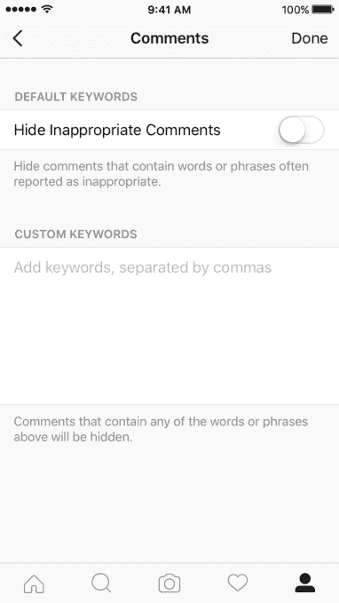
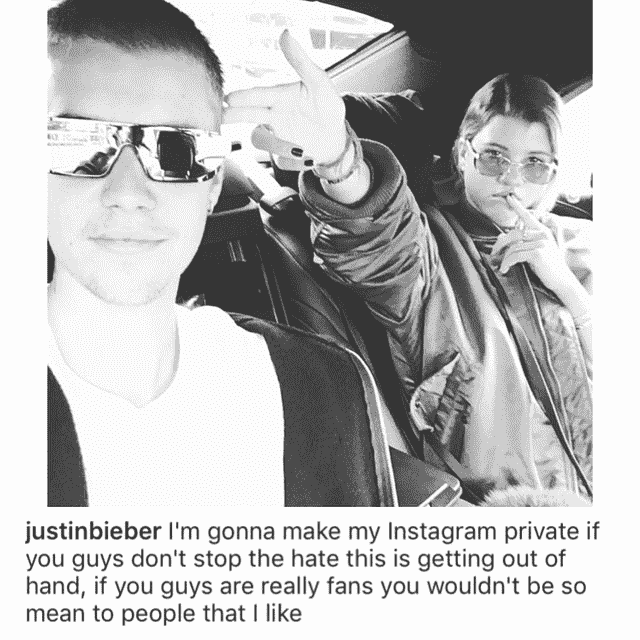

# Instagram 现在允许每个人使用黑名单过滤评论，将首先显示朋友的评论 

> 原文：<https://web.archive.org/web/https://techcrunch.com/2016/09/12/instagram-now-lets-everyone-filter-comments-using-blocklists-will-show-friends-comments-first/>

Instagram 今天向其所有用户推出了一项功能，允许每个人自己决定他们希望如何缓和对照片共享服务的评论。该社交网络于 7 月首次推出商业账户，现在向所有用户提供默认和自定义评论关键词黑名单。

这项新功能将允许人们启用一个过滤器，自动阻止一个默认的单词列表，以隐藏他们的 Instagram 评论，或者通过自定义关键词列表，他们可以进一步选择他们不想在帖子评论中看到的某些单词。

后一种选择也可以帮助 Instagram 账户所有者禁止某些话题，即使这些词本身不被认为是“辱骂性的”

现在，任何用户都可以在 Instagram 个人资料设置中启用这两个选项。[据报道，泰勒·斯威夫特是这款工具的早期测试者，](https://web.archive.org/web/20221206115206/http://www.thetimes.co.uk/article/taylor-swift-given-right-to-delete-online-abuse-s02ks7k33)在它公开发布之前。

Instagram 此前推出了其他评论审核工具，如滑动删除评论，报告不当评论的能力，以及封锁用户账户的能力。

像这样的功能很重要，因为 Instagram 默认是公开的，也通常用于个人照片共享，这是恶霸和流氓的成熟目标。

“Instagram 社区的美妙之处在于其成员的多样性。Instagram 联合创始人兼首席执行官凯文·斯特罗姆在公司博客上解释评论审核工具的必要性时写道:“所有不同类型的人——来自不同背景、种族、性别、性取向、能力等——都把 Instagram 称为家，但有时他们帖子上的评论可能是不友善的。”。

“为了赋予每个人权力，我们需要促进一种文化，在这种文化中，每个人都感到做自己是安全的，不会受到批评或骚扰。这不仅是我个人的愿望，我相信这也是我们公司的责任，”他补充道。

此举正值社交网络竞相击败其平台上的欺凌和虐待行为。Instagram 最近处理了一起备受瞩目的在线钓鱼案件，事实上，这导致其顶级名人用户之一，[贾斯汀比伯关闭了他的账户，因为他的粉丝开始在他和他的新女友索菲亚·里奇的照片上留下仇恨的评论。](https://web.archive.org/web/20221206115206/http://www.cnn.com/2016/08/16/entertainment/justin-bieber-sofia-richie-instagram/)

在网络上的其他地方，辱骂性的评论——通常是针对女性的——已经迫使许多人放弃参与社交网络。例如，《捉鬼敢死队》的主演[莱斯莉·琼斯最近在推特上被一群种族主义、性别歧视的网上暴民攻击。之前一个值得注意的事件是，巨魔用她父亲的尸体的 PS 图像嘲弄罗宾·威廉姆斯悲伤的女儿塞尔达。与此同时，整个#GamerGate 争议涉及一场针对那些公开谈论视频游戏文化中性别歧视问题的人的骚扰活动。](https://web.archive.org/web/20221206115206/http://fusion.net/story/327103/leslie-jones-twitter-racism/)

与 Twitter 相比，Instagram 没有看到太多“有新闻价值”的在线钓鱼和滥用案例，但它也更积极地在达到这一点之前推出新工具。

据报道，Twitter 也在建立一个用户控制的关键词黑名单，据彭博称[，并且它上个月推出了一个“低质量内容”垃圾邮件过滤器。但它在处理网络欺凌方面的许多举措——包括引入信任和安全委员会、禁止报复色情以及推出其他反骚扰规则——被许多人视为“太少、太迟”。](https://web.archive.org/web/20221206115206/http://www.bloomberg.com/news/articles/2016-08-26/twitter-said-to-work-on-anti-harassment-keyword-filtering-tool)

另一方面，Instagram 正试图在欺凌行为在其服务上变得普遍之前解决这个问题，并以更快的速度推出工具。

当然，Instagram 母公司脸书可能会因为其庞大的机器学习、反滥用和国际化基础设施而赋予这项服务优势。例如，脸书于 2011 年在[首次给予商家关键词屏蔽。](https://web.archive.org/web/20221206115206/http://www.adweek.com/socialtimes/keyword-moderation-profanity-blocklist/256856)

**更个性化的评论，太多了**

虽然反骚扰工具对于维护一个所有人都感到受欢迎的安全社区至关重要，但它们并不是 Instagram 致力于改善评论体验的唯一工具。

该公司还推出了另一项变革，将在评论预览中显示更多个性化的相关评论，而不是最近的两条评论。与脸书类似，这意味着当你浏览时，你会比别人先看到你朋友的评论。

这一功能也将于今天推出，同时还有关键词黑名单工具。