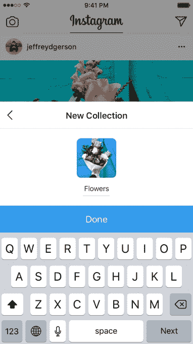
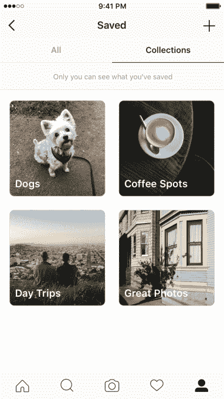

# Instagram 现在可以让你将书签整理成私人收藏

> 原文：<https://web.archive.org/web/https://techcrunch.com/2017/04/17/instagram-now-lets-you-organize-bookmarks-into-private-collections/>

Instagram 将使其书签功能更加有用，公司[今天早上宣布](https://web.archive.org/web/20230407054651/http://blog.instagram.com/post/159679268807/170417-collections#_=_)，推出“收藏”这项新功能将允许用户将他们保存的帖子组织到私人分组中，以便于访问。这一增加可能会进一步挑战 Pinterest，它也支持图像书签和将项目保存到特定页面的能力。

当 Instagram 第一次[在 12 月推出其书签工具](https://web.archive.org/web/20230407054651/https://techcrunch.com/2016/12/14/instagram-now-lets-you-bookmark-posts-for-later-viewing/)时，它利用了其应用程序中已经很普遍的行为——人们经常保存其他人发布的照片。Instagram 用户会经常看到他们希望以后回顾的帖子——无论是有趣的视频还是精彩的引用，他们喜欢并想购买的服装，假期灵感，他们想尝试的产品，等等。

有了书签，你可以将这些帖子保存到你的个人资料中，这样你就可以在以后快速找到它们，而不是将照片下载到你手机的相机胶卷中，这样它们就会丢失。

该公司表示，自从 Instagram 几个月前推出书签功能以来，近一半(46%)的用户至少保存了一篇帖子。

通过 collections，该公司现在的目标是使这一功能更加强大。

Instagram 解释说，要使用收藏，你可以点击并按住任何帖子下面的书签图标，将其直接保存到收藏中。您可以在此时创建并命名一个新的收藏，也可以将文章保存到您已经创建的收藏中。

如果你已经保存了文章，你现在可以返回并创建一个收藏。为此，你可以点击屏幕右上角的“加号”图标，命名新的收藏，然后选择你想添加的已保存的帖子-类似于将照片组织到手机的相册中。

创建收藏后，您可以随时从个人资料中访问它们。和保存的帖子一样，收藏是私有的，只有你能看到。

收藏的私密性是 Instagram 的书签方式与 Pinterest 最显著的区别。你在 Instagram 上的保存只对你一个人有意义，而 Pinterest 鼓励其用户创建并与他人分享图片和他们整理好的图板，以此为其社交网络注入更多内容。

尽管如此，Instagram 的书签功能仍然与 Pinterest 有很多重叠，因为 Instagram 也经常是人们寻求风格提示、食谱、旅行想法、工艺项目、灵感引语和 Pinterest 成名的其他领域的地方。

此前不久，Pinterest 网站上周又遭到攻击，但攻击来自谷歌，而非脸书。谷歌在图片搜索中引入了自己的时尚[“风格理念”，以及在搜索服装和配饰时类似项目的扩展选择。](https://web.archive.org/web/20230407054651/https://techcrunch.com/2017/04/13/google-makes-fashion-image-searches-more-like-pinterest/)

Instagram 表示，作为苹果应用商店和 Google Play 中 insta gram 10.16 版本更新的一部分，收藏可以在 iOS 和 Android 上使用。