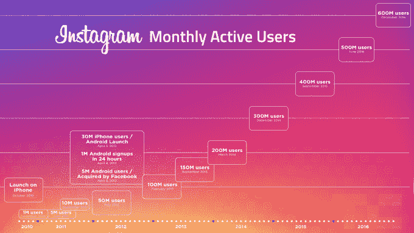

# Android 上的 Instagram 进入离线模式

> 原文：<https://web.archive.org/web/https://techcrunch.com/2017/04/18/instagram-offline/>

# Android 上的 Instagram 进入离线模式

Instagram 的 6 亿用户中有 80%在美国以外，因此它需要一种方法来为网络连接有限或没有数据计划的用户提供更好的体验。

今天在 F8，Instagram 宣布它已经建立了在没有互联网接入的情况下使用其大部分功能的支持。这些功能中的大部分现在都可以在 Android 上使用，Android 是发展中国家首选的设备类型。接下来的几个月还会有更多，Instagram 告诉我它正在开发 iOS 版本。

Instagram 工程师亨德里表示，离线用户将能够看到之前在 Instagram 的 feed 中加载的内容。人们可以留下评论，喜欢的东西，保存媒体，或取消关注他人-所有这些都将在他们重新连接时进行。他们以前访问过的个人资料将可见，旧版本的“浏览”选项卡或他们自己的个人资料也将可见。

做到这一点所需的工程体操可能有助于 Instagram 在发展中国家的发展，在这些国家，数据要么过于昂贵，每个人都负担不起，要么没有无处不在或稳定的数据连接。脸书的发展中国家应用程序脸书 Lite 在短短一年内就拥有了 2 亿用户，证明了 Instagram 可以通过允许用户即使在孤立的情况下也能享受应用程序而抓住的巨大机会。虽然 Snapchat 似乎已经忘记了发展中国家，但 Instagram 知道任何地方的每个人都想要视觉交流。