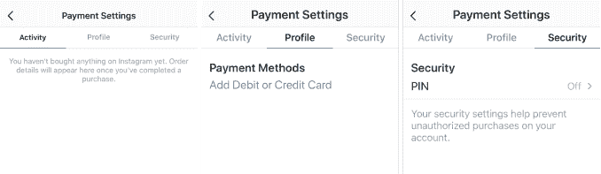
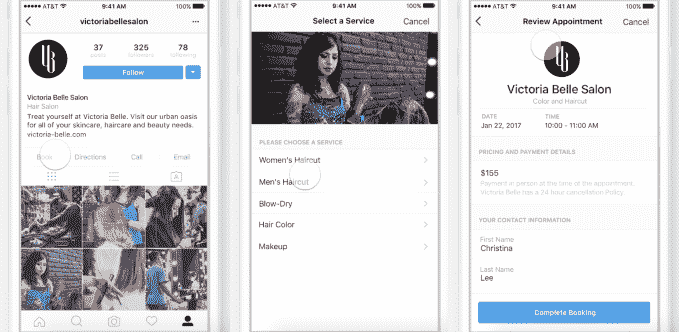
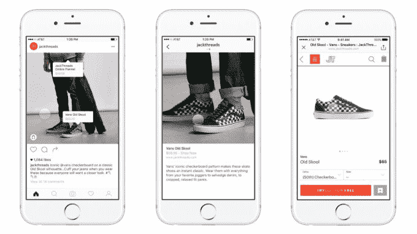

# Instagram 悄然推出商务支付

> 原文：<https://web.archive.org/web/https://techcrunch.com/2018/05/03/instagram-payments/>

准备去购物吧。Instagram 只是悄悄地为一些用户添加了原生支付功能。它可以让你注册一张借记卡或信用卡作为个人资料的一部分，设置一个安全密码，然后开始购物，而无需离开 Instagram。任何时候你想买东西都不必去一个单独的网站并输入支付信息，这可能会使 Instagram 在商业领域发挥更大的作用。

TechCrunch 读者 [Genady Okrain](https://web.archive.org/web/20230327060121/https://twitter.com/genadyo) 首先向我们透露了支付功能。当我们询问 Instagram 时，一位发言人证实，餐厅或沙龙等预约预约的原生支付现在仅对有限的几个合作伙伴开放。

其中最先配备的是晚餐预订应用 [Resy](https://web.archive.org/web/20230327060121/https://resy.com/) 。它的一些客户的 Instagram 页面现在为预订提供这种原生支付。Instagram 表示，未来你可以通过该应用直接支付电影票等费用。Instagram [最初在 2017 年 3 月宣布](https://web.archive.org/web/20230327060121/https://business.instagram.com/blog/welcoming-1-million-advertisers)“我们将在今年晚些时候推出直接从他们的个人资料中预订服务的功能”，但从未提到原生支付。

Instagram 的原生预约

我们已经确认付款设置现在可见；美国的一些(但不是全部)用户有它，而至少英国的一些用户没有。浏览服务条款可以发现，Instagram 支付受到脸书支付规则的支持。

凭借其精美的图片和过多的品牌，通过 Instagram 购物可能会受到欢迎，并给企业提供一个在该应用程序上做广告的新理由。如果他们可以获得更高的转化率，因为人们不会在填写支付信息时中途退出，品牌可能会更喜欢推动人们通过 Instagram 购买。

与新的支付功能不同，Instagram 现有的可购物标签功能会迫使你去一个商业网站购物

脸书在 2013 年左右开始涉足本地商务，并最终开始通过 Messenger 推出点对点支付。但在聊天应用中，购物的原生支付仍处于封闭测试阶段。目前还不清楚点对点支付是否会出现在 Instagram 上，但有办法在文件上添加信用卡或借记卡是该功能的关键组成部分。

支付选项可能会与 Instagram 的[“可购物标签”](https://web.archive.org/web/20230327060121/https://techcrunch.com/2016/11/01/instagram-shoppable-photos/)一起使用，该标签于 2016 年开始测试，让你看到哪些产品在帖子中，并在该品牌的网站上点击购买。从那以后，Instagram 与店面平台 [BigCommerce](https://web.archive.org/web/20230327060121/https://techcrunch.com/2017/10/02/instagram-opens-its-shoppable-posts-feature-to-retailers-on-bigcommerces-platform/) 和 [Shopify](https://web.archive.org/web/20230327060121/https://techcrunch.com/2017/10/03/shopify-rolling-out-instagram-shopping-feature-to-thousands-of-merchants/) 合作，让他们的客户参与进来，而[在 3 月](https://web.archive.org/web/20230327060121/https://techcrunch.com/2018/03/19/after-launching-in-the-u-s-instagram-expands-its-shoppable-posts-features-to-business-users-in-eight-other-countries/)将该功能扩展到更多国家。不过，就目前而言，Instagram 之前的购物功能合作伙伴，如 Warby Parker 或 Kate Spade，都不会让你在 Instagram 内结账，仍然会让你去他们的网站。

但是 Instagram 不允许标题中有链接的目的是为了让你保持流畅、不间断的浏览。去网上买东西打破了。Instagram 支付可以让冲动购物变得更快，吸引更多企业加入进来。即使 Instagram 没有从收入中提成，如果原生支付意味着更多人实际完成购买，品牌也可能会增加广告支出，让更多人看到他们的可购物帖子。

Instagram 不是唯一一个看到这种潜力的人。二月份，Snapchat 开始测试自己的原生支付和结账功能。