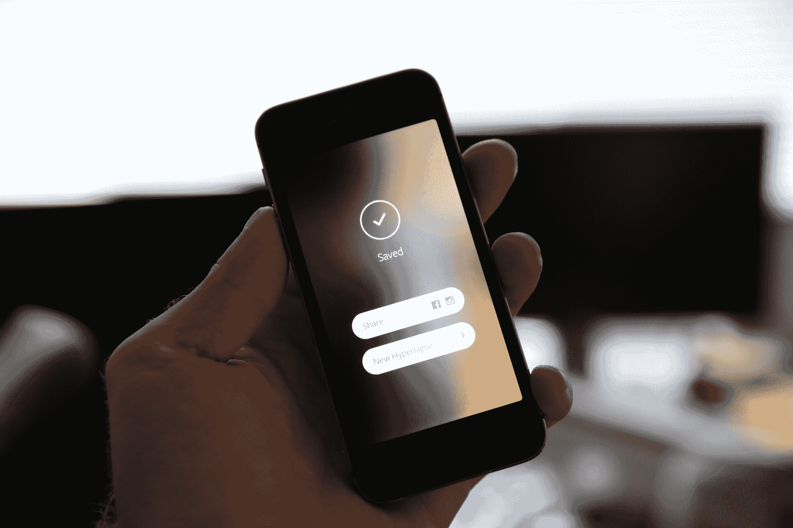

# Instagram 揭开了 hyperlapstechcrunch 背后的工程奇迹

> 原文：<https://web.archive.org/web/https://techcrunch.com/2014/08/27/instagram-pulls-back-the-curtain-on-the-engineering-magic-behind-hyperlapse/>

# Instagram 揭开了 Hyperlapse 背后的工程奇迹

Instagram 在其[工程博客](https://web.archive.org/web/20221006135746/http://instagram-engineering.tumblr.com/post/95922900787/hyperlapse)上发布了一个新的更新，揭示了一些巧妙的技巧和技术进步，这些技巧和技术进步使其新的[超光速应用](https://web.archive.org/web/20221006135746/https://beta.techcrunch.com/2014/08/26/instagram-hyperlapse/)工作得很好。对于那些不熟悉昨天发布的新应用程序的人来说，这是一个仅适用于 iOS 的(目前)应用程序，允许用户拍摄高质量的延时视频，具有高级图像稳定功能，即使在行走、跑步或其他运动中手持拍摄，剪辑也看起来很流畅。

工程团队的先睹为快揭示了我们昨天讨论的更多内容，当时我们讨论了它采用的稳定技术如何利用你的 iPhone 陀螺仪数据，而不是试图通过 Final Cut Pro 等专业桌面电影制作软件中使用的处理器密集型得多的图像分析方法来稳定。

Hyperlapse 应用程序[使用 Cinema](https://web.archive.org/web/20221006135746/https://beta.techcrunch.com/2013/06/20/instagram-launches-cinema-its-fix-for-the-iphones-shaky-camera/) ，Instagram 视频中使用的视频稳定方法，来实现其稳定的平移效果。这将陀螺仪数据与帧结合起来，以解决如何产生看起来平滑的合成相机运动，没有通常伴随手持镜头的颠簸和颠簸。一旦算法创建了正确的方向或运动，它就会应用于视频捕捉的所有帧，以使整个事情保持稳定——这种效果是通过自动裁剪或缩放帧来实现的，以便为 Hyperlapse 提供一个缓冲帧，在这个缓冲帧内，最终生成的视频帧可以自由移动，以保持中心主题和地平线稳定。

电影已经被改变为 HyperlapseInstagram 的工程团队制作了它，以便它只为它保留的帧计算正确的方向，并根据整体抖动来确定保留哪个帧，这意味着它甚至可以在拍摄良好的超级拍摄所需的较长时间内补偿极度抖动的时期。Hyperlapse 的缩放功能决定了最终的帧，也是自适应的，这意味着如果视频是在相对较少的握手下拍摄的，那么最终的产品将比在非常抖动的条件下拍摄的更接近原始分辨率。

Instagram 的工程博客包含了[个说明性的视频示例](https://web.archive.org/web/20221006135746/http://instagram-engineering.tumblr.com/post/95922900787/hyperlapse)，向你展示这一切是如何实时发生的，如果你对 magic Hyperlapse 根据一些非常平凡的原始资料制作的电影印象深刻，那就值得一看。