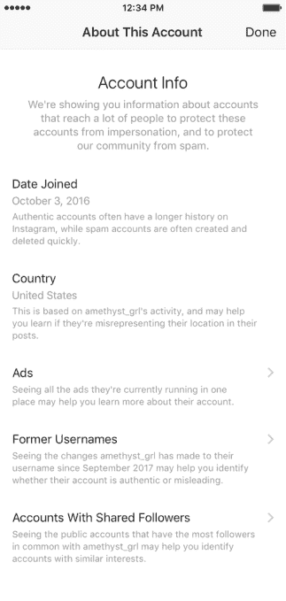
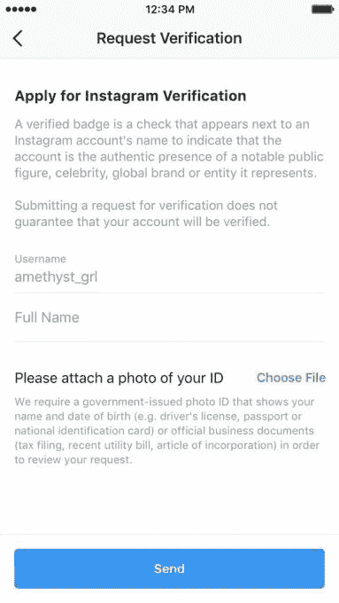
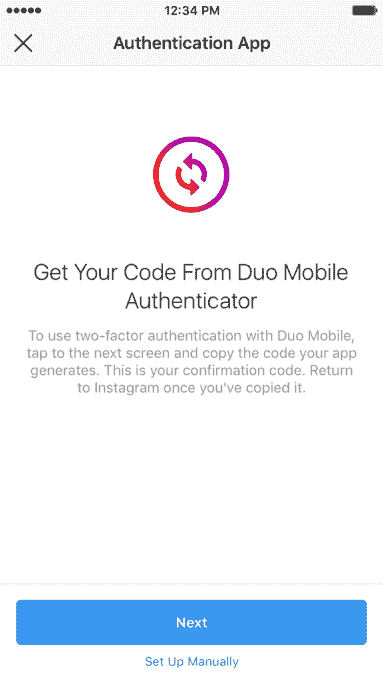

# Instagram 宣布验证请求、透明工具和更强的 2FA 

> 原文：<https://web.archive.org/web/https://techcrunch.com/2018/08/28/instagram-request-verification-2fa-about-this-account/>

# Instagram 宣布验证请求、透明工具和更强的 2FA

Instagram 今天推出了一系列广泛的新工具，并考虑到了安全性和透明度。在一篇题为“确保 Instagram 安全的新工具”的博客文章中，该公司宣布了三项重大更新:一个“关于这个账户”部分，为用户提供更多关于拥有大量粉丝的账户的背景信息，账户可以通过该表格申请令人垂涎的蓝色验证徽章和对第三方认证应用的支持。

Instagram 的新“关于这个账户”部分旨在为用户提供更多信息，供他们在评估账户的合法性时使用。该功能将通过点击具有实质性影响的账户的菜单按钮来实现，并将提供账户创建时间、所在国家、共享关注者的账户以及该账户用户名在过去一年中的变化等信息。

该功能还将把拥有大量受众的账户与他们运行的 Instagram 广告联系起来，这是对最近围绕广告透明度的对话的认可，因为俄罗斯政府支持的政治广告和虚假信息渗入了社交平台。

据 Instagram 称，“9 月，拥有大量受众的账户的人可以查看即将公开的账户信息。”该阶段结束后,“关于此客户”工具将向全球用户推出。

Instagram 的第二个重大变化将为账户提供一条在平台上验证的途径，将通常不透明的过程标准化。点击菜单图标，选择“设置”和“请求验证”，可以通过用户自己的个人资料请求蓝色验证徽章 Instagram 随后将审查该请求，要求用户“提供你的账户用户名、全名以及你的法律或商业身份证明的副本”，这些信息不会向公众公开。

最后但同样重要的是，Instagram 正在增加对第三方认证应用程序的支持，如 Google Authenticator 和 DUO Mobile，它们提供了更强大的双因素认证(2FA)方法。此举是[期待已久的努力](https://web.archive.org/web/20230225044953/https://techcrunch.com/2018/07/17/instagram-2-factor/)使 Instagram 更强大，以抵御针对基于文本的 2FA 的用户账户的威胁，这是众所周知的容易受到 sim 卡劫持攻击的。

Instagram 联合创始人兼首席技术官迈克·克里格(Mike Krieger)在一份关于更新的声明中表示:“我们从一开始就专注于我们平台的安全性，今天的更新建立在我们现有的工具基础上，例如我们的垃圾邮件和滥用内容过滤器以及报告或阻止账户的能力。”。

“我们知道我们还有更多工作要做，以阻止不良行为者进入 Instagram，我们致力于继续开发更多工具来做到这一点。”