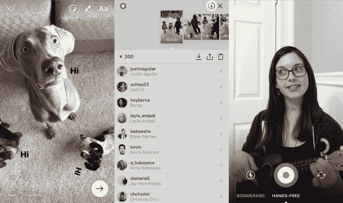

# Instagram Stories 推出位置、表情符号和季节的叠加贴纸 

> 原文：<https://web.archive.org/web/https://techcrunch.com/2016/12/20/instagram-stickers/>

Instagram 发布了对 Snapchat geofilters 的回应，提供了一种通过显示基本位置名称、时间、天气和表情符号的[贴纸](https://web.archive.org/web/20221208200831/https://beta.techcrunch.com/2016/12/20/instagram-stickers/)来增加照片和视频趣味的方法。还有限时季节性图案，如圣诞树和光明节烛台，以及节日糖果棒画笔。

Instagram 还推出了 Story saving，可以在观众浏览器中下载你最近 24 小时的更新，就像 Snapchat 一样。此外，现在有无限的故事文本框，而不是每个图像只有一个，还有一个一触式免提视频录制选项，以吸引像吉他手这样需要两只手的表演者，你可以从故事相机选择器中滑动。这些功能今天开始在 iOS 和 Android 上推出。

Instagram Stories 补充道(左起):每张图片多个文本框，故事保存，免提视频录制

新功能给 Instagram 带来了开始赶上 Snapchat 所需的乐趣和灵活性，因为它试图缩小他们的创作工具之间的差距。与此同时，Instagram 正在扩大其更纯的彩色滤镜永久订阅和任何事情都会发生的短暂故事画布之间的区别。

Instagram 拒绝评论它是否计划提供赞助贴纸作为收入来源、艺术家绘制的位置贴纸或提交贴纸设计的平台。它只是分享说“我们正在开发更多有创意的工具，将在未来几个月推出…给我们的社区带来更多有趣和多样的选择。”

昨天，我使用了 Instagram 的新创意工具，实际上它比看上去的要多得多。

## 动手使用 Instagram 贴纸

拍摄完照片或视频后，您可以通过点击 Stories 相机屏幕顶部的笑脸图标来访问贴纸。这显示了一盘可用的贴纸。对于位置，你可以在 Instagram 的 Places 数据库中搜索任何地方，将商店、地标、街区或城市变成贴纸。用户可以点击位置标签，从那个地方获取永久照片。

Instagram 贴纸可以显示不同的设计，尽管位置功能只有基本字体，而不是 Snapchat 上的独特插图

Snapchat 的特色是艺术家绘制的地理过滤器，只有当你在他们的地理围栏附近时才可用，与此不同，你可以从世界任何地方自由添加位置。但位置贴纸并不像 Snapchat 那样是独一无二的插图，它们只有两种标准字体，白色或紫色渐变，你可以通过点击在两种字体之间切换。Instagram 为了可扩展性牺牲了风格，所以任何地方都可以成为贴纸，但没有一个真正突出。

Instagram 上的许多季节性贴纸可以显示不同的设计，比如这些不同的毛衣、糖果手杖设计、光明节图标和圣诞树

除了位置、时间、天气，一些季节性的贴纸也可以用来改变他们的设计。你可以用模拟时钟、老式闹钟或现代数字钟来看时间，而天气也可以显示温度或天气预报。像圣诞树这样的季节性贴纸可以用棕榈树或仙人掌代替传统的松树。

Instagram 拒绝提供关于贴纸未来的信息，例如是否会出售赞助贴纸广告，为热门地点添加艺术家绘制的位置贴纸，或者让用户提交自己的贴纸设计。一位发言人只是说“我们正在开发更多有创意的工具，将在未来几个月内推出…给我们的社区带来更多有趣和多样的选择。”

虽然 Snapchat 出了名的拒绝给带来粉丝的名人提供特殊的 T2 待遇，但 Instagram 很乐意与他们合作，提供教程，帮助恢复账户，并接受反馈。现在有了免提录音选项，它甚至可以更好地取悦音乐家和其他创作者。如果这些表演者更喜欢 Instagram 的功能，他们可以转换或开始优先考虑 Instagram，带来他们的大批粉丝。

Instagram 还缺少 Snapchat 普及的自拍面膜。脸书在收购口罩制造商 MSQRD 后，最近将它们添加到其主要的脸书应用程序和 Messenger 中，肯定有足够的火力来创造它们。如果 Instagram 能够利用其母公司的巨大资源实现与 Snapchat 同等的创意工具，它将拆除让 Snapchat 成为分享你日常生活的明显更具表现力的工具的最后几样东西之一。

Instagram Stories 在推出[首席执行官凯文·斯特罗姆承认是 Snapchat Stories 复制版](https://web.archive.org/web/20221208200831/https://beta.techcrunch.com/2016/08/02/silicon-copy/)后仅两个月，日活用户就达到了 1 亿。现在，通过结合 Instagram 的 6 亿月度用户群(这让 Snapchat 相形见绌), Stories 在使用率很高的 Instagram feed 上的排名，以及快速改进的创作工具，Instagram 的克隆努力可以获得丰厚的回报。