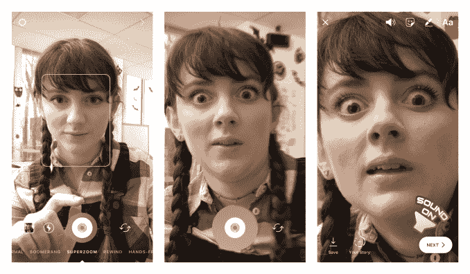
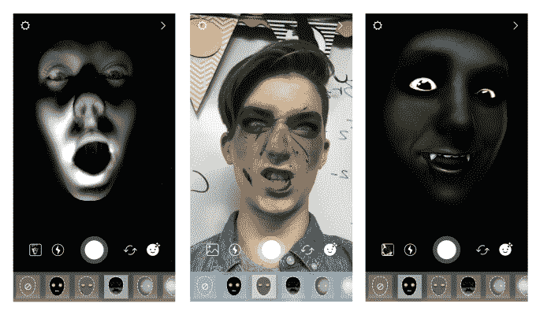
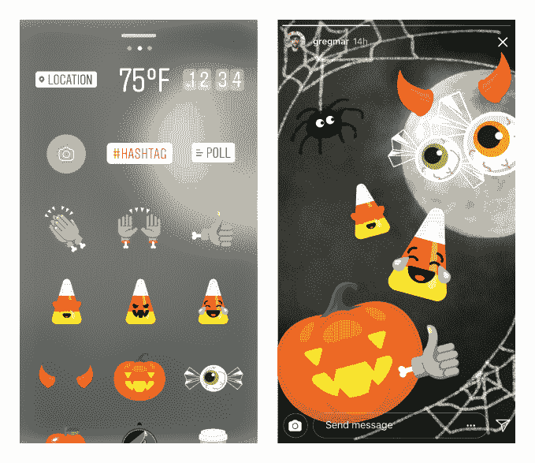

# Instagram Superzoom 记录引人注目的特写视频 

> 原文：<https://web.archive.org/web/https://techcrunch.com/2017/10/26/instagram-superzoom/>

Instagram 的最新功能让你只需轻轻一点，就可以拍摄口吃的放大效果，包括电影音效，从而制作自己的“戏剧花栗鼠”风格的视频。今天，super zoom[将](https://web.archive.org/web/20230201093637/http://blog.instagram.com/post/166818406452/171026-superzoom-halloween)在 [iOS](https://web.archive.org/web/20230201093637/https://itunes.apple.com/us/app/instagram/id389801252?mt=8) 和 [Android](https://web.archive.org/web/20230201093637/https://play.google.com/store/apps/details?id=com.instagram.android&hl=en) 上发布 Instagram 故事，同时还有一系列怪异的万圣节贴纸和增强现实面具。

Superzoom 加入了 Instagram 的 Boomerang GIFs、Hyperlapse time-lapse 和 Layout collages，成为其额外相机效果工具包的一员。随着 Instagram 与 Snapchat 争夺用户，现在[都有了 AR 面具](https://web.archive.org/web/20230201093637/https://techcrunch.com/2017/05/16/instagram-face-filters/)，每个人都在寻找新的效果，激发创造力，打破人们在竞争应用之间选择的平衡。你可以看下面我们的动手视频。

我们测试了 Instagram 的 Superzoom，发现它很容易使用，也很有趣。你可以选择前置或后置摄像头，瞄准十字线可以让你轻松对准镜头。Instagram 通过同步的粗体管弦乐音效进行三阶段放大来完成剩余的工作。

视频持续三秒钟，但你可以按住快门按钮更长时间，以延长到 15 秒钟，并对你的主题进行缓慢的最终缩放。它非常适合坦率地抓人，或者把自拍变成更加浮夸和滑稽的事情。Instagram 向我证实，特殊的稳定技术使它能够比手动更稳定地保持画面。您可以将视频发布到您的故事、Instagram Direct 或保存到您的相机胶卷，以便发布到 Instagram 的 feed 或其他地方。

Instagram 是怎么想出 Superzoom 的？“我们的用户，”产品经理 Jyoti Sood 告诉我们。“一次又一次，我们看到人们使用 Instagram 的摄像头放大他们的朋友，以捕捉和创造有趣的时刻。我们希望让他们在我们的相机中更容易做到这一点，同时也提供一种有趣的新声音。”

这些用户可能从经典的[戏剧花栗鼠迷因](https://web.archive.org/web/20230201093637/https://www.youtube.com/watch?v=a1Y73sPHKxw)中获得灵感，但也有像几年前[推广](https://web.archive.org/web/20230201093637/https://vine.co/v/iMx7uHHFOea)喜剧效果的[莎拉·绍尔、](https://web.archive.org/web/20230201093637/https://twitter.com/SJSchauer)这样的人。

如果 Superzoom 有更多的音效可供选择，那就太好了，Instagram 的一位发言人告诉我们，“我们很乐意探索更多的音乐和声音选项，但我们现在没有任何具体的计划可以分享。”只有一种音乐风格可能会变得有点老，我预计 Superzoom 将成为创作者的一支坚实的箭，它肯定会成为一种时尚几天。但它没有回旋镖一样的开放式潜力 Snapchat 尚未复制这一点。

Instagram 允许许可的音乐配乐或声卡为你的视频添加效果怎么样？Sood 说:“我们很高兴有机会为 Instagram 的相机添加更多声音和音乐选项，这样用户就可以与朋友分享更丰富的体验。虽然我们现在没有计划分享，但我们会听取社区对 Superzoom 的反馈，以进行学习和改进。”

至于万圣节的特色，你会看到预期的南瓜和糖果玉米贴纸阵列。AR 面具以有趣的方式玩光，从在黑暗中将令人毛骨悚然的手电筒放在你的脸上，将你笼罩在雾中，或者将你放在夜视摄像头上。还有吸血鬼的尖牙和僵尸化妆自拍滤镜可以玩。它们都比 Snapchat 的万圣节面具更可口和可预测，给你一个浮动的女妖身体，血腥的食尸鬼频闪效果或某种海滩弗兰肯斯坦外观。

如果 Instagram 能够利用规模、资金和工程资源，比 Snapchat 更快地开发新功能，它就可以摆脱被归类为抄袭的命运。这可能会让它增长得更快，获得更多的广告浏览量，并在青少年中重新获得“酷”。