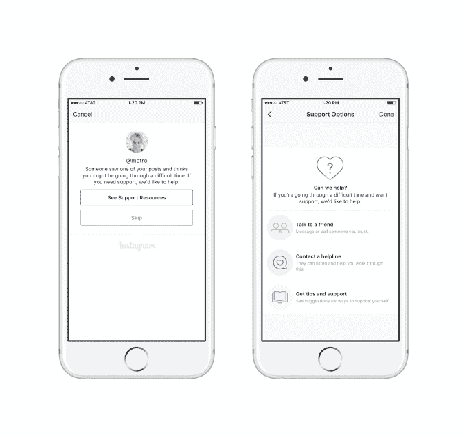
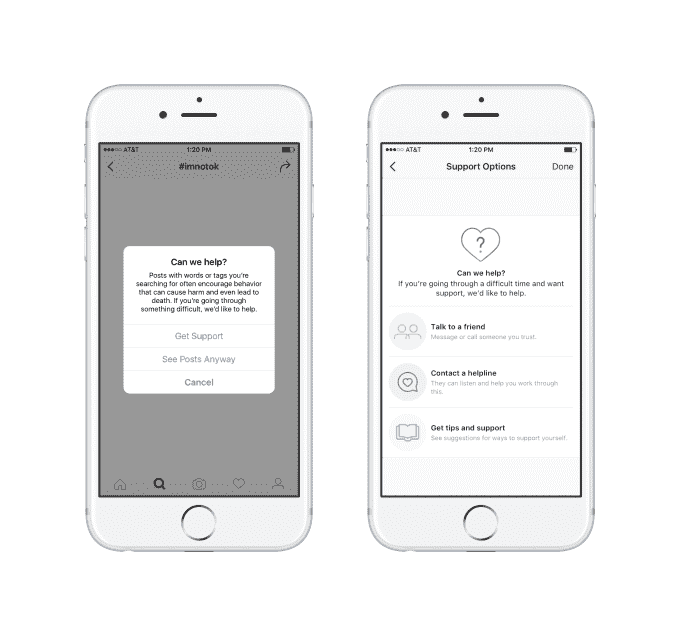
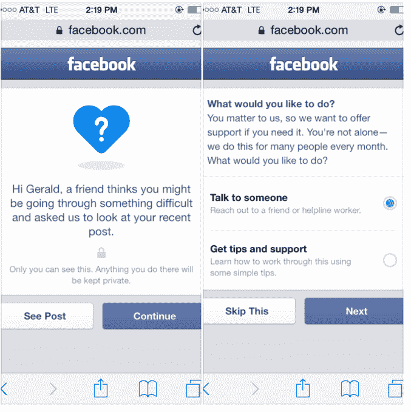

# Instagram 利用新的报告工具、支持选项 解决自残和自杀问题

> 原文：<https://web.archive.org/web/https://techcrunch.com/2016/10/19/instagram-tackles-self-harm-and-suicide-with-new-reporting-tools-support-options/>

当 Twitter 继续与猖獗的欺凌和虐待作斗争时，Instagram 却在加强保护用户免受伤害的游戏。脸书拥有的照片分享网络[本周开始推出一个新的报告工具](https://web.archive.org/web/20230313191229/http://www.seventeen.com/life/news/a43281/new-instagram-tools-perfectlyme/)，让用户匿名标记朋友关于自残的帖子。反过来，这将从 Instagram 向有问题的用户提示一条信息，提供支持，包括提示和求助热线，所有这些都可以在应用程序本身中直接访问。

该系统本身使用起来相当简单，但解决了社交网络上的一个严重需求，该网络继续拥有[大量青少年](https://web.archive.org/web/20230313191229/http://www.businessinsider.com/snapchat-overtakes-instagram-among-teens-2016-4)和年轻成年观众。

当你看到一个朋友威胁要自残或自杀的帖子时，你可能不太愿意和他们讨论这个话题。或者你可能不知道该说什么。在其他情况下，你可能会关注那些你不太了解(或者根本不了解)的人的叙述，并且觉得这不是你该说出来的。

相反，Instagram 提供了一种不同的选择。通过匿名标记帖子，这位朋友将收到一条支持消息，内容是:*“有人看到了你的一篇帖子，认为你可能正在经历一段困难时期。如果您需要支持，我们愿意提供帮助。”*

然后，收件人可以点击查看支持选项列表，其中包括发送信息或给朋友打电话的建议，访问更多一般提示以及支持或联系帮助热线，这将根据用户的位置而有所不同。世界各地有 40 个组织是该系统求助热线的合作伙伴。

该公司还表示，它与国家饮食失调协会、南希·朱克博士(杜克大学心理学和神经科学副教授)和由华盛顿大学学术研究人员领导的 Forefront 合作开发新工具。其他组织包括国家自杀预防生命线和 Save.org(美国)，撒马利亚人(英国)，超越蓝色和顶空(澳大利亚)也提供了投入。

Instagram 工具的有趣之处在于，它不仅仅是由匿名举报引发的。当用户在 Instagram 上搜索某些标签时，insta gram 的应用程序还会指引用户找到支持信息，比如被禁的搜索词#thinspo，它与饮食失调有关。

**处理虐待(和自我导向的虐待)**

此举是 Instagram 近日来为限制其网络上的滥用行为而做出的几项改变之一。今年 9 月，[它还使得任何人都可以使用可定制的黑名单](https://web.archive.org/web/20230313191229/https://techcrunch.com/2016/09/12/instagram-now-lets-everyone-filter-comments-using-blocklists-will-show-friends-comments-first/)来过滤他们的评论，这意味着他们可以禁止任何人在他们的 Instagram 评论中发布某些露骨的词语或欺凌术语。

诸如此类的步骤对于建立社区的基调至关重要。不受监管的自由言论可能会演变成匿名欺凌——正如现在 Twitter 上如此普遍的那样，它至少部分影响了网络寻找收购者的能力。(据报道，[迪士尼因为这个问题放弃了收购](https://web.archive.org/web/20230313191229/https://www.bloomberg.com/news/articles/2016-10-17/disney-said-to-have-dropped-twitter-pursuit-partly-over-image)。)

当然，关于自残的帖子与欺凌是两码事，但它们属于更广泛的用户保护和安全范畴。

它们是关于建立一个可以安全分享的社区，但也是一个可以针对潜在问题缓和某些类型的分享的社区——无论是有人发布针对另一个人的有害评论，还是有人发布针对自己的有害评论。

没有这些限制和政策可能会导致危险的结果，特别是当网络迎合年轻观众的时候。例如，青少年问答网络在过去因欺凌而变得如此出名，它最终成为一系列青少年自杀事件的促成因素。

多年来，主要的社交媒体公司从过去的悲剧中吸取了教训，提供了更好的方法来保护他们的用户。许多人与支持组织合作，在用户搜索有害词汇时制作并运行公益广告——Tumblr、[Pinterest 和 Instagram 都这么做过](https://web.archive.org/web/20230313191229/https://techcrunch.com/2013/06/20/over-a-year-after-new-content-policies-self-harm-social-media-still-thrives/)。今天，大多数人使用自动化系统、人工主持人和标记工具的组合来解决问题，从用户主导的对相关术语和标签的搜索(如 thinspo 或自杀)到用户帖子本身触发的提示。

Instagram 的新标记工具是在母公司脸书已经存在的工具基础上设计的，是一个较小的网络如何受益于脸书已经建立的解决自残相关问题的基础设施的例子。

去年，[脸书为美国的脸书用户推出了一款几乎完全相同的工具](https://web.archive.org/web/20230313191229/https://www.facebook.com/fbsafety/posts/817724748265365)—[，2016 年早些时候](https://web.archive.org/web/20230313191229/http://www.mercurynews.com/2016/06/14/facebook-rolls-out-suicide-prevention-tools-globally/)，它也向国际用户推出了这款工具。

随着新工具的推出， [Instagram 还与 Seventeen 合作开展了一项以身体形象和自信为主题的活动](https://web.archive.org/web/20230313191229/http://www.seventeen.com/life/news/a43281/new-instagram-tools-perfectlyme/)，即国家身体自信日。这是在#PerfectlyMe 标签下运行的。11 月号的《17》杂志也将包括 16 页来支持身体自信和#PerfectlyMe。