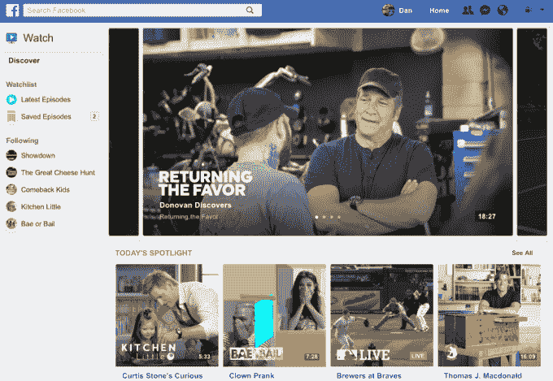

# Instagram 计划推出 Snapchat Discover 风格的视频中心 

> 原文：<https://web.archive.org/web/https://techcrunch.com/2018/06/06/instagram-watch-video/>

Instagram 正准备推出一个更长形式视频的主页——这是 YouTube 的竞争对手，也是 Snapchat Discover 的对手。据多个消息来源称，Instagram 将提供一个专用空间，以垂直方向、全屏、高清 4K 分辨率展示脚本节目、音乐视频等。Instagram 一直在与流行的社交媒体明星和内容出版商会面，以了解他们在其他地方的视频频道如何在其应用程序中工作。它还在寻找合作伙伴，以宣布暂定于 6 月 20 日推出的长篇视频。

公众不应该期待网飞的原件或 HBO 级别的质量。这不是《权力的游戏》相反，该功能更侧重于你从 YouTube 创作者那里看到的视频类型。这些镜头的长度通常在 5 到 15 分钟之间，用很好的相机和灯光拍摄，但不是一些大型的好莱坞电影制作团队。普通用户也可以上传更长的视频，超过目前 60 秒的限制。

Instagram 打算最终让创作者和发布者从较长的视频中赚钱，但它尚未最终确定前置广告和中间插播广告或收入分成等附带广告将如何运作。它也没有为 Facebook Watch 这样的节目预先支付创作者。但每个视频都有一个向上滑动的选项来打开一个链接，创作者可以用它来增加网站、电子商务商店或活动票务的流量。由于 Instagram 有 8 亿多用户，视频部分可能会成为一个强大的营销工具，而不仅仅是直接为创作者创造现金。

长格式视频部分将聚焦一组流行视频，并提供“继续观看”选项，因为用户可能会在几个会话的过程中观看长剪辑。用户还可以在作者简介的故事亮点气泡附近看到长篇剪辑。创作者将无法拍摄和发布长篇视频，因为该部分只允许预先制作的视频上传。

Instagram 此前提供了 Spotlight 系列，将多个视频汇集成不间断的观看体验

这一来自 TechCrunch 消息来源的新信息来自于昨天华尔街日报的一份简短的初步报告，该报告称 Instagram 正在与内容出版商就一项垂直视频功能进行谈判。《华尔街日报》的文章关注的是普通用户发布长达一小时的视频剪辑的能力，但这里真正的故事是 Instagram 推出了一个专业制作的视频娱乐中心。Instagram 拒绝了我们的置评请求。

目前还不清楚新的视频功能将被命名为什么，或者会出现在哪里。它可能存在于“探索”标签中，拥有自己的标签，甚至可以独立成一个应用程序。我们的消息来源不知道这些视频将如何与 Instagram 的主要内容配合使用，在 insta gram 中，它们可能会以全长形式出现，或者以预览形式出现，以提醒出版商的粉丝注意他们最新的长篇剪辑。发布日期或功能细节仍有可能发生变化。

事实证明，脸书的长篇视频观看部分并不受欢迎

脸书在 2017 年 8 月推出的原创长篇视频部分 [Facebook Watch](https://web.archive.org/web/20230123111914/https://techcrunch.com/2017/08/09/facebook-watch/) 一直运气不佳。平庸、无脚本的真人秀和纪录片片段并没有证明对社交网络的吸引力，社交网络现在正扩展到[脚本节目](https://web.archive.org/web/20230123111914/https://variety.com/2018/digital/events/facebook-watch-strangers-season-2-mia-lidofsky-sxsw-1202726218/)和[新闻节目](https://web.archive.org/web/20230123111914/https://techcrunch.com/2018/06/06/facebook-is-funding-news-programs-from-cnn-fox-news-univision-and-others/)。Instagram 可能被证明是一个更自然的休闲娱乐内容之家。

## InstaTube

Instagram 的长篇视频部分将是脸书对两个竞争社交视频目的地的回应，它尚未成功克隆。

Snapchat 的 Discover 部分提供来自一系列出版商的独家、专业制作的垂直视频节目，作为摇摇欲坠的用户生成故事的替代选择。但是，随着用户增长疲软危及收视率，对埋葬 Discover 的重新设计的强烈反对，以及停止向 Discover 出版商预先付费的政策转变，Instagram 及其庞大的用户数量可能会诱使出版商将更长的视频放到它的应用程序中。

YouTube 是更强的敌人。其广告收入分成协议和大规模参与使其成为视频制造商的首选平台。尽管如此，创作者总是希望建立自己的粉丝群，赚更多的钱，并推广他们的其他在线业务。Instagram 的迅猛增长以及在那里关注人们的熟悉程度，可能会让长篇视频部分值得接受。

这个功能有很大的潜力，只要它不太打断人们根深蒂固的滚动提要和挖掘故事的行为模式。Instagram 还必须说服创作者垂直拍摄他们的内容，或者找到优雅地裁剪内容的方法，如果他们通常为传统视频播放器拍摄风景，一些人可能会担心。

脸书的应用程序家族可能永远无法与 YouTube 视频目录的广度和深度相提并论。但 Instagram 有机会从庞大的创作者/发布者生态系统中筛选出最好的内容，并为临时观众进行连贯的策划。这可能会让我们花更多的时间在 Instagram 上，即使我们的朋友很无聊。